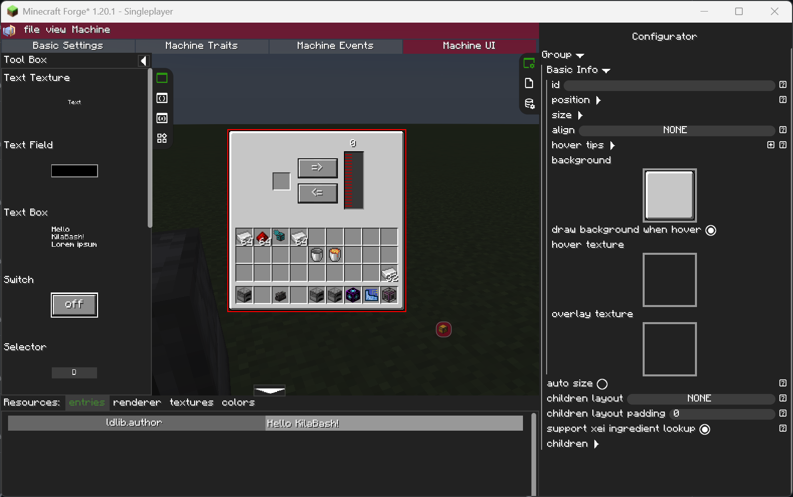
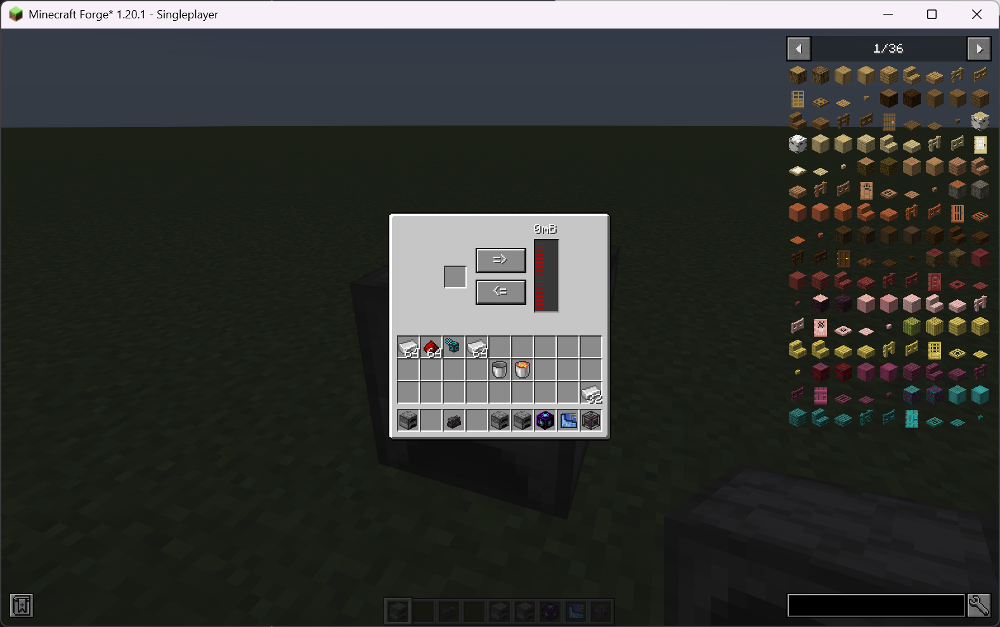

# UI

You might have used mbd2’s visual editor to create the UI, but you may have noticed that apart from the trait widget, the other widgets don't really work. This is because we haven't set up the UI logic, such as what should happen when a button is pressed. As mentioned in the [Ldlbib UI](../../ldlib/ui/index.md), we recommend using the UI Editor to create and edit the UI layout, and using [`KubeJS`](../../ldlib/ui/code/index.md) / <del>`NodeGraph (W.I.P)`</del> to set up the interaction logic.

Here, we implement a simple, UI-based manual lava filling machine.

!!! note inline end
    Example can be download <a href="../assets/example.zip" download>here</a>! 
    
    Put it under the `.minecraft` folder.

First, we configure the machine to have one item trait and one fluid trait, and prepare our UI:

1. A UI corresponding to the trait.
2. Two [`buttons`](../../ldlib/ui/widget/Button.md) corresponding to the filling directions.
3. A [`TextTexture`](../../ldlib/ui/widget/TextTexture.md) to display the amount of fluid in the tank.

{ width="80%" style="display: block; margin: 0 auto;" }

Once you have everything set up, opening the machine's UI should look like this:

{ width="80%" style="display: block; margin: 0 auto;" }


## KubeJS Control
Next, we use KubeJS to add interaction logic to the UI.
We provide an event [`MBDMachineEvents.onUI`](https://github.com/Low-Drag-MC/Multiblocked2/blob/1.20.1/src/main/java/com/lowdragmc/mbd2/integration/kubejs/events/MBDServerEvents.java) for you to setup the root widget. This event is triggered after [`MBDMachineEvents.onOpenUI`](https://github.com/Low-Drag-MC/Multiblocked2/blob/1.20.1/src/main/java/com/lowdragmc/mbd2/integration/kubejs/events/MBDServerEvents.java) and everything is prepared except the logic.

```javascript
MBDMachineEvents.onUI("mbd2:kjs_ui_test", e => {
    const { machine, root } = e.event;
    const slot = root.getFirstWidgetById("ui:item_slot_0") // SlotWidget
    const tank = root.getFirstWidgetById("ui:fluid_tank_0") // FluidTankWidget
    const fill_button = root.getFirstWidgetById("fill_button") // Button
    const drain_button = root.getFirstWidgetById("drain_button") // Button
    const label = root.getFirstWidgetById("tank_label") // TextWidget

    // Set label to display fluid amount
    label.setTextProvider(() => Component.string(tank.fluid.amount + "mB"))

    // on button click
    fill_button.setOnPressCallback(clickData => {
        if (clickData.isRemote) {
            // trigger on the remote side
            // because everything is synced from server to client. you can do nothing on the remote side
        } else {
            var stored = slot.item
            // check if a lava bucket is stored
            if (stored && stored.id === "minecraft:lava_bucket") {
                // check if there is enough space in the tank
                if (tank.lastTankCapacity - tank.fluid.amount >= 1000) {
                    // remove the lava bucket
                    slot.item = { item: "minecraft:bucket", count: 1 }
                    // add 1000mB of lava to the tank
                    tank.fluid = { fluid: "minecraft:lava", amount: tank.fluid.amount + 1000 }
                }
            }
        }
    })

    drain_button.setOnPressCallback(clickData => {
        if (!clickData.isRemote) {
            // check if there is lava in the tank
            if (tank.fluid.amount >= 1000 && slot.item.id === "minecraft:bucket") {
                // remove 1000mB of lava from the tank
                tank.fluid = { fluid: "minecraft:lava", amount: tank.fluid.amount - 1000 }
                // add a lava bucket
                slot.item = { item: "minecraft:lava_bucket", count: 1 }
            }
        }
    })

})
```

Let's see our final result!

<div>
  <video controls>
    <source src="../../assets/kjs_ui_result.mp4" type="video/mp4">
    Your browser does not support video.
  </video>
</div>

We only use four widgets here (`TextTexture`, `Button`, `Slot`, and `Tank`). For more details about other widgets please check [pages](../../ldlib/ui/widget/index.md).