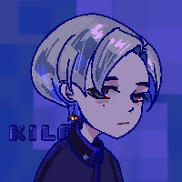

# LowDragMC

!!! info inline end "简介"
    { width="105%"}

LowDragMC 并非一个活跃的团队，而是各种有趣模组项目的集合。

这些项目的唯一维护者是 **[KilaBash](https://github.com/Yefancy) :)**

---

:simple-discord: [加入我们的 Discord](https://discord.com/invite/sDdf2yD9bh)

:simple-github: [GitHub 仓库](https://github.com/Low-Drag-MC)

本质上，这里更像是一个来自我自己以及众多有才华的开发者的独立项目的**枢纽**，而非一个有组织的团队。

我们致力于开发具有**自定义能力**的**创意模组**，尤其专注于**技术与渲染方面**。

### **我们的模组列表**：
1. [**LDLib**](ldlib/index.md)
2. [**LDLib2 (1.21+)**](ldlib2/index.md)
3. [**Multiblocked & Multiblockded2**](multiblocked2/index.md)
4. [**Photon & Photon2**](photon2/index.md)
5. **Shimmer**

如果你遇到任何问题，欢迎**提交 issue**。

如果你喜欢我们的项目，欢迎通过 **PR** 做出贡献！🚀
