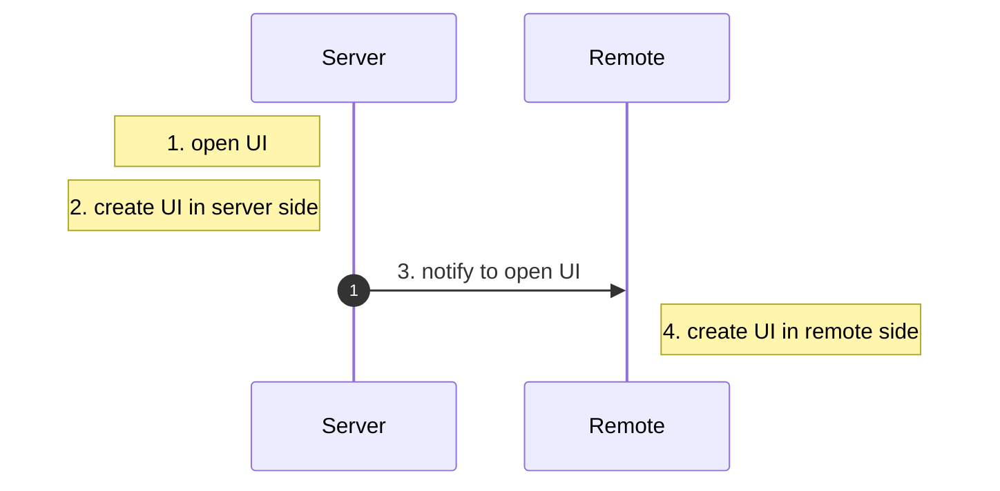

# 快速入门

使用 `Java` 和 `KubeJS` 创建 UI 的方式基本相同。本页将介绍创建和使用 UI 的基本流程。

整个 **UI 创建与使用流程** 包含以下步骤：

1. 创建 UI 组件与布局 (1)
    { .annotate }

    1.  :material-hexagon-multiple: 创建 `buttons` 和 `item slots`，设置它们的位置……

2. 绑定 UI 功能逻辑 (1)
    { .annotate }

    1.  :material-hexagon-multiple: 添加 `button` 被点击时执行的逻辑，将 `inventory` 绑定到 `item slots`……

3. 显示 UI (1)
    { .annotate }

    1.  :material-hexagon-multiple: `right-clicking` 物品时打开 `GUI`，`right-clicking` 方块时打开 `GUI`……

从技术上讲，`UI 功能绑定` 和 `UI 组件创建` 过程是同时进行的，因为许多控件都提供了在创建时就绑定功能的构造函数。

在本页中，为了更清晰地展示 `UI` 的工作原理，我们**将步骤 1 和步骤 2** 在代码示例中分开讲解。

---

## 创建 `UI` 组件与布局
    
让我们从 [`WigetGroup`](../widget/WidgetGroup.md) 开始，它是一个用于容纳子组件的容器。因此，我们创建一个 `WidgetGroup` 作为根组件。在 [`此处`](../widget/index.md) 查看所有组件。

然后，我们向其中添加一个 `Label` 和一个 `Button`。

=== "Java"

    ``` java 
    public WidgetGroup createUI() {
        // create a root container
        var root = new WidgetGroup();
        root.setSize(100, 100);
        root.setBackground(ResourceBorderTexture.BORDERED_BACKGROUND);

        // create a label and a button
        var label = new LabelWidget();
        label.setSelfPosition(20, 20);
        label.setText("Hello, World!");
        var button = new ButtonWidget();
        button.setSelfPosition(20, 60);
        button.setSize(60, 20);
        // prepare button textures
        var backgroundImage = ResourceBorderTexture.BUTTON_COMMON;
        var hoverImage = backgroundImage.copy().setColor(ColorPattern.CYAN.color);
        var textAbove = new TextTexture("Click me!");
        button.setButtonTexture(backgroundImage, textAbove);
        button.setClickedTexture(hoverImage, textAbove);

        // add the label and button to the root container
        root.addWidgets(label, button);
        return root;
    }
    ```

=== "KubeJS"

    ``` javascript
    function createUI() {
        // create a root container
        let root = new WidgetGroup();
        root.setSize(100, 100);
        root.setBackground(ResourceBorderTexture.BORDERED_BACKGROUND);

        // create a label and a button
        let label = new LabelWidget();
        label.setSelfPosition(20, 20);
        label.setText("Hello, World!");
        let button = new ButtonWidget();
        button.setSelfPosition(20, 60);
        button.setSize(60, 20);
        // prepare button textures
        let backgroundImage = ResourceBorderTexture.BUTTON_COMMON;
        let hoverImage = backgroundImage.copy().setColor(ColorPattern.CYAN.color);
        let textAbove = new TextTexture("Click me!");
        button.setButtonTexture(backgroundImage, textAbove);
        button.setClickedTexture(hoverImage, textAbove);

        // add the label and button to the root container
        root.addWidgets(label, button);
        return root;
    }
    ```

<div style="text-align: center;">
  <video width="640" height="360" controls>
    <source src="../assets/root.mp4" type="video/mp4">
    您的浏览器不支持视频播放。
  </video>
</div>

 <!-- { width="80%" style="display: block; margin: 0 auto;" } -->

---


## 绑定 UI 功能逻辑

创建 UI 后，我们需要实现其逻辑。例如，我们希望**点击按钮以更改标签文本**。


=== "Java"

    ``` java 
    public WidgetGroup createUI() {
        // creation of the ui
        // ....

        // click logic
        AtomicInteger counter = new AtomicInteger(0);
        button.setOnPressCallback(clickData -> {
            label.setText("Clicked " + counter.incrementAndGet() + " times!");
        });

        return root;
    }
    ```

=== "KubeJS"

    ``` javascript
    function createUI() {
        // creation of the ui
        // ....

        // click logic
        let counter = 0;
        button.setOnPressCallback(clickData => {
            counter++;
            label.setText("Clicked " + counter + " times!");
        });

        return root;
    }
    ```

<div style="text-align: center;">
  <video width="640" height="360" controls>
    <source src="../assets/counter.mp4" type="video/mp4">
    您的浏览器不支持视频播放。
  </video>
</div>

---

## 显示 UI

现在，让我们显示我们创建的 UI！我们需要指定一个 `UI Factory` 来显示 UI，它负责管理 UI 的生命周期。

共有四个步骤：

1. `open ui`
2. `create UI in server side`
3. `notify to open UI`
4. `create UI in remote side`



`UI Factory` 将协助处理 `step 3`。因此，用户需要定义**何时**触发 `step 1`，以及在 `step 2` 和 `step 4` 中**创建什么**。通常情况下，服务端和远程端创建的 UI 在大多数情况中都是相同的。

LDLib 提供了两种内置工厂：

1. Block Entity UI Factory
2. Held Item UI Factory

### Block Entity UI Factory

此工厂允许用户从方块打开 UI。

#### Java

1. Java 用户应为自己的 `BlockEntity` 实现 [`IUIHolder.Block`](https://github.com/Low-Drag-MC/LDLib-MultiLoader/blob/1.20.1/common/src/main/java/com/lowdragmc/lowdraglib/gui/modular/IUIHolder.java)，并实现 `createUI(Player entityPlayer)` 方法。

2. 在想要打开 UI 时，调用 `BlockEntityUIFactory.INSTANCE.openUI()` 方法。

#### KubeJS

KubeJS 用户可以用更简单的方式实现同样的功能。用户甚至可以为方块（无实体）打开 UI，但相比 Java 可访问性较低。

1. KubeJS 用户应使用 `LDLibUI.block(ui_name, e => {})` 根据给定的 `ui_name` 创建 UI。
2. 在想要打开 UI 时，调用 `BlockUIFactory.INSTANCE.openUI(player, pos, ui_name)` 方法。

=== "Java"

    ``` java 
    public class TestBlockEntity extends BlockEntity implements IUIHolder {
        
        public void onPlayerUse(Player player) {
            // step 1 here.
            if (player instanceof ServerPlayer serverPlayer) {
                BlockEntityUIFactory.INSTANCE.openUI(this, serverPlayer);
            }
        }

        private WidgetGroup createUI() {
            // ....
        }

        @Override
        public ModularUI createUI(Player entityPlayer) {
            // step 2 and step 4 here 
            return new ModularUI(createUI(), this, entityPlayer);
        }
    }
    ```

=== "KubeJS"

    ``` javascript
    // server script

    BlockEvents.rightClicked('test_block_ui', event => { 
        // step 1 here.
        BlockUIFactory.INSTANCE.openUI(event.player, event.block.pos);
    })

    function createUI() {
        // ....
    }

    LDLibUI.block("test_block_ui", e => { 
        // step 2 and step 4 here 

        // let level = e.level
        // let pos = e.pos
        // let block = e.block
        // let player = e.player

        var ui = createUI();
        e.success(ui);
    })
    ```

### Held Item UI Factory

此工厂允许用户从手持物品打开 UI。

#### Java

1. Java 用户应为自己的 `Item` 实现 [`IUIHolder.Item`](https://github.com/Low-Drag-MC/LDLib-MultiLoader/blob/1.20.1/common/src/main/java/com/lowdragmc/lowdraglib/gui/modular/IUIHolder.java)，并实现 `createUI(Player entityPlayer, HeldItemUIFactory.HeldItemHolder holder)` 方法。

2. 在想要打开 UI 时，调用 `HeldItemUIFactory.INSTANCE.openUI()` 方法。

#### KubeJS

KubeJS 用户可以用更简单的方式实现同样的功能。用户甚至可以为方块（无实体）打开 UI，但相比 Java 可访问性较低。

1. KubeJS 用户应使用 `LDLibUI.item(ui_name, e => {})` 根据给定的 `ui_name` 创建 UI。
2. 在想要打开 UI 时，调用 `ItemUIFactory.INSTANCE.openUI(player, hand, ui_name)` 方法。

=== "Java"

    ``` java 
    public class TestItem implements IUIHolder.Item {
        @Override
        public InteractionResult useOn(UseOnContext context) {
            // step 1 here.
            if (context.getPlayer() instanceof ServerPlayer serverPlayer) {
                HeldItemUIFactory.INSTANCE.openUI(serverPlayer, context.getHand());
            }
            return InteractionResult.SUCCESS;
        }

        private WidgetGroup createUI() {
            // ....
        }

        @Override
        public ModularUI createUI(Player entityPlayer, HeldItemUIFactory.HeldItemHolder holder) {
            // step 2 and step 4
            return new ModularUI(createUI(), holder, entityPlayer);
        }
    }
    ```

=== "KubeJS"

    ``` javascript
    // server script

    ItemEvents.firstRightClicked('minecraft:stick', event => {
        // step 1 here.
        ItemUIFactory.INSTANCE.openUI(event.player, event.hand, "test_item_ui");
    })

    function createUI() {
        // ....
    }

    LDLibUI.item("test_item_ui", e => {
        // step 2 and step 4

        // let player = e.player
        // let hand = e.hand
        // let held = e.held

        var ui = createUI();
        e.success(ui);
    })
    ```
<div style="text-align: center;">
  <video width="640" height="360" controls>
    <source src="../assets/display.mp4" type="video/mp4">
    您的浏览器不支持视频播放。
  </video>
</div>