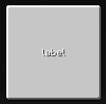

# LabelWidget



`LabelWidget` 用于显示文本和组件（component）。

::: info 高级控件
`LabelWidget` 是一个轻量级控件，仅用于显示文本。文本高度、对齐方式等属性是固定的。
因此，我们建议使用 [`TextTextureWidget`](TextTexture.md) 替代，它提供了更高级的文本显示控制。
:::


## 基本属性

| 字段           | 描述                                                                       |
|-----------------|-----------------------------------------------------------------------------------|
| `color`         | 文本颜色，以整数表示                                                      |
| `dropShadow`    | 是否启用投影效果                               |
| `lastTextValue` | 当前文本 `只读` |

---

## API

### `setText()`

使用 `string` 更新标签文本。

<DocTabs>
<DocTab title="Java / KubeJS">

``` java
label.setText("New Label Text");
```

</DocTab>
</DocTabs>

---

### `setComponent()`

与 `setText()` 相同，但支持以 `component` 作为输入。

---

### `setTextProvider()`

配置一个供应商（supplier），用于动态提供标签文本。它将在每刻获取最新的文本。

<DocTabs>
<DocTab title="Java">

``` java
label.setTextProvider(() -> "Dynamic Text");
```

</DocTab>
<DocTab title="KubeJS">

``` javascript
label.setTextProvider(() => "Dynamic Text");
```

</DocTab>
</DocTabs>

---

### `setColor()`

设置文本颜色。如果已经设置了富文本组件，其样式将被相应替换。

<DocTabs>
<DocTab title="Java / KubeJS">

``` java
label.setColor(0xFFFFFFFF); // ARGB
```

</DocTab>
</DocTabs>

---

### `setDropShadow()`

启用或禁用标签的投影效果。

<DocTabs>
<DocTab title="Java / KubeJS">

``` java
label.setDropShadow(true);
```

</DocTab>
</DocTabs>

---
