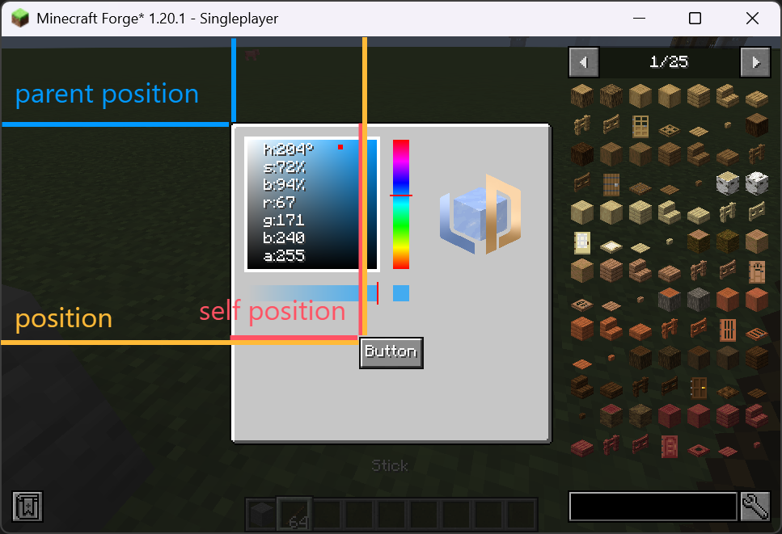

# 初步了解

LDLib 提供了广泛的 Widget。你可以在各个页面上查看它们的功能和 API。在本节中，我们将介绍所有 Widget 的基础概念，确保你对它们的共同原理有扎实的理解。

所有 Widget 都继承自 [Widget](https://github.com/Low-Drag-MC/LDLib-MultiLoader/blob/1.20.1/common/src/main/java/com/lowdragmc/lowdraglib/gui/widget/Widget.java) 类。因此，它们都共享一组通用的 API。

---

## 基本属性

所有属性都可以通过 Java / KubeJS 访问。

=== "Java"

    ``` java 
    var id = widget.getId();
    var pos = widget.getPosition();
    widget.setSize(10, 32);
    widget.setSlefPosition(10, 10);
    ```

=== "KubeJS"

    ``` javascript
    let id = widget.getId();
    let pos = widget.position // getPosition() 也可以。
    widget.setSize(10, 32);
    widget.setSlefPosition(10, 10);
    ```

| 字段       | 描述                          |
| :---------- | :----------------------------------- |
| `id`       | Widget ID，不需要唯一，可以为空。  |
| `selftPosition`       | Self position 表示在父 Widget 中的相对本地位置。 |
| `parentPosition`       | 父 Widget 的全局位置。 |
| `position`       | 窗口中的全局位置，由 self position 和 parent position 计算得出。 |
| `size`    | Widget 尺寸，此属性影响矩形碰撞检测，例如悬停、点击等。 |
| `isVisible`    | Widget 是否可见，仅影响渲染，逻辑仍然有效。 |
| `isActive`    | Widget 逻辑是否有效。 |
| `align`    | 相对于父级的对齐位置。 |
| `backgroundTexture`    | 背景纹理。 |
| `hoverTexture`    | 鼠标悬停时绘制的纹理。 |
| `overlay`    | 覆盖在背景纹理之上的叠加纹理。 |
| `parent`    | 父 Widget。 |
| `align`    | 相对于父级的对齐位置。 |

!!! info "关于 position"
    `Position` 是一个重要的概念。查看下图：
    { width="70%" style="display: block; margin: 0 auto;" }

---

## API

### `setHoverTooltips()`

用于定义鼠标悬停时显示的工具提示。它支持 `string` 和 `component` 作为输入。

<div>
  <video width="30%" controls>
    <source src="../assets/tooltips.mp4" type="video/mp4">
    你的浏览器不支持视频播放。
  </video>
</div>

=== "Java / KubeJS"

    ``` java 
    widget.setHoverTooltips("this is a button");
    // widget.setHoverTooltips("line 1", "line2");
    ```

---

!!! info inline end 纹理

    LDLib 提供了大量不同类型的纹理，选择你需要的:)。查看 [`GUI 纹理`](../textures.md) 了解支持的纹理。

### `setBackground()`

用于设置 Widget 的背景纹理。

### `setHoverTexture()`

用于设置 Widget 的悬停纹理。


=== "Java / KubeJS"

    ``` java 
    widget.setBackground(new ResourceTexture("ldlib:textures/gui/icon.png"));
    ```

---

### `isMouseOverElement()`

用于检查鼠标是否在 Widget 上。

=== "Java / KubeJS"

    ``` java 
    widget.isMouseOverElement(mouseX, mouseY);
    ```
