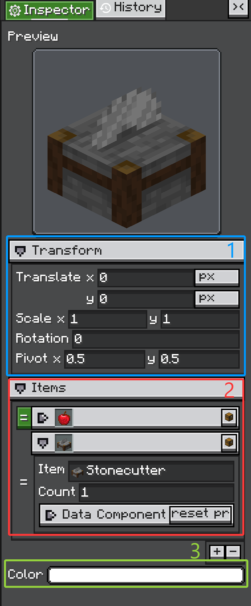

# Configurator UI

Configurator 是用于编辑一个值或一组值的小型 UI 组件。Accessors 创建 configurators，Inspector 展示它们，Editor 监听它们的变更事件。

<figure markdown="span">
    { width="52%" }
    <figcaption>
    Configurator UI 结构：1. `ConfiguratorGroup`，2. `ArrayConfiguratorGroup`，3. 常规 `ValueConfigurator` 行。
    </figcaption>
</figure>

图中三块是自定义 editor 最常复用的 UI 单元。`ConfiguratorGroup` 创建可折叠 section，`ArrayConfiguratorGroup` 编辑数组或集合，`ValueConfigurator` 行通过一个 inline 控件编辑一个值。

## Configurator

`Configurator` 是基类，提供：

* label 区域；
* inline 内容容器；
* 可选 tips 图标；
* 右键复制/粘贴菜单支持；
* `notifyChanges()`；
* `Configurator.CHANGE_EVENT` 事件。

大多数具体 configurator 会把自己的控件添加到 `inlineContainer`。

```java
NumberConfigurator speed = new NumberConfigurator(
        "Speed",
        () -> model.speed,
        value -> model.speed = value.floatValue(),
        1.0f,
        true
);
```

自定义 configurator 修改模型后，需要调用：

```java
notifyChanges();
```

Inspector 正是依赖这个事件来运行 listener 和记录 history。

## ValueConfigurator

`ValueConfigurator<T>` 是大多数可编辑属性行的核心基类。它把一个 UI 控件和一个值连接起来。

构造参数：

```java
public ValueConfigurator(
        String name,
        Supplier<@Nullable T> supplier,
        Consumer<@Nullable T> onUpdate,
        @Nullable T defaultValue,
        boolean forceUpdate
)
```

每个参数的含义：

* `supplier`：从目标对象读取当前值。
* `onUpdate`：把修改后的值写回目标对象。
* `defaultValue`：fallback 值，以及默认 paste/drop 类型。
* `forceUpdate`：为 `true` 时，`screenTick()` 会从 `supplier` 刷新 configurator。

`ValueConfigurator` 区分两种更新方向：

* `onValueUpdatePassively(newValue)`：更新 configurator 内部值和视觉控件，但不通知 listener。
* `updateValueActively(newValue)`：用户修改控件；更新值，调用 `onUpdate`，并触发 `Configurator.CHANGE_EVENT`。

如果 widget 是从模型刷新，使用 passive 路径。如果是用户编辑 widget，使用 active 路径。

```java
protected void onSliderChanged(float value) {
    updateValueActively(value);
}

@Override
protected void onValueUpdatePassively(Float newValue) {
    super.onValueUpdatePassively(newValue);
    slider.setValue(newValue == null ? defaultValue : newValue, false);
}
```

它还提供复制/粘贴和拖拽 hook：

* `setCopiable(...)`
* `setPastable(...)`
* `canDropObject(...)`
* `onDropObject(...)`

大多数简单自定义 configurator 应该继承 `ValueConfigurator<T>`，而不是直接继承 `Configurator`。

## ConfiguratorGroup

`ConfiguratorGroup` 包含其他 configurators。它用于 class-level `@Configurable`、嵌套 `subConfigurable` 字段，以及手动 section。

```java
ConfiguratorGroup display = new ConfiguratorGroup("Display", false);
display.addConfigurator(new StringConfigurator("Name", () -> name, v -> name = v, "", true));
father.addConfigurator(display);
```

Group 可以折叠。由注解生成 group 时，`@Configurable(collapse = ..., canCollapse = ...)` 会映射到同样的行为。

## ArrayConfiguratorGroup

数组和集合使用 `ArrayConfiguratorGroup`。这个 group 管理一组 child configurators，并可以允许添加、删除和重排。

`@ConfigList` 是调整该行为的常用方式：

```java
@Configurable(name = "Entries")
@ConfigList(canAdd = true, canRemove = true, canReorder = true)
public List<Entry> entries = new ArrayList<>();
```

## 常见 Configurator

| Type | Class | Description |
| --- | --- | --- |
| Boolean | `BooleanConfigurator` | `boolean` / `Boolean` 的 toggle 编辑器。 |
| Number | `NumberConfigurator` | 基于文本框的数字编辑器，支持 range 和鼠标滚轮步进。 |
| String | `StringConfigurator` | 单行文本编辑器，也可限制为 resource-location 语法。 |
| Text area | `TextAreaConfigurator` | 多行文本编辑器。 |
| Color | `ColorConfigurator` | 整数颜色选择器，通常由 `@ConfigColor` 选择。 |
| HDR color | `HDRColorConfigurator` | HDR 颜色编辑器。 |
| Selector | `SelectorConfigurator` | 固定候选项的下拉选择器，常用于 enum。 |
| Toggle selector | `ToggleSelectorConfigurator` | 使用 toggle/icon 风格候选项的紧凑选择器。 |
| Conditional selector | `ConfiguratorSelectorConfigurator` | 选择值变化时重建子 `ConfiguratorGroup`。 |
| Search | `SearchComponentConfigurator` | 面向大型或动态候选集合的搜索字段。 |
| Registry search | `RegistrySearchComponent` | Minecraft registry values 的搜索 UI。 |
| Tag key | `TagKeySearchComponent` | tag-key 类型值的搜索 UI。 |
| NBT/tag | `TagConfigurator` | 编辑 NBT `Tag` 值。 |
| Data component | `DataComponentConfigurator`, `TypedDataComponentConfigurator` | 编辑 Minecraft data component 值。 |
| Texture | `IGuiTextureConfigurator` | 选择并配置注册过的 `IGuiTexture` 实现。 |
| Renderer | `IRendererConfigurator` | 选择并配置注册过的 `IRenderer` 实现。 |
| Transform reference | `TransformRefConfigurator` | Scene editor 的 transform reference 编辑器。 |
| Layout value | `LengthPercentConfigurator`, `LPAConfigurator`, `DimensionConfigurator` | layout 相关数值/单位编辑器。 |
| Optional float | `FloatOptionalConfigurator` | 可以表示空 optional 值的 float 编辑器。 |
| Group header | `HeaderConfigurator` | 非值类型 header 行，用于分隔 section。 |
| Array/list | `ArrayConfiguratorGroup` | 数组和集合的添加、删除、重排编辑器。 |

不要一开始就为每个字段手写 UI。普通属性交给注解和 accessor，只有需要自定义行为时再添加手动 configurator。

## 自定义 Configurator

当某个值需要特殊 widget 时，创建自定义 configurator。基本模式：

1. 继承 `ValueConfigurator<T>`；
2. 创建 UI 控件并加入 `inlineContainer`；
3. 用户修改控件时调用 `updateValueActively(value)`；
4. 重写 `onValueUpdatePassively(...)`，在模型变化时刷新控件；
5. 按需提供复制、粘贴和拖拽行为。

```java
public class ToggleNameConfigurator extends ValueConfigurator<Boolean> {
    private final Toggle toggle;

    public ToggleNameConfigurator(
            String name,
            Supplier<Boolean> supplier,
            Consumer<Boolean> onUpdate,
            Boolean defaultValue,
            boolean forceUpdate
    ) {
        super(name, supplier, onUpdate, defaultValue, forceUpdate);
        setCopiable(value -> value);

        toggle = new Toggle();
        toggle.toggleLabel.setText("");
        toggle.setOn(value == null ? defaultValue : value, false);
        toggle.setOnToggleChanged(this::updateValueActively);

        inlineContainer.addChild(toggle);
    }

    @Override
    protected void onValueUpdatePassively(Boolean newValue) {
        if (newValue == null) newValue = defaultValue;
        if (newValue.equals(value)) return;
        super.onValueUpdatePassively(newValue);
        toggle.setOn(newValue, false);
    }
}
```

手动使用：

```java
father.addConfigurator(new ToggleNameConfigurator(
        "Enabled",
        () -> model.enabled,
        value -> model.enabled = value,
        true,
        true
));
```

或者在 accessor 中返回：

```java
@Override
public Configurator create(
        String name,
        Supplier<Boolean> supplier,
        Consumer<Boolean> consumer,
        boolean forceUpdate,
        @Nullable Field field,
        @Nullable Object owner
) {
    return new ToggleNameConfigurator(name, supplier, consumer, true, forceUpdate);
}
```

只有当 UI 不代表一个单独值时，才直接继承 `Configurator`，比如 header、action row、preview panel，或者由自己管理多个 child 的复合编辑器。

## 复制和粘贴

`Configurator` 可以在右键菜单中暴露复制和粘贴操作。

```java
configurator
        .setCopiableDirect(model.value)
        .setPastable(Value.class, value -> {
            model.value = value;
            configurator.notifyChanges();
        });
```

这对颜色、向量、贴图和渲染器设置这类会被重复使用的数据很有用。
