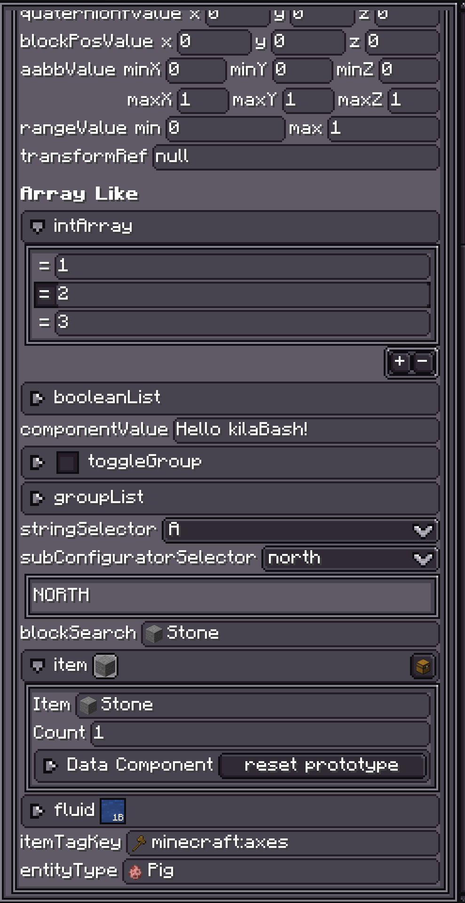
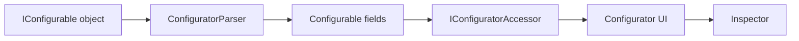

# 介绍

<VersionBadge version="2.1.5" label="自" icon="tag" />

Configurable 是 LDLib2 基于注解的属性编辑系统。它可以把普通 Java 对象转换成可编辑 UI，让编辑器工具能够 inspect 当前选中的对象、修改字段，并把修改记录进 history，而不需要为每个属性面板手写 UI。

UI Editor 的元素属性、贴图、渲染器、样式对象、编辑器设置，以及大量 inspector 面板，都是通过这套系统实现的。对于自定义编辑器来说，Configurable 通常就是暴露“当前选中对象属性”的方式。

::: tip IDE 支持
推荐安装 IDEA 插件 [LDLib Dev Tool](https://plugins.jetbrains.com/plugin/28032-ldlib-dev-tool)。它为 LDLib2 项目提供代码高亮、语法检查、跳转、补全和注解支持。参考 [Java Integration](../java_integration.md)。
:::

例如，`TestConfigurators` 本质上只是一个带注解字段和少量辅助方法的普通数据对象。这里省略了 `package/import`，但结构与测试源码一致：

<div class="ldlib-limited-code" markdown="1">

```java
@LDLRegister(name = "configurators", registry = "ldlib2:menu_test")
@NoArgsConstructor
public class TestConfigurators implements IConfigurable, IPersistedSerializable {
    @Configurable
    @ConfigNumber(range = {-5, 5})
    private float numberFloat = 0.0f;

    @Configurable
    @ConfigColor
    private int numberColor = -1;

    @Configurable
    private boolean booleanValue = false;

    @ConfigHeader("Header")
    @Configurable(tips = "Test tip 0")
    private String stringValue = "default";

    @Configurable
    private ResourceLocation resourceLocation = LDLib2.id("test");

    @Configurable
    private Direction enumValue = Direction.NORTH;

    @Configurable
    private Vector3f vector3fValue = new Vector3f(0, 0, 0);

    @Configurable
    private Vector3i vector3iValue = new Vector3i(0, 0, 0);

    @Configurable
    private Quaternionf quaternionfValue = new Quaternionf(0, 0, 0, 1);

    @Configurable
    private BlockPos blockPosValue = BlockPos.ZERO;

    @Configurable
    private AABB aabbValue = new AABB(0, 0, 0, 1, 1, 1);

    @Configurable
    @ConfigNumber(range = {0, 1}, type = ConfigNumber.Type.FLOAT)
    private Range rangeValue = Range.of(0, 1);

    @Configurable
    private TransformRef transformRef = new TransformRef();

    @ConfigHeader("Array Like")
    @Configurable
    private int[] intArray = new int[]{1, 2, 3};

    @Configurable
    private List<Boolean> booleanList = new ArrayList<>(List.of(true, false, true));

    @Configurable
    private Component componentValue = Component.translatable("ldlib.author");

    @Configurable(subConfigurable = true)
    private final TestToggleGroup toggleGroup = new TestToggleGroup();

    @Configurable
    @ConfigList(
            configuratorMethod = "buildTestGroupConfigurator",
            addDefaultMethod = "addDefaultTestGroup"
    )
    private final List<TestGroup> groupList = new ArrayList<>();

    @Configurable
    @ConfigSelector(candidate = {"A", "B", "C"})
    private String stringSelector = "A";

    @Configurable
    @ConfigSelector(
            candidate = {"north", "west", "east"},
            subConfiguratorBuilder = "subConfiguratorBuilder"
    )
    private Direction subConfiguratorSelector = Direction.NORTH;

    @Configurable
    @ConfigSearch(searchConfiguratorMethod = "createBlockSearchConfigurator")
    private Block blockSearch = Blocks.STONE;

    @Configurable
    private ItemStack item = new ItemStack(Items.STONE);

    @Configurable
    private FluidStack fluid = new FluidStack(Fluids.WATER, 1000);

    @Configurable
    @ConfigRL(ConfigRL.Type.ITEM_TAG_KEY)
    private ResourceLocation itemTagKey = ItemTags.AXES.location();

    @Configurable
    private EntityType<?> entityType = EntityType.PIG;

    @Override
    public ModularUI createUI(Player player) {
        var root = new ScrollerView();
        root.layout(layout -> {
            layout.width(250);
            layout.height(350);
        }).setId("root");

        var group = new ConfiguratorGroup("root");
        group.setCollapse(false);
        group.setTips("Test tip 0", "Test tip 1", "Test tip 2");
        buildConfigurator(group);

        return new ModularUI(UI.of(root.addScrollViewChild(group)));
    }

    private Configurator buildTestGroupConfigurator(
            Supplier<TestGroup> getter,
            Consumer<TestGroup> setter
    ) {
        var instance = getter.get();
        return instance != null ? instance.createDirectConfigurator() : new Configurator();
    }

    private TestGroup addDefaultTestGroup() {
        return new TestGroup();
    }

    private void subConfiguratorBuilder(Direction direction, ConfiguratorGroup group) {
        switch (direction) {
            case NORTH -> group.addConfigurator(new Configurator("NORTH"));
            case WEST -> {}
            case EAST -> group.addConfigurator(new Configurator("EAST"));
            default -> group.addConfigurator(new Configurator("DEFAULT"));
        }
    }

    private SearchComponentConfigurator.ISearchConfigurator<Block> createBlockSearchConfigurator() {
        return new SearchComponentConfigurator.ISearchConfigurator<>() {
            @Override
            public Block defaultValue() {
                return Blocks.STONE;
            }

            @Override
            public void search(String word, IResultHandler<Block> searchHandler) {
                String lower = word.toLowerCase();
                for (ResourceLocation key : BuiltInRegistries.BLOCK.keySet()) {
                    if (key.toString().toLowerCase().contains(lower)) {
                        searchHandler.acceptResult(BuiltInRegistries.BLOCK.get(key));
                    }
                }
            }

            @Override
            public String resultText(Block value) {
                return BuiltInRegistries.BLOCK.getKey(value).toString();
            }
        };
    }

    public static class TestToggleGroup implements IToggleConfigurable {
        @Getter
        @Setter
        private boolean isEnable = false;

        @Configurable
        @ConfigSelector(candidate = {"north", "west", "south", "east"})
        private Direction enumValue = Direction.NORTH;
    }

    public static class TestGroup implements IConfigurable {
        @Configurable
        @ConfigNumber(range = {0, 1}, type = ConfigNumber.Type.FLOAT)
        private Range rangeValue = Range.of(0, 1);

        @Configurable
        private Direction enumValue = Direction.NORTH;

        @Configurable
        private Vector3i vector3iValue = new Vector3i(0, 0, 0);
    }
}
```

</div>

调用 `buildConfigurator(group)` 后，LDLib2 会把这些字段转换成可编辑面板：

<figure>

<figcaption>
&lt;code&gt;TestConfigurators&lt;/code&gt; 生成的 configurator 面板。
</figcaption>
</figure>



## 章节导航

[快速开始](./getting_start.md) 介绍如何把几个字段暴露到 editor inspector。

[注解](./annotations.md) 介绍 `@Configurable` 以及用于名称、提示、范围、选择器、列表、搜索字段、setter 和资源路径的辅助注解。

[Accessors](./accessors.md) 介绍 LDLib2 如何根据 Java 类型选择 UI 控件，以及如何为自己的类型注册支持。

[Configurator UI](./configurator-ui.md) 介绍 accessors 创建的实际 UI 节点：`Configurator`、`ConfiguratorGroup`、数组/列表组、事件和复制粘贴行为。

[Inspector 与 History](./inspector-and-history.md) 介绍 editor 的 `InspectorView` 如何展示 `IConfigurable`、监听变更并记录 undo/redo。

[源码示例](./examples.md) 给出建议阅读的源码入口。

## 什么时候使用

当对象有编辑器属性时使用 Configurable：商店条目、动画片段、节点图常量、渲染器设置、UI 元素样式，或者自定义 view 选中的任何数据模型。

如果属性面板主要是普通字段，给字段加注解并让 `ConfiguratorParser` 构建 UI。如果面板需要自定义布局、条件行或者特殊控件，重写 `buildConfigurator(...)` 并手动添加 configurators。

`@Configurable` 字段默认会持久化。`PersistedParser` 会像处理 `@Persisted` 字段一样处理它们，除非使用 `@Configurable(persisted = false)`。序列化部分见 [PersistedParser](../sync/PersistedParser.md)。
