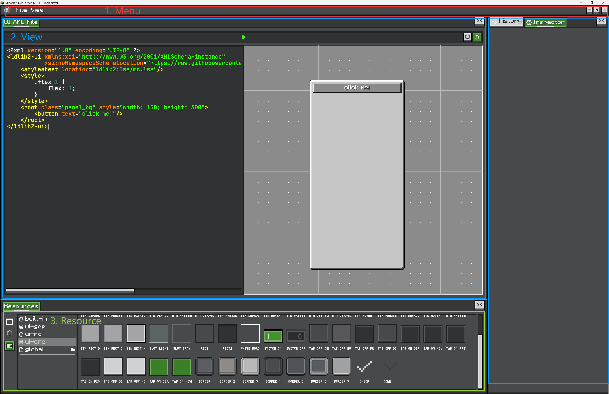

# Getting Start

本页会构建一个最小但可用的编辑器：一个编辑器窗口、一个项目类型、一个项目，以及默认资源。

## 认识编辑器界面

一个编辑器界面通常由三块可见区域组成：

<figure markdown="span">
    
    <figcaption>
    典型编辑器界面：菜单、View、资源。
    </figcaption>
</figure>

1. **Menu**  
   顶部栏保存编辑器命令。`FileMenu` 负责 New、Open、Save、Save As、Settings、Exit 等项目操作。自定义编辑器可以添加更多菜单项或新的菜单标签。

2. **View area**  
   主工作区由可停靠 View 组成。View 可以是画布、树、代码编辑器、图编辑器、预览、Inspector 类面板，或任意自定义 UI。View 可以放在分割面板中。

3. **Resource area**  
   资源面板显示当前项目暴露的可复用资产。资源按类型分组，并通过 built-in、文件夹、pack 等 provider 加载。

## 默认 View 区域

编辑器工作区默认被划分为几个区域。这些区域底层是 `ViewContainer`，也就是用来展示 `View` 的标签容器。

<figure markdown="span">
    
    <figcaption>
    默认编辑器工作区。
    </figcaption>
</figure>

1. **`leftWindow`**  
   左侧区域，适合层级、树、列表、浏览器类 View。

2. **`centerWindow`**  
   主工作区域。通常放主要编辑 View：画布、图、代码编辑器、预览或场景视图。

3. **`rightWindow`**  
   右侧区域，适合 Inspector 类面板。内置 `InspectorView` 和 `HistoryView` 默认放在这里。

4. **`bottomWindow`**  
   底部区域，适合资产和资源 View。内置 `ResourceView` 默认放在这里。

使用 `placeView(view, fallback)` 将 View 放入这些区域：

```java
placeView(myView, () -> centerWindow.getLeftTop());
```

`fallback` 选择默认的 `ViewContainer`。用户运行时仍然可以拖拽 View 到其他面板。

## 创建 Editor

为你的工具创建一个 `Editor` 子类。Editor 管理工作区、菜单、内置 View、设置和当前加载的项目。

```java
public class ShopEditor extends Editor {
    public static final ResourceLocation WINDOW_ID = LDLib2.id("shop_editor");

    public ShopEditor() {
        var view = new View("editor.view.shop");
        view.addChild(new Label().setText("Shop Editor"));
        placeView(view, () -> centerWindow.getLeftTop());
    }

    @Override
    protected Editor createNewEditorInstance() {
        return new ShopEditor();
    }

    @Override
    protected void initMenus() {
        super.initMenus();
        fileMenu.addProjectProvider(ShopProject.TYPE);
    }
}
```

`EditorWindow` 是承载 Editor 的外壳。它负责 editor tab、最大化/窗口化、最小化恢复、拖拽、缩放和 GUI scale 恢复。

如果希望同一个编辑器最小化后可以恢复，使用固定 `WINDOW_ID`：

```java
EditorWindow.open(ShopEditor.WINDOW_ID, ShopEditor::new);
```

如果只需要一个临时客户端界面，可以直接创建窗口：

```java
new EditorWindow(ShopEditor::new);
```

## 创建 Project Type

项目类型告诉 File 菜单如何创建、打开、保存和识别项目文件。

```java
public class ShopProject implements IProject {
    public static final ProjectType TYPE = ProjectType.of(
            Icons.FILE,
            "project.shop",
            ".shop.nbt",
            ShopProject::new
    );

    private final Resources resources = Resources.of(
            ShopEntryResource.INSTANCE
    );

    @Override
    public Resources getResources() {
        return resources;
    }

    @Override
    public ProjectType getProjectType() {
        return TYPE;
    }

    @Override
    public void initNewProject() {
        // 填充默认项目数据。
    }

    @Override
    public void onLoad(Editor editor) {
        // 添加项目专属 View。
    }

    @Override
    public void onClosed(Editor editor) {
        // 移除项目专属 View。
    }

    @Override
    public CompoundTag serializeProject(HolderLookup.Provider provider) {
        return new CompoundTag();
    }

    @Override
    public void deserializeProject(HolderLookup.Provider provider, CompoundTag nbt) {
        // 恢复项目数据。
    }
}
```

项目加载时，`Editor` 会读取 `project.getResources()` 并加载到内置资源 View 中。

## 作为客户端 Screen 打开

对于纯客户端工具或测试界面，可以直接从 `EditorWindow` 创建 `ModularUI`：

```java
public ModularUI createUI(Player player) {
    var root = new EditorWindow(ShopEditor::new);
    return new ModularUI(UI.of(root))
            .shouldCloseOnEsc(false)
            .shouldCloseOnKeyInventory(false);
}
```

这种方式简单，适合不需要 container-menu 行为的本地编辑工具。

## 通过 Menu 打开

对于真正由玩家打开的编辑器，注册 `PlayerUIMenuType`，并从服务端打开它。

```java
PlayerUIMenuType.register(ShopEditor.WINDOW_ID, ignored -> player -> {
    if (player.level().isClientSide) {
        return new ModularUI(UI.of(EditorWindow.open(ShopEditor.WINDOW_ID, ShopEditor::new)))
                .shouldCloseOnEsc(false)
                .shouldCloseOnKeyInventory(false);
    }
    return new ModularUI(UI.empty());
});
```

之后打开：

```java
PlayerUIMenuType.openUI(serverPlayer, ShopEditor.WINDOW_ID);
```

!!! tip "XEI 拖拽设置"
    如果你的编辑器需要支持 XEI 拖拽设置功能，应通过 menu 打开。纯客户端 screen 适合快速工具，但 menu-backed 打开方式会提供这些集成所需的 container context。
