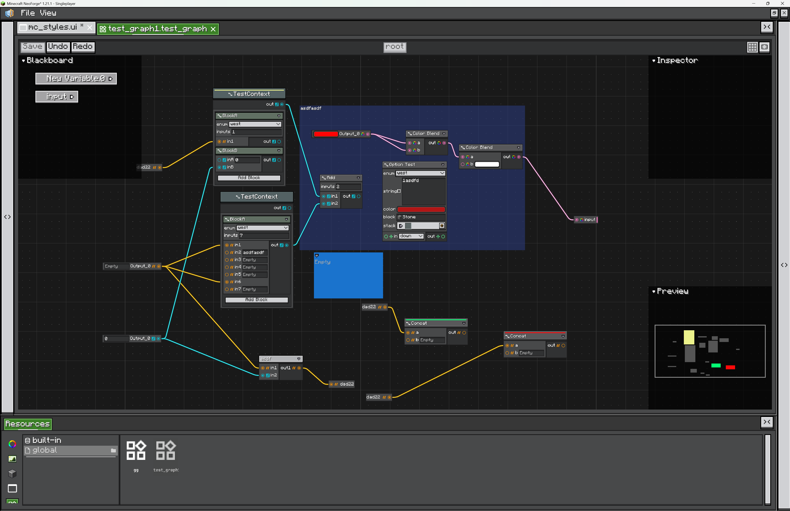
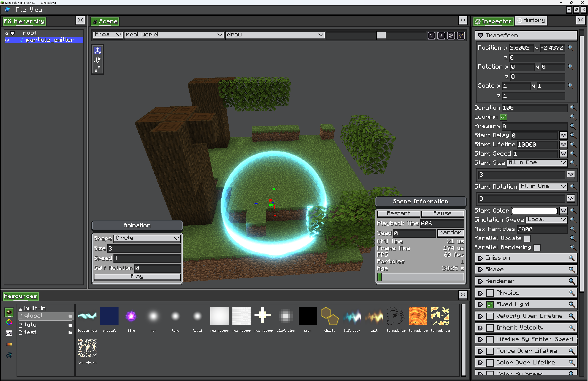
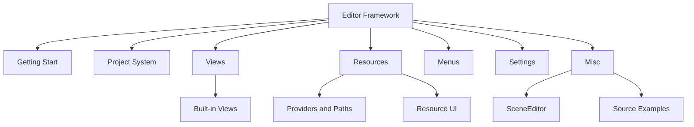
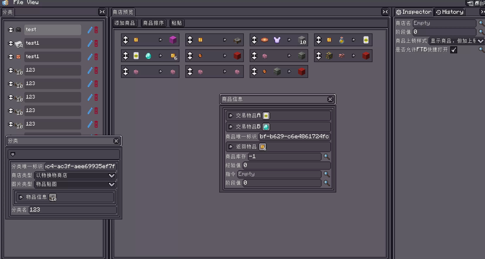

# 介绍

{{ version_badge("2.1.5", label="自", icon="tag") }}

Editor 框架是 LDLib2 用来构建游戏内编辑软件的基础设施。

它不是某一个固定编辑器，而是一组可复用系统：分割面板、可停靠 View、项目文件、资源浏览器、Inspector、撤销历史、设置面板，以及场景编辑器、图编辑器这类专用组件。

LDLib2 内置的 UI Editor 就是基于这套框架实现的。你在自己的编辑器中也可以使用同样的项目系统、资源面板、Inspector、HistoryView 和分割工作区。

<figure markdown="span">
    
    <figcaption>
    基于 Editor 框架构建：UI Editor
    </figcaption>
</figure>

<figure markdown="span">
    
    <figcaption>
    基于 Editor 框架构建：Node Graph Editor
    </figcaption>
</figure>

<figure markdown="span">
    
    <figcaption>
    基于 Editor 框架构建：Photon Editor
    </figcaption>
</figure>

你可以用它制作商店编辑器、可视化脚本编辑器、UI 构建器、节点图编辑器、场景/对象编辑器、资源管理器，或者任何更接近 Unity、Blender、Blockbench、Adobe 这类软件，而不是普通 Minecraft Screen 的游戏内工具。

## 模块

[Getting Start](./getting_start.md){ data-preview } 会创建一个小型编辑器项目，介绍默认 View 区域，并说明如何打开编辑器。

[Project System](./project-system.md){ data-preview } 介绍项目类型、项目生命周期和文件持久化。

[Views](./views/index.md){ data-preview } 介绍 View 系统。[Built-in Views](./views/builtin-views.md){ data-preview } 介绍 Inspector 和 History。

[Resources](./resources/index.md){ data-preview } 介绍资源定义。[Providers and Paths](./resources/providers.md){ data-preview } 介绍资源来源和路径。[Resource UI](./resources/resource-ui.md){ data-preview } 介绍内置资源浏览器。

[Menus](./menus.md){ data-preview } 介绍 File/View 菜单扩展。

[Settings](./settings.md){ data-preview } 介绍持久化编辑器设置。

[Misc](./misc/scene-editor.md){ data-preview } 目前包含 `SceneEditor` 和 [Source Examples](./misc/source-examples.md){ data-preview }。

## 学习参考

学习这套框架最好的方式，是阅读真实编辑器并对比它们的结构。

* `UIEditor`：完整编辑器，包含项目注册和默认资源。
* `UIXmlProject` / `UIXmlProjectType`：将 XML 文本保存为项目文件，而不是默认 NBT。
* `GraphEditorView`：复杂 View，包含 dirty 状态、命令处理、保存按钮和导航。
* `ResourceProviderContainer`：资源面板交互的主要参考。

更多细节见 [Source Examples](./misc/source-examples.md){ data-preview }。

<figure markdown="span">
    
    <figcaption>
    基于 LDLib2 Editor 框架开发的模组：[ViScriptShop](https://github.com/zhenshiz/ViScriptShop)
    </figcaption>
</figure>
