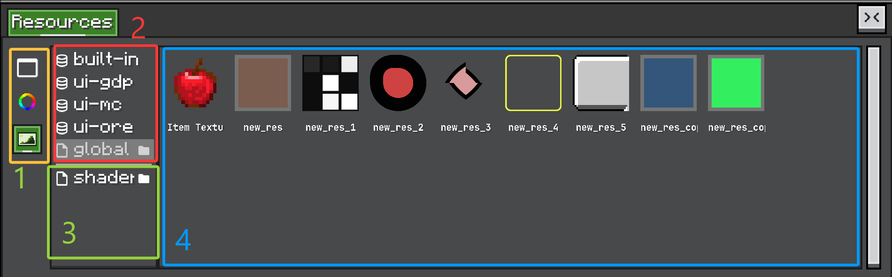

# Resource UI

<figure>

<figcaption>
资源面板组成：资源类型、provider 和 provider contents。
</figcaption>
</figure>

资源面板有四个主要区域：

1. **Resource type tabs**  
   每个 tab 切换到一种 `Resource&lt;?&gt;` 类型，例如 texture、color、UI template，或你的项目自定义资源类型。

2. **Built-in resource providers**  
   由代码注册的 provider。Built-in resource 通常是示例、默认值或内部资产，一般只读。

3. **Additional resource providers**  
   用户或项目额外添加的 provider，例如文件夹资源。这里适合放可编辑的用户资源。

4. **Resource contents**  
   `ResourceProviderContainer` 的内容区域。它显示选中 provider 的资源，并处理选择、编辑、拖拽、复制、重命名和删除。

资源面板由三层组成。

`ResourceView` 是内置编辑器 View。它为每种 `Resource&lt;?&gt;` 创建一个垂直 tab，并保存当前选中的 `ResourceInstance`。

`ResourceContainer&lt;T&gt;` 是某一种资源类型的内容。左侧列出 provider，右侧显示选中 provider 的资源。

`ResourceProviderContainer&lt;T&gt;` 渲染某个 provider 中的资源。

## Provider UI

每个 provider 通过 `IResourceProvider.createProviderToggle()` 提供 toggle。File provider 会添加打开文件夹按钮。Built-in provider 使用只读资源图标。

右键 provider 列表可以创建支持 custom instance 的 `ResourceProviderType`。

## Resource UI

`ResourceProviderContainer` 支持：

* grid 和 list 显示；
* 选择资源；
* 双击编辑；
* 拖拽 payload；
* 复制路径；
* 添加资源；
* 复制资源；
* 重命名资源；
* 删除资源；
* provider 专属右键菜单。

常用 hook：

```java
container.setAddDefault(() -> new ShopEntry());
container.setOnEdit((view, path) -> openShopEntryEditor(path));
container.setOnMenu((view, menu) -> menu.leaf("shop.validate", this::validate));
container.setOnDragProvider(path -> resourceProvider.getResource(path));
```

在资源类型层面自定义：

```java
@Override
public ResourceProviderContainer<ShopEntry> createResourceProviderContainer(IResourceProvider<ShopEntry> provider) {
    return new ResourceProviderContainer<>(provider)
            .setAddDefault(ShopEntry::new)
            .setOnEdit((container, path) -> edit(container, path));
}
```

资源编辑通常应该走 `HistoryView`，这样 undo / redo 能和其他编辑器操作保持一致。

## 自定义显示

使用 `setUiSupplier(...)` 渲染每个资源项。

```java
@Override
public ResourceProviderContainer<ShopEntry> createResourceProviderContainer(IResourceProvider<ShopEntry> provider) {
    return super.createResourceProviderContainer(provider)
            .setAddDefault(ShopEntry::new)
            .setUiSupplier(path -> {
                var entry = provider.getResource(path);
                return new UIElement()
                        .layout(layout -> {
                            layout.widthPercent(100);
                            layout.heightPercent(100);
                        })
                        .addChild(new Label().setText(entry == null ? "missing" : entry.displayName()));
            });
}
```

`ColorsResource` 用它绘制颜色矩形。`TexturesResource` 用它绘制纹理本身。

## 自定义编辑

使用 `setOnEdit(...)` 处理双击编辑或右键菜单编辑。

```java
.setOnEdit((container, path) -> {
    var entry = provider.getResource(path);
    if (entry == null) return;

    container.getEditor().inspectorView.inspect(entry, configurator -> {
        container.markResourceDirty(path);
    });
})
```

如果编辑会替换资源值，推入 history action：

```java
container.getEditor().historyView.pushHistory(
        Component.translatable("shop.edit_entry"),
        EditAction.of(
                () -> {
                    provider.addResource(path, newEntry);
                    container.reloadSpecificResource(path);
                },
                () -> {
                    provider.addResource(path, oldEntry);
                    container.reloadSpecificResource(path);
                }
        )
);
```

## 自定义拖拽

当拖拽资源时需要提供非原始资源值的对象，使用 `setOnDragProvider(...)`。

```java
.setOnDragProvider(path -> new ShopEntryReference(path))
```

`TexturesResource` 使用这个模式拖拽 `UIResourceTexture` 引用，而不是直接拖拽 texture 对象。

## 自定义右键菜单

使用 `setOnMenu(...)` 添加资源专属命令。

```java
.setOnMenu((container, menu) -> {
    if (container.getSelected() != null) {
        menu.branch("shop.copy", branch -> {
            branch.leaf("shop.copy_path", () ->
                    ClipboardManager.INSTANCE.copyDirect(container.getSelected().getPathWithType()));
            branch.leaf("shop.copy_id", () ->
                    ClipboardManager.INSTANCE.copyDirect(container.getSelected().getResourceName()));
        });
    }
})
```

如果行为属于资源类型本身，放在 `Resource&lt;T&gt;` 子类里。若行为取决于资源来源，则使用 provider hook。
