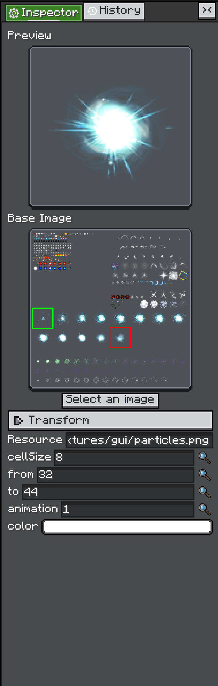

# Built-in Views

`Editor` 自带一些大多数编辑器都会复用的 View。

## InspectorView

`InspectorView` 包装了 LDLib2 的 `Inspector` 组件，默认放在右侧面板。

<figure>

<figcaption>
Inspector 正在编辑一个 &lt;code&gt;AnimationTexture&lt;/code&gt;。
</figcaption>
</figure>

当当前选中对象需要暴露可编辑属性时，使用它：

```java
editor.inspectorView.inspect(selectedObject);
```

被 inspect 的对象可以是任意 `IConfigurable` 对象。Inspector 会让该对象构建 configurators，然后将这些 configurators 显示为可编辑 UI。

完整重载允许监听 configurator、关闭时清理，并提供 history action：

```java
editor.inspectorView.inspect(
        selectedObject,
        configurator -> {},
        () -> clearSelection(),
        () -> editor.historyView.pushHistory(name, action)
);
```

Inspector 已经共享 Editor 的 `HistoryView`，因此属性修改可以参与 undo / redo。

本页只介绍如何在编辑器中使用 Inspector。Configurable / Configurator 系统见 [Configurable](../../configurable/index.md)。

## HistoryView

`HistoryView` 是 Editor 默认的 undo / redo 栈。它本身也是一个可见 View，因此用户可以跳转到历史记录点。

记录一个修改：

```java
editor.historyView.pushHistory(
        Component.translatable("shop.rename_entry"),
        EditAction.of(
                () -> entry.setName(newName),
                () -> entry.setName(oldName)
        )
);
```

如果 `execute` 为 true，action 会立即执行。如果为 false，则只记录。

当 history item 使用相同 source 和 name 时，可以合并。这适合来自同一个 configurator 或文本输入框的连续编辑。

`HistoryView` 监听：

* `CommandEvents.UNDO`
* `CommandEvents.REDO`

`Editor` 会处理当前项目的 `CommandEvents.SAVE`。`GraphEditorView` 是自定义 View 处理内部 undo / redo 栈的参考。
