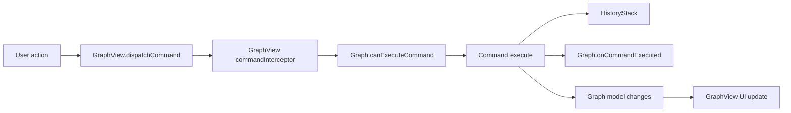

# 命令与自定义

NGT 的编辑是命令驱动的。当一个变更需要参与 undo、redo、模型变更追踪和 UI 刷新时，使用 commands。

## Command Flow



当策略属于图类型时，使用 graph-level hooks：

```java
@Override
public boolean canExecuteCommand(IGraphCommand command) {
    return !(command instanceof GraphCommands.DeleteElementsCommand);
}
```

当只需要拦截某个编辑器实例时，使用 view-level interception：

```java
graphView.setCommandInterceptor(command -> allowEditMode);
```

两者都必须允许命令执行。

## Command Listeners

当 UI 或工具行为需要在命令运行后响应时，使用 listeners。

```java
graphView.addCommandListener((view, graphModel, command) -> {
    refreshCustomPanel();
});
```

当响应逻辑属于图定义本身时，使用 `Graph.onCommandExecuted(...)`。

## Capabilities

图元素模型使用 capabilities 控制用户操作。

常见 capabilities：

| Capability | 效果 |
| ---------- | ---- |
| `MOVABLE` | 可以在画布上移动。 |
| `DELETABLE` | 可以删除。 |
| `COPIABLE` | 可以复制和粘贴。 |
| `RENAMABLE` | 可以重命名。 |
| `COLORABLE` | 可以使用颜色选择操作。 |
| `COLLAPSIBLE` | 可以折叠。 |
| `RESIZABLE` | 可以调整大小。 |
| `NEEDS_CONTAINER` | 必须位于容器中，block nodes 使用。 |

当规则适用于某一个元素时，优先使用 capabilities。当规则取决于整条命令时，优先使用 command veto。

## Diagnostics

使用 `GraphLogger` 在 footer 中显示图校验信息。

```java
@Override
public void onGraphChanged(GraphLogger logger) {
    if (hasMissingOutput()) {
        logger.error(Component.literal("Output is not connected"));
    }
}
```

支持的消息类型是 info、warning 和 error。

## Extra Elements

NGT 不只有 nodes 和 wires：

* placemats：用于可视化分组图区域，
* sticky notes：放在图画布上的注释，
* wire portals：通过命名 entry/exit portal 路由连线，
* graph panels：用于停靠工具，
* graph preview：用于自定义预览 UI。

这些元素都是普通图模型，并在其 capabilities 支持的范围内参与序列化和选择。

## Custom UI

常见自定义点：

| 目标 | 用途 |
| ---- | ---- |
| `GraphResource.getGraphViewFactory()` | 使用自定义 `GraphView` 子类。 |
| `GraphView.setLayers(...)` | 修改画布 layer 顺序。 |
| `Node.getNodeIcon()` | 自定义节点图标。 |
| `Node.getNodeWidth()` | 最小节点宽度。 |
| `Node.hasNodePreview()` | 添加节点预览面板。 |
| `IPortBuilder.withConnectorUI(...)` | 自定义端口连接点视觉。 |
| `IOptionBuilder.withConfigurable(...)` | 自定义 option 编辑器。 |
| `IInputPortBuilder.withConfigurable(...)` | 自定义输入常量编辑器。 |
