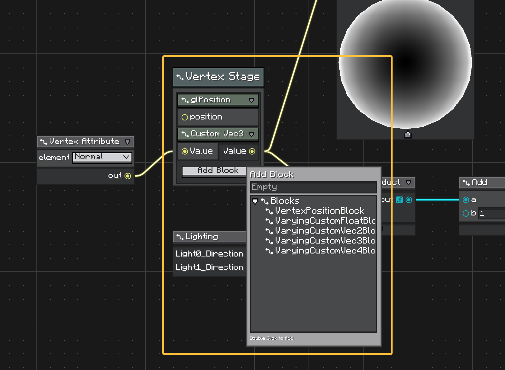

# Context 和 Block 节点

Context nodes 持有有序 block nodes。

当一个图元素需要全局设置，同时又需要一个可配置的子操作列表时使用它。它适合 shader stage、render pass、状态定义、规则组、子句，或者任何更适合编辑成一小组可组合 block，而不是散落成多个顶层节点的结构。

<figure markdown="span">
    
    <figcaption>
    Shader 风格的 context node。这个 context 表示 vertex shader stage，它的 blocks 配置该 stage 的不同部分。
    </figcaption>
</figure>

## 关系

Context node 是容器。它可以有自己的标题、options、输入端口和输出端口，并拥有一个垂直 block 列表。

Block node 是该列表里的子节点。它也可以有 options 和端口，但它不是顶层画布节点。它不能脱离兼容的 context 单独放置。

可以这样划分职责：

| 部分 | 用途 |
| ---- | ---- |
| Context node | 全局设置、stage 级配置、公共输入/输出，以及 block 列表所有权。 |
| Block node | Context 内部的一个有序操作、子句、状态或可配置片段。 |

例如 shader graph 可以用 `Vertex Shader` context 表示 stage 设置，再用 blocks 表示 vertex position、normal、UV、color 或其他 stage-specific 输出。

## 编辑 Blocks

当 context 至少接受一种 block 类型时，context UI 会显示 Add Block 按钮。

添加 block 会打开只显示兼容 blocks 的 Item Library。Blocks 显示在 context node 内部，并且可以在 block 列表中重新排序。

Blocks 仍然可以参与图连线。它们的端口会注册到 graph 中，因此即使 block 在视觉上嵌套在 context 内，连线仍然可以连接到 block 端口。

## Context Node

Context node 继承 `ContextNode`。

```java
@NodeAttribute(name = "vertex_shader", group = "shader", graphTypes = {ShaderGraph.class})
public class VertexShaderContext extends ContextNode {
    @Override
    public Component getDisplayName() {
        return Component.literal("Vertex Shader");
    }

    @Override
    public void onDefineOptions(IOptionDefinitionContext context) {
        context.addOption("target", ShaderTarget.class)
                .withDefaultValue(ShaderTarget.VERTEX);
    }

    @Override
    public void onDefinePorts(IPortDefinitionContext context) {
        context.addInputPort("time", Float.class).build();
        context.addOutputPort("position", Vec3.class).build();
    }
}
```

Context options 用于作用于整个组的设置。在 shader graph 中，这可以是 shader stage、target、render state 或其他 stage-level 数据。

Context ports 用于被整组行为共享的值，或者从该组暴露出去的值。

Context 也提供只读 block 访问：

```java
int count = contextNode.getBlockCount();
IBlockNode block = contextNode.getBlock(0);
List<? extends IBlockNode> blocks = contextNode.getBlocks();
```

## Block Node

Block node 继承 `BlockNode`。

```java
@UseWithContext({VertexShaderContext.class})
@NodeAttribute(name = "vertex_position", group = "shader/vertex", graphTypes = {ShaderGraph.class})
public class VertexPositionBlock extends BlockNode {
    @Override
    public Component getDisplayName() {
        return Component.literal("Position");
    }

    @Override
    public void onDefinePorts(IPortDefinitionContext context) {
        context.addInputPort("position", Vec3.class).build();
    }
}
```

从定义角度看，blocks 像普通节点一样工作：它们可以定义 options、ports、preview 和逻辑。区别在所有权。一个 block 属于一个 context，在该 context 内有 index，并且作为 context node 的一部分序列化。

```java
IContextNode parent = blockNode.getContextNode();
int index = blockNode.getIndex();
```

## 兼容性

默认 context 行为会从 `@UseWithContext` 发现兼容 blocks。

```java
@UseWithContext({MyContextNode.class})
public class MyBlockNode extends BlockNode {
}
```

当兼容性需要显式或动态控制时，覆盖 `getSupportBlocks()`：

```java
@Override
public List<Class<? extends BlockNode>> getSupportBlocks() {
    return List.of(MyBlockNode.class);
}
```

`ContextNode.acceptsBlock(...)` 会先检查 `@UseWithContext`，再检查 `getSupportBlocks()`。

## 顺序和生命周期

`ContextNodeModel` 拥有 block 插入、删除、移动、序列化和级联删除。

Block 变更会在父 context 上发出 graph topology change。Block UI 会在 context element 内部重建，而不是作为顶层画布元素创建。

这会影响 copy、paste、序列化和连线：

* blocks 作为 context node 的一部分序列化，
* 删除 context 会删除它的 blocks，
* 移除 block 会断开它的连线，
* block ports 仍会注册用于 wire lookup，
* graph-wide node iteration 会跳过 blocks。

当元素应该独立显示在画布上时，使用普通 nodes。当组合应当作为另一个图复用时，使用 subgraphs。当组合是一个带有有序可编辑部分的概念节点时，使用 context/block nodes。
