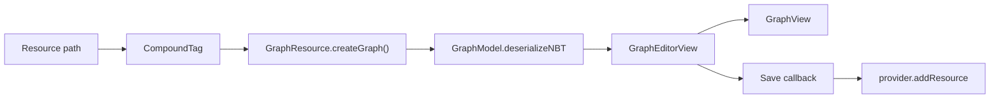

# 编辑器资源

当图需要作为 LDLib2 Editor 资源编辑时，使用 `GraphResource`。

这是用户编写图资产时推荐的设置。它为图提供资源面板入口、默认 NBT 资源形状、`GraphEditorView`、保存处理、子图 dive 和外部子图解析。

## 定义 Graph Resource

```java
public class TestGraphResource extends GraphResource<TestGraph> {
    public static final TestGraphResource INSTANCE = new TestGraphResource();

    @Override
    public TestGraph createGraph() {
        return new TestGraph();
    }
}
```

`GraphResource` 将图数据存为 `CompoundTag`。新资源由 `createGraph().graphModel.serializeNBT(...)` 创建。

## 添加到项目

从你的 editor project 暴露图资源：

```java
private final Resources resources = Resources.of(
        TestGraphResource.INSTANCE
);

@Override
public Resources getResources() {
    return resources;
}
```

Editor 资源面板会使用 `GraphResourceProviderContainer`。

## 打开和保存

`GraphResourceProviderContainer` 会为图资源打开一个 `GraphEditorView`。

编辑器流程是：



`GraphEditorView` 通过比较序列化后的 graph NBT 和已保存快照来追踪 dirty 状态。

保存按钮会通过资源容器提供的回调，把当前图写回去。

`GraphEditorView` 也负责子图导航。当用户进入子图时，它通过同一个 factory 创建另一个 `GraphView`，更新面包屑，并保留根编辑器保存流程。

## 自定义 GraphView Factory

覆盖 `getGraphViewFactory()` 来使用自定义 `GraphView` 子类。

```java
@Override
public Supplier<? extends GraphView> getGraphViewFactory() {
    return MyGraphView::new;
}
```

该 factory 会用于根图 view 和子图 dive view。

## 外部子图解析

当图从资源打开时，容器会在 graph model 上安装 `IGraphReferenceResolver`。

Resolver 可以：

* 将被引用的图资源路径解析为新的 `Graph`，
* 通过 dive-in view 编辑外部子图时保存它，
* 标识来源 `GraphResource`。

外部子图节点需要它来从被引用图中重建端口形状。

图资源也可以从资源面板拖拽到已打开图的画布上。`GraphView` 会把拖入资源导入为一个 external subgraph node，并存储资源路径。见 [Subgraphs](./subgraphs.md#import-external-subgraphs-from-resources)。
