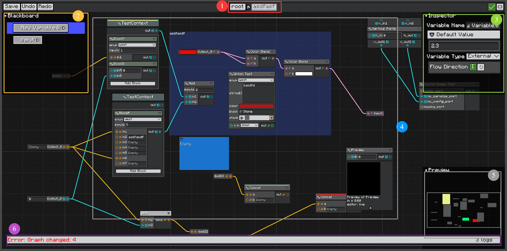

# 快速开始

本页创建一个最小可用的图：一个图定义、几个节点类，以及一个显示该图的 `GraphEditorView`。

示例对应测试源码中的 `com.lowdragmc.lowdraglib2.test.noddegraphtoolkit`。

## 创建图类型

图类型继承 `Graph`。大多数图类型使用 `GraphNodeRegistry`，这样带有注解的节点类可以自动被发现。

```java
public class TestGraph extends Graph {
    public static final GraphNodeRegistry NODE_REGISTRY =
            GraphNodeRegistry.create(LDLib2.id("test_graph"), TestGraph.class);

    @Override
    public List<Class<? extends Node>> getSupportNodes() {
        return NODE_REGISTRY.getNodeClasses();
    }

    @Override
    public @Nullable List<TypeHandle> getSupportTypes() {
        var types = new HashSet<>(CustomGraphModelImpl.detectSupportedTypes(graphModel));
        types.add(TypeHandles.FLOAT);
        types.add(TypeHandles.STRING);
        types.add(TypeHandles.BOOL);
        return List.copyOf(types);
    }
}
```

`getSupportNodes()` 控制图中可以创建哪些节点类。

`getSupportTypes()` 控制常量节点和变量类型。返回 `null` 时，LDLib2 会从已注册节点的端口中自动检测类型。

## 创建节点

普通节点继承 `Node`，并使用 `@NodeAttribute` 注册。

```java
@NodeAttribute(name = "test_concat", group = "test", graphTypes = {TestGraph.class})
public class TestStringConcatNode extends Node {
    @Override
    public Component getDisplayName() {
        return Component.literal("Concat");
    }

    @Override
    public void onDefinePorts(IPortDefinitionContext context) {
        context.addInputPort("a", String.class).build();
        context.addInputPort("b", String.class).build();
        context.addOutputPort("out", String.class).build();
    }
}
```

`name` 是图工具包内部使用的节点 id。`group` 用于 Item Library 分组。`graphTypes` 将节点绑定到图类型。

## 创建图实例

使用 `graph.graphModel` 创建变量、节点和连线。

```java
public static Graph createTestGraph() {
    var graph = new TestGraph();

    graph.graphModel.createVariable("test_v", Float.class, 10f, null);

    graph.graphModel.createNodeModel(new TestStringConcatNode(), new Vector2f(200, 200));
    var constant = graph.graphModel.createNodeModel(new TestConstantNode(), new Vector2f(0));
    var add = graph.graphModel.createNodeModel(new TestAddNode(), new Vector2f(150));

    graph.graphModel.createWire(
            constant.getOutputsById().get("out"),
            add.getInputsById().get("in2")
    );

    return graph;
}
```

连线从输出端口连接到输入端口。兼容性会检查端口方向、端口类型、容量和 Java 类型可赋值关系。

## 在编辑器 View 中显示

普通图编辑 UI 推荐使用 `GraphEditorView`。

它包装 `GraphView`，并提供大多数图工具都需要的功能：保存、dirty 状态、面包屑路径、子图 dive、外部子图保存支持，以及嵌套图层级的一致 `GraphView` 创建流程。

```java
var editorView = new GraphEditorView();
editorView.loadGraph(createTestGraph(), savedTag -> {
    // 将 savedTag 持久化到项目、资源或 screen 状态。
});
```

添加到 LDLib2 `Editor` 工作区：

```java
placeView(editorView, () -> centerWindow.getLeftTop());
```

或者在简单的 `ModularUI` 中使用：

```java
var editorView = new GraphEditorView();
editorView.layout(layout -> {
    layout.widthPercent(100);
    layout.heightPercent(100);
});
editorView.loadGraph(createTestGraph(), savedTag -> {});

return new ModularUI(UI.of(editorView), player);
```

<figure>

<figcaption>
带有内置图工具的 &lt;code&gt;GraphEditorView&lt;/code&gt;。
</figcaption>
</figure>

## 编辑器布局

截图中标记的区域是：

1. **子图面包屑路径**  
   显示当前图路径。用它判断当前正在编辑根图还是嵌套子图。见 [Subgraphs](./subgraphs.md)。

2. **Blackboard**  
   定义图变量。变量可以只在当前图内部使用，也可以暴露为子图输入/输出端口。见 [Variables and Blackboard](./variables-and-blackboard.md)。

3. **Inspector**  
   显示选中对象的设置，例如变量、节点、端口、Placemat 或 Sticky Note。

4. **主视图**  
   显示图节点、连线、Placemat、Sticky Note、Portal 和子图节点。这是主要编辑画布。

5. **Preview**  
   显示图布局预览 / LOD 缩略图，便于浏览大型图。

6. **Graph log**  
   显示 `Graph.onGraphChanged(GraphLogger)` 输出的图诊断信息，例如错误、警告和普通提示。见 [GraphView Diagnostics Footer](./graph-view.md#diagnostics-footer) 和 [Graph Definition](./graph-definition.md#graph-hooks)。

## 底层 GraphView

`GraphView` 仍然可以直接用于小型嵌入式视图或测试：

```java
var graphView = new GraphView();
graphView.loadGraph(createTestGraph());
```

不要把直接使用 `GraphView` 作为默认编辑器入口。它不提供完整的 `GraphEditorView` 工作流，包括子图 dive 和资源级外部子图编辑。

对于基于资源的图资产，使用 `GraphResource`，这样 Editor 会自动打开 `GraphEditorView`。见 [Editor Resources](./editor-resources.md)。
