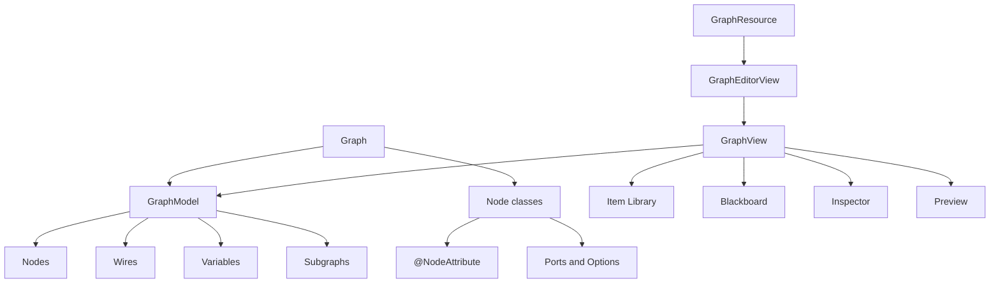

# 节点图工具包

Node Graph Toolkit 是 LDLib2 用来构建游戏内图编辑器的框架。

它提供图数据模型、节点和端口定义、连线、变量、子图、Blackboard、编辑器面板、可撤销命令，以及基于资源系统的图编辑流程。

<figure>

<figcaption>
Node Graph Toolkit 概览。
</figcaption>
</figure>

## 主要组成

`Graph` 是面向使用者的图定义。它决定支持哪些节点类和类型。

`GraphModel` 保存实际的图状态：节点、端口、连线、变量、子图、Placemat、Sticky Note，以及变更追踪。

`GraphEditorView` 是推荐的编辑器 UI 入口。它包装 `GraphView`，并提供保存、dirty 状态、面包屑路径和子图 dive 支持。

`GraphView` 是更底层的图画布和面板宿主。只有在嵌入式 UI 或测试 UI 不需要完整编辑器流程时，才建议直接使用它。

`GraphResource` 将图资源接入 LDLib2 Editor 的资源系统。

## 章节

[Getting Started](./getting-started.md) 创建一个小型图，并通过 `GraphEditorView` 打开。

[Graph Definition](./graph-definition.md) 介绍 `Graph`、`GraphNodeRegistry`、支持的节点、支持的类型和校验 hook。

[Nodes and Ports](./nodes-and-ports.md) 介绍 `Node`、节点 options、输入/输出端口、端口方向和预览。

[Variables and Blackboard](./variables-and-blackboard.md) 介绍图变量、Blackboard、变量 Inspector，以及子图输入/输出端口。

[Type Handles](./type-handles.md) 介绍 `TypeHandle`、内置类型、自定义类型注册、常量、默认值、图标、颜色和 configurator。

[GraphView](./graph-view.md) 介绍 `GraphEditorView` 内部使用的底层图 UI。

[Editor Resources](./editor-resources.md) 介绍 `GraphResource`、`GraphEditorView`、保存回调和资源面板编辑。

[Subgraphs](./subgraphs.md) 介绍本地子图和外部子图。

[Context and Block Nodes](./context-and-block-nodes.md) 介绍拥有有序 block 列表的 context node。

[Commands and Customization](./commands-and-customization.md) 介绍命令拦截、capability、诊断信息和 UI 自定义点。

[Glossary](./glossary.md) 定义常用模型和 UI 术语。
