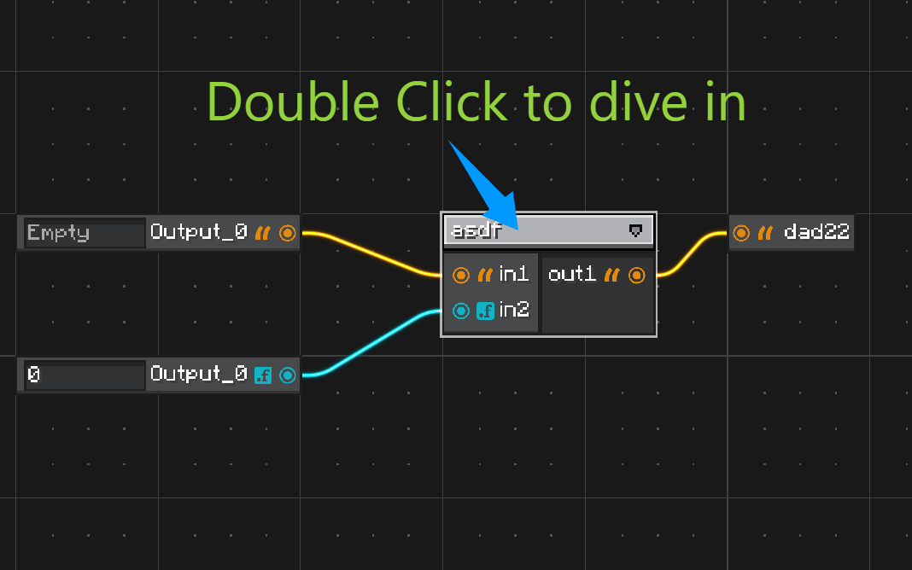
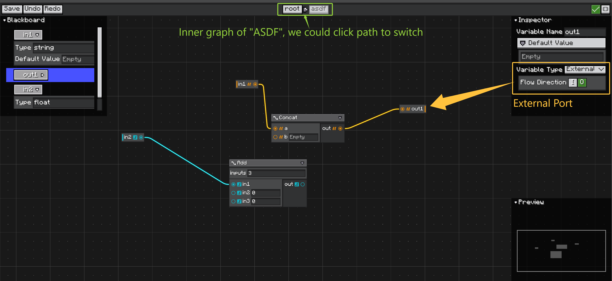
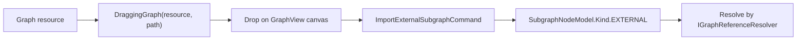

# 子图

子图节点表示当前图内部的另一个图。

子图节点的端口由内部图的暴露变量生成。

<figure markdown="span">
    
    <figcaption>
    父图中的子图节点。双击节点可以 dive into，进入内部图。
    </figcaption>
</figure>

当用户需要进入子图时，使用 `GraphEditorView`。双击动作由子图节点元素处理，并请求最近的 `GraphEditorView` 将内部图作为新的面包屑层级打开。

<figure markdown="span">
    
    <figcaption>
    子图内部。使用暴露变量定义子图节点端口，并通过面包屑路径返回父图。
    </figcaption>
</figure>

在子图内部，不直接编辑子图节点上的端口。应该在 Blackboard 中定义变量，然后在 Inspector 中设置它们的 flow direction：

* `Input` 会在面向父图的子图节点上创建输入端口。
* `Output` 会在面向父图的子图节点上创建输出端口。
* `Input + Output` 会创建两个方向的端口。

准确的方向映射见 [Variables and Blackboard](./variables-and-blackboard.md#direction-and-subgraph-ports){ data-preview }。

## 本地子图

本地子图以内联方式存储在父图中。

`SubgraphNodeModel.Kind.LOCAL` 通过 UID 指向父模型 `localSubGraphs` 列表中的某个图。

当内部图只属于该父图时，使用本地子图。

## 外部子图

外部子图指向一个 `IResourcePath`。

`SubgraphNodeModel.Kind.EXTERNAL` 通过 `GraphModel.getReferenceResolver()` 解析。

在编辑器上下文之外，resolver 可能为 `null`。这种情况下，子图节点会复用缓存的端口形状，让已有连线能保留下来。

## 从资源导入外部子图 { #import-external-subgraphs-from-resources }

对于基于资源的图资产，可以从 editor resource panel 把图资源拖到图画布上。

编辑器流程是：



`GraphResourceProviderContainer` 会保留被拖拽资源的路径，因此放下后的节点会存储稳定的外部引用，而不是复制图 NBT。

以下情况会拒绝 drop：

* 图不允许创建子图，
* 资源被拖放到图内容区域之外，
* 资源路径与当前打开的根图相同，
* 资源属于另一个图类型，并且宿主图没有通过 `acceptsSubgraphGraph(...)` 接受它。

导入后，该节点和其他子图节点一样使用。双击它可以编辑被引用的图。通过 dive-in view 编辑外部子图时，`GraphEditorView` 会通过 reference resolver 保存该层级，`SubgraphRegistry` 会刷新其他引用同一资源的已打开图。

## 变量端口

子图节点端口由内部图的变量生成：

| 内部变量 | 外部子图节点 |
| -------- | ------------ |
| `VariableKind.INPUT` | 输入端口。 |
| `VariableKind.OUTPUT` | 输出端口。 |

`READ_WRITE` 变量会用带后缀的端口 id 创建两个方向。

使用这个 graph hook 限制可暴露的变量方向：

```java
@Override
public Set<VariableKind> getSupportedSubgraphVariableKinds() {
    return Set.of(VariableKind.INPUT, VariableKind.OUTPUT);
}
```

返回空集合可以禁用基于变量的子图端口。

## 跨类型子图

默认允许同类型本地子图。

跨类型子图需要宿主图显式允许：

```java
@Override
public boolean acceptsSubgraphGraph(Graph other) {
    return other instanceof MaterialGraph;
}
```

这同时适用于导入的外部引用和外来本地子图。

## 外部保存广播

当外部图资源被保存时，`SubgraphRegistry` 会广播事件。

订阅者包括：

* 需要重新定义子图节点端口的根 `GraphModel` 实例，
* 可能需要重新加载或刷新已打开图 view 的编辑器监听器。

`GraphEditorView` 会在图加载时注册，在清理时注销。
