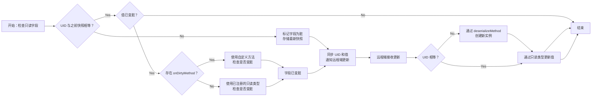

# 注解
{{ version_badge("2.1.0", label="自", icon="tag") }}

本页面展示所有注解及其使用方法。

!!! note "LDLib Dev Tool"
    { width="60%" align=right}

    如果您计划使用 LDLib2 进行开发，我们强烈建议您安装我们的 IDEA 插件 [LDLib Dev Tool](https://plugins.jetbrains.com/plugin/28032-ldlib-dev-tool)。
    该插件具备以下功能：

    - 代码高亮
    - 语法检查
    - 代码跳转
    - 自动补全
    - 其他功能
    
    这些功能将极大地帮助您使用 LDLib2 的各项特性。特别是，所有 LDLib2 的注解都已得到支持。

## 通用注解

### `@DescSynced`
用于注解一个字段，该字段的值（服务端）将被同步到客户端（具体来说，是 `remote`）

``` java
@DescSynced
int a;

@DescSynced
private ItemStack b = ItemStack.EMPTY;

@DescSynced
private List<ResourceLocation> c = new ArrayList<>();
```

---

### `@Persisted`
用于注解一个字段，该字段的值（服务端）将被写入/读取自 BlockEntity 的 nbt。

`String key()` 表示 nbt 中的标签名称。默认使用字段名。

``` java
@Persisted(key = "fluidAmount")
int value = 100;
@Persisted
boolean isWater = true;
```

其 nbt/json 格式如下：
```json
{
  "fluidAmount": 100,
  "isWater": true
}
```

`boolean subPersisted()` 如果为 true，它将基于其 `non-null` 实例包装字段的内部值。

这对于不允许创建新实例的 `final` 实例非常有用。如果字段设置了 `subPersisted = true`，LDLib2 将执行以下操作：

- 如果字段继承自 `INBTSerializable<?>`，它将尝试使用其 API 进行序列化。
- 否则，它将序列化字段的内部值并将其包装为 map。

```java
@Persisted(subPersisted = true) // 这里使用 @Persisted 也可以，因为 INBTSerializable 同样作为只读字段被支持。
private final INBTSerializable<CompoundTag> stackHandler = new ItemStackHandler(5);
@Persisted(subPersisted = true)
private final TestContainer testContainer = new TestContainer();

public static class TestContainer {
    @Persisted
    private Vector3f vector3fValue = new Vector3f(0, 0, 0);
    @Persisted
    private int[] intArray = new int[]{1, 2, 3};
}
```

其 nbt/json 格式如下：
```json
{
    "stackHandler": {
        "Size": 5,
        "Items": [],
    },
    "testContainer": {
        "vector3fValue": [0, 0, 0],
        "intArray": [1, 2, 3],
    }
}
```

---

### `@LazyManaged`
一个将字段标记为延迟管理的注解。这意味着该字段只会被手动标记为脏（dirty），而非自动标记。
此注解适用于不经常更新的字段，或批量更新的字段。

``` java
@DescSynced
@Persisted
int a;

@DescSynced 
@Persisted
@LazyManaged
int b;

public void setA(int value) {
    this.a = value;  // 通常情况下会自动同步/持久化
}

public void setB(int value) {
    this.b = value;
    markDirty("b"); // 手动通知已更改
}
```

---

### `@ReadOnlyManaged`
此注解用于标记由用户管理的只读字段。

`read-only` 类型（例如 `IManaged` 和 `INBTSerializable<?>`）要求字段非空且字段实例不会改变（final 字段）。

!!! note "什么是 `read-only` 类型？"
    `read-only` 类型指的是始终非空且不可变的字段，并且不确定如何创建该类型的新实例。更多详情可在 [类型支持](./types_support.md){ data-preview } 中找到。

因为我们不知道如何为这些类型创建新实例。在这种情况下，您可以使用此注解并提供方法来：
通过 `serializeMethod()` 从服务端存储一个唯一 id，并通过 `deserializeMethod()` 在客户端创建一个新实例。
 
此外，您可以提供一个方法来自行控制字段是否已更改，使用 `onDirtyMethod()`。

- `onDirtyMethod`：指定一个用于自定义脏检查的方法。返回是否已更改。
    ```java
    boolean methodName();
    ```
- `serializeMethod`：返回给定实例的唯一 id（`Tag`）。
    ```java
    Tag methodName(@Nonnull T obj);
    ```
- `deserializeMethod`：通过给定的 uid 创建一个实例。
    ```java
    T methodName(@Nonnull Tag tag)
    ```

同步流程（持久化类似）



1. 为了检查 `read-only` 字段是否有内部更改，LDLib2 首先会检查唯一 id 是否与之前的快照相等。
    - 如果 `不相等`，将此字段标记为脏，并存储最新快照。
    - 如果 `相等`，进入第 2 步。
2. 检查与之前的快照相比，值是否已脏。
    - 如果未设置 `onDirtyMethod`，LDLib2 将根据已注册的 `read-only` 类型检查是否脏。
    - 如果为 `true`，使用自定义方法检查是否脏。
3. 如果字段已脏。LDLib2 将同步 uid 和值数据，并要求远程（客户端）更新值。
4. 当远程收到更改时，它会首先检查 uid。
    - 如果不相等，首先基于 `deserializeMethod` 创建一个新实例。
    - 然后基于已注册的 `read-only` 类型更新值。

示例

```java
@Persisted
@DescSynced
@ReadOnlyManaged(serializeMethod = "testGroupSerialize", deserializeMethod = "testGroupDeserialize")
private final List<TestGroup> groupList = new ArrayList<>();

public static class TestGroup implements IPersistedSerializable {
    @Persisted
    private Range rangeValue = Range.of(0, 1);
    @Persisted
    private Direction enumValue = Direction.NORTH;
    @Persisted
    private Vector3i vector3iValue = new Vector3i(0, 0, 0);
}

public IntTag testGroupSerialize(List<TestGroup> groups) {
    return IntTag.valueOf(groups.size());
}

public List<TestGroup> testGroupDeserialize(IntTag tag) {
    var groups = new ArrayList<TestGroup>();
    for (int i = 0; i < tag.getAsInt(); i++) {
        groups.add(new TestGroup());
    }
    return groups;
}
```
!!! note
    在这个示例中，`onDirtyMethod` 是不必要的。因为 `TestGroup` 继承自 `IPersistedSerializable`，而 `IPersistedSerializable` 又继承自 `INBTSerializable<?>`。因此，它是一个受支持的 `read-only` 类型。

---

### `@RPCMethod`
用于注解一个方法，您可以在服务端和远程端之间发送 RPC 数据包。只要参数支持同步，您就可以自由定义方法的参数，并在类中的任何位置发送 rpc。
这对于传播事件（`c->s` / `s->c`）非常有用。
!!! note
    如果 `RPCSender` 被定义为方法的第一个参数。LDLib2 将提供发送者信息。

确保所有参数与注解方法的参数匹配。

```java
@RPCMethod
public void rpcTestA(RPCSender sender, String message) {
    if (sender.isServer()) {
        LDLib2.LOGGER.info("Received RPC from server: {}", message);
    } else {
        LDLib2.LOGGER.info("Received RPC from client: {}", message);
    }
}

@RPCMethod
public void rpcTestB(ItemStack item) {
    LDLib2.LOGGER.info("Received RPC: {}", item);
}

// 发送 rpc 的方法
public void sendMsgToPlayer(ServerPlayer player, String msg) {
    rpcToServer(player, "rpcTestA", msg)
}

public void sendMsgToAllTrackingPlayers(ServerPlayer player, String msg) {
    rpcToTracking("rpcTestA", msg)
}

public void sendMsgToServer(ItemStack item) {
    rpcToServer("rpcTestB", item)
}
```

* `rpcToTracking`：如果此区块在其远程端已加载（被跟踪），则发送给所有远程玩家。
* `rpcToPlayer`：发送给特定玩家
* `rpcToServer`：发送给服务端。

```java
@RPCMethod
public void rpcTest(String msg) {
    if (level.isClient) { // 接收 
        LDLib2.LOGGER.info("Received RPC from server: {}", message);
    } else { // 发送
        rpcToTracking("rpcTest", msg)
    }
}
```
在这个示例中，您可以在一个方法中发送和接收消息，这是一个非常简洁的方法。

---

### `@UpdateListener`
使用此注解在远程端添加同步接收监听器。

指定当注解字段从服务端更新时（远程端）要调用的方法名称。

第一个参数是旧值，第二个参数是新值。

```java
@DescSynced
@UpdateListener(methodName = "onIntValueChanged")
private int intValue = 10;

private void onIntValueChanged(int oldValue, int newValue) {
    LDLib2.LOGGER.info("Int value changed from {} to {}", oldValue, newValue);
}
```

---

### `@ConditionalSynced`
通常情况下，所有带有 `@DescSynced` 注解的字段如果发生更改都会被同步。
然而，您可能希望控制是否同步，例如条件同步。

LDLib2 提供了此注解，允许您精细控制字段是否应该被同步。

```java
@Configurable
@ConditionalSynced(methodName = "shouldSync")
int intField = 10;

public boolean shouldSync(int value) {
    return value > 0;
}
```

---

### `@SkipPersistedValue`
通常情况下，所有带有 `@Persisted` 注解的字段都会在持久化期间被序列化。
然而，您可能希望跳过序列化，例如减小输出大小，跳过未更改的值等。

LDLib2 提供了此注解，允许您精细控制字段是否应该被序列化。

```java
@Persisted
int intField = 10;

@SkipPersistedValue(field = "intField")
public boolean skipIntFieldPersisted(int value) {
    // 10 是该类的初始值，没有必要存储它。
    return value == 10;
}
```

---

## BlockEntity 专属
!!! note
    这些注解专为 `BlockEntity` 设计，在使用它们之前请先查看 [管理 BlockEntity](./blockentity.md){ data-preview }。

### `@DropSaved`
有时，您希望在破坏方块时将字段值存储到掉落物品中。
此注解用于标记要保存到掉落物品的字段。但是，在使用它之前还需要额外的代码工作。
```java
public class MyBlock extends Block {
    @Override
    public void setPlacedBy(Level level, BlockPos pos, BlockState state, @Nullable LivingEntity placer, ItemStack stack) {
        if (!level.isClientSide) {
            if (level.getBlockEntity(pos) instanceof IPersistManagedHolder persistManagedHolder) {
                // 如果您愿意，可以使用其他 DataComponents。
                Optional.ofNullable(stack.get(DataComponents.CUSTOM_DATA)).ifPresent(customData -> {
                    persistManagedHolder.loadManagedPersistentData(customData.copyTag());
                });
            }
        }
    }

    @Override
    protected List<ItemStack> getDrops(BlockState state, LootParams.Builder params) {
        var opt = Optional.ofNullable(params.getOptionalParameter(LootContextParams.BLOCK_ENTITY));
        if (opt.isPresent() && opt.get() instanceof IPersistManagedHolder persistManagedHolder) {
            var drop = new ItemStack(this);
            var tag = new CompoundTag();
            persistManagedHolder.saveManagedPersistentData(tag, true);
            drop.set(DataComponents.CUSTOM_DATA, CustomData.of(tag));
            // 如果您愿意，可以将此部分移到 LootTable 中。
            return List.of(drop);
        }
        return super.getDrops(state, params);
    }

    @Override
    public ItemStack getCloneItemStack(BlockState state, HitResult target, LevelReader level, BlockPos pos, Player player) {
        // 如果您想克隆带有掉落数据的物品，请不要忘记它
        if (level.getBlockEntity(pos) instanceof IPersistManagedHolder persistManagedHolder) {
            var clone = new ItemStack(this);
            var tag = new CompoundTag();
            persistManagedHolder.saveManagedPersistentData(tag, true);
            clone.set(DataComponents.CUSTOM_DATA, CustomData.of(tag));
            return clone;
        }
        return super.getCloneItemStack(state, target, level, pos, player);
    }
}

public class MyBlockEntity extends BlockEntity implements ISyncPersistRPCBlockEntity {
    @Persisted
    private int intValue = 10;
    @Persisted
    @DropSaved
    private ItemStack itemStack = ItemStack.EMPTY;
}
```
在上述设置之后，MyBlockEntity 中的 `itemStack` 的值将在破坏和克隆时存储到物品栈中。
并且存储在物品栈中的值将在放置后恢复。

---

### `@RequireRerender`
当注解的字段更新时（从服务端同步）将安排区块渲染更新。要使用此功能，您的 BlockEntity 必须继承自 `IBlockEntityManaged`。

```java
public class MyBlockEntity extends BlockEntity implements ISyncPersistRPCBlockEntity {
    @Persisted
    @DescSynced
    @RequireRerender
    private int color = -1;
}
```
它实际上等同于
```java
public class MyBlockEntity extends BlockEntity implements ISyncPersistRPCBlockEntity {
    @Persisted
    @DescSynced
    private int color = -1;

    public MyBlockEntity(BlockPos pos, BlockState state) {
        super(...)
        ...
        addSyncUpdateListener("color", this::onColorUpdated); // 添加一个监听器
    }

    private Consumer<Object> onColorUpdated(ManagedKey managedKey, Object currentValue) {
        return newValue -> scheduleRenderUpdate();
    }

    public void scheduleRenderUpdate() {
        var level = getLevel();
        if (level != null) {
            if (level.isClientSide) {
                var state = getBlockState();
                level.sendBlockUpdated(getBlockPos(), state, state, 1 << 3); // 通知区块重新渲染
            }
        }
    }
}
```
