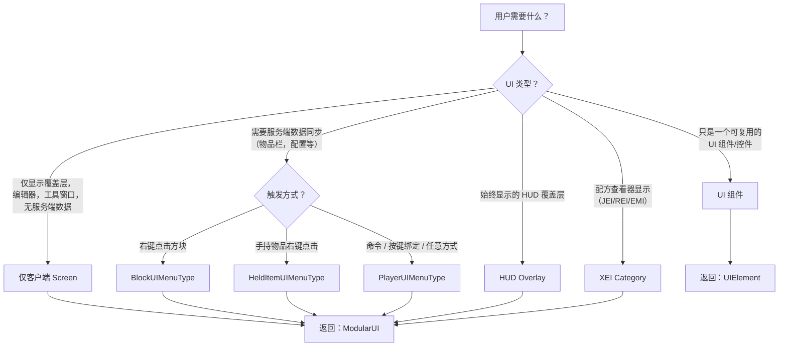

# LDLib2 UI — Agent 指南

> **本文档面向 AI agent。** 它提供了使用 LDLib2 构建 UI 的结构化工作流程。
> 请遵循决策树，使用最小模板，然后根据需要导航到详细页面。

---

## 步骤 1：确定语言 / 格式

询问用户他们想要的格式。这决定了所有后续代码的语法。

| 格式 | 何时使用 | 语言专属文档 |
|--------|------------|---------------------|
| **Kotlin** | 使用 Kotlin DSL 进行模组开发（最简洁） | [kotlin_support.md](./kotlin_support.md) |
| **Java** | 使用 Java 进行模组开发 | [getting_start.md](./getting_start.md) |
| **KubeJS** | 整合包脚本，无需编译 | [kjs_support.md](./kjs_support.md) |
| **XML** | 声明式 UI 结构，可视化编辑 | [xml.md](./xml.md) + [XSD 模式](https://raw.githubusercontent.com/Low-Drag-MC/LDLib2/refs/heads/1.21/ldlib2-ui.xsd) |

> **XML 注意：** XML 仅定义 UI 树和样式。你仍然需要 Java/Kotlin/KubeJS 代码来加载 XML、进行数据绑定，并将其包装在 `ModularUI` 中。请引导 agent 阅读 XSD 文件以了解可用的标签和属性。

---

## 步骤 2：确定 UI 类型



**关键规则：** 如果 UI 需要 `Player` 数据或服务端状态，它**必须**是基于 Menu 的 UI 并使用 `ModularUI.of(ui, player)`。

---

## 步骤 3：最小模板

每个模板都是一个完整的、可运行的起点。选择匹配步骤 2 的一个。

### 仅客户端 Screen

=== "Java"

    ```java
    ModularUI createUI() {
        var root = new UIElement().addClass("panel_bg").addChildren(
            new Label().setText("Hello")
        );
        return ModularUI.of(UI.of(root, StylesheetManager.INSTANCE.getStylesheetSafe(StylesheetManager.GDP)));
    }
    // 打开：Minecraft.getInstance().setScreen(new ModularUIScreen(createUI(), Component.empty()));
    ```

=== "Kotlin"

    ```kotlin
    fun createUI(): ModularUI {
        val root = element({ cls = { +"panel_bg" } }) {
            label({ text("Hello") })
        }
        return ModularUI(UI.of(root, StylesheetManager.GDP))
    }
    // 打开：Minecraft.getInstance().setScreen(ModularUIScreen(createUI(), Component.empty()))
    ```

=== "KubeJS"

    ```javascript
    // 仅客户端 screen 必须从 client_scripts 中打开
    let root = new UIElement().addClass("panel_bg").addChildren(
        new Label().setText("Hello")
    );
    let mui = ModularUI.of(UI.of(root));
    // 通过客户端触发器打开
    ```

### 基于 Menu 的 UI（服务端同步）

对于 Menu UI，请使用内置工厂。详见 [factory.md](./factory.md)。

=== "Java (Block)"

    ```java
    public class MyBlock extends Block implements BlockUIMenuType.BlockUI {
        @Override
        public ModularUI createUI(BlockUIMenuType.BlockUIHolder holder) {
            var root = new UIElement().addClass("panel_bg").addChildren(
                new Label().setText("Block UI"),
                new InventorySlots()
            );
            return ModularUI.of(
                UI.of(root, StylesheetManager.INSTANCE.getStylesheetSafe(StylesheetManager.GDP)),
                holder.player
            );
        }
        // 打开：BlockUIMenuType.openUI((ServerPlayer) player, pos);
    }
    ```

=== "Kotlin (Block)"

    ```kotlin
    class MyBlock : Block(...), BlockUIMenuType.BlockUI {
        override fun createUI(holder: BlockUIMenuType.BlockUIHolder): ModularUI {
            val root = element({ cls = { +"panel_bg" } }) {
                label({ text("Block UI") })
                inventorySlots()
            }
            return ModularUI(UI.of(root, StylesheetManager.GDP), holder.player)
        }
        // 打开：BlockUIMenuType.openUI(player as ServerPlayer, pos)
    }
    ```

=== "KubeJS (Block)"

    ```javascript
    // startup_scripts/main.js — 在两侧运行
    LDLib2UI.block("mymod:my_block_ui", event => {
        event.modularUI = ModularUI.of(UI.of(
            new UIElement().addClass("panel_bg").addChildren(
                new Label().setText("Block UI"),
                new InventorySlots()
            )
        ), event.player);
    });
    // server_scripts: LDLib2UIFactory.openBlockUI(event.player, event.block.pos, "mymod:my_block_ui");
    ```

> **其他触发器：** 将 `BlockUIMenuType` 替换为 `HeldItemUIMenuType`（物品）或 `PlayerUIMenuType`（任意）。详见 [factory.md](./factory.md)。

### HUD Overlay

```java
// 仅客户端。在 RegisterGuiLayersEvent 中注册。
var muiCache = Suppliers.memoize(() -> ModularUI.of(UI.of(
    new UIElement().layout(l -> l.widthPercent(100).heightPercent(100).paddingAll(10))
)));
event.registerAboveAll(MyMod.id("my_hud"), (ModularHudLayer) muiCache::get);
```

详见 [hud.md](./hud.md)。

### 基于 XML 的 UI

```xml
<?xml version="1.0" encoding="UTF-8" ?>
<ldlib2-ui xmlns:xsi="http://www.w3.org/2001/XMLSchema-instance"
           xsi:noNamespaceSchemaLocation="https://raw.githubusercontent.com/Low-Drag-MC/LDLib2/refs/heads/1.21/ldlib2-ui.xsd">
    <stylesheet location="ldlib2:lss/mc.lss"/>
    <root class="panel_bg">
        <label text="Hello from XML"/>
        <button text="Click me"/>
    </root>
</ldlib2-ui>
```

```java
// 加载并使用
var xml = XmlUtils.loadXml(ResourceLocation.parse("mymod:my_ui.xml"));
var ui = UI.of(xml);
// 查询元素：ui.select("#my_id"), ui.select(".my_class > button")
return ModularUI.of(ui, player); // 仅客户端用 ModularUI.of(ui)
```

> **关于 XML 自动补全和验证**，请阅读 [XSD 模式](https://raw.githubusercontent.com/Low-Drag-MC/LDLib2/refs/heads/1.21/ldlib2-ui.xsd) 以了解所有可用的标签、属性和结构。

---

## 步骤 4：数据绑定模式

这是生成正确 UI 代码最关键的知识。共有 3 种模式：

### 模式 A：仅客户端（无服务端同步）

使用 `bindDataSource` / `bindObserver` 或 Kotlin 的 `dataSource` / `observer`。不涉及网络。

```java
// 消费者：显示动态数据
new Label().bindDataSource(SupplierDataSource.of(() -> Component.literal("Value: " + myVar)));
// 生产者：响应用户输入
new TextField().bindObserver(value -> myVar = value);
```

### 模式 B：双向同步（Menu UI）

使用 `DataBindingBuilder` + `.bind()`。仅服务端 getter/setter —— 客户端自动处理。

```java
new Switch().bind(DataBindingBuilder.bool(() -> serverBool, v -> serverBool = v).build());
new TextField().bind(DataBindingBuilder.string(() -> serverStr, v -> serverStr = v).build());
new ItemSlot().bind(itemHandler, 0); // 物品栏简写
new FluidSlot().bind(fluidTank, 0);  // 流体简写
```

Kotlin 简写：`switch { bind(::serverBool) }`，`textField { bind(::serverStr) }`

### 模式 C：服务端到客户端只读

使用 `S2C` 变体。客户端无法修改该值。

```java
new Label().bind(DataBindingBuilder.componentS2C(() -> Component.literal(serverData)).build());
```

Kotlin：`label { bindS2C({ Component.literal(serverData) }) }`

> **对于复杂绑定**（自定义类型、RPCEvent、列表同步、远程 getter/setter）：请阅读 [data_bindings.md](./preliminary/data_bindings.md)。

---

## 步骤 5：导航地图

使用此表按需求查找详细文档。

### 核心概念

| 需求 | 阅读 | 路径 |
|------|------|------|
| ModularUI 的工作原理 | [ModularUI](./preliminary/modularui.md) | `docs/ldlib2/ui/preliminary/modularui.md` |
| Screen 与 Menu 的区别 | [Screen & Menu](./preliminary/screen_and_menu.md) | `docs/ldlib2/ui/preliminary/screen_and_menu.md` |
| UI 工厂（方块/物品/玩家） | [Factory](./factory.md) | `docs/ldlib2/ui/factory.md` |
| 布局（flexbox、grid、size、padding） | [Layout](./preliminary/layout.md) | `docs/ldlib2/ui/preliminary/layout.md` |
| 样式表 / LSS | [Stylesheet](./preliminary/stylesheet.md) | `docs/ldlib2/ui/preliminary/stylesheet.md` |
| 事件（鼠标、键盘、生命周期） | [Events](./preliminary/event.md) | `docs/ldlib2/ui/preliminary/event.md` |
| 数据绑定与 RPC | [Data Bindings](./preliminary/data_bindings.md) | `docs/ldlib2/ui/preliminary/data_bindings.md` |
| 样式动画 | [Style Animation](./preliminary/style_animation.md) | `docs/ldlib2/ui/preliminary/style_animation.md` |
| HUD 覆盖层 | [HUD](./hud.md) | `docs/ldlib2/ui/hud.md` |
| XEI（JEI/REI/EMI） | [XEI](./xei_support.md) | `docs/ldlib2/ui/xei_support.md` |
| XML UI | [XML](./xml.md) | `docs/ldlib2/ui/xml.md` |
| Kotlin DSL | [Kotlin](./kotlin_support.md) | `docs/ldlib2/ui/kotlin_support.md` |
| KubeJS 绑定 | [KubeJS](./kjs_support.md) | `docs/ldlib2/ui/kjs_support.md` |

### 组件速查表

| 组件 | 类 | 关键方法 | 文档 |
|-----------|-------|-----------|-----|
| 基础元素 | `UIElement` | `.layout()`, `.style()`, `.addClass()` | [element.md](./components/element.md) |
| 标签 | `Label` | `.setText()`, `.bind()` | [label.md](./components/label.md) |
| 按钮 | `Button` | `.setText()`, `.setOnClick()`, `.setOnServerClick()` | [button.md](./components/button.md) |
| 文本框 | `TextField` | `.setText()`, `.bind()`, `.setNumbersOnlyInt()` | [text-field.md](./components/text-field.md) |
| 文本域 | `TextArea` | `.setText()`, `.bind()` | [text-area.md](./components/text-area.md) |
| 开关 | `Toggle` | `.setText()`, `.bind()` | [toggle.md](./components/toggle.md) |
| 切换开关 | `Switch` | `.bind()` | [switch.md](./components/switch.md) |
| 选择器 | `Selector` | `.setCandidates()`, `.bind()` | [selector.md](./components/selector.md) |
| 进度条 | `ProgressBar` | `.setProgress()`, `.bind()`, `.label()` | [progress-bar.md](./components/progress-bar.md) |
| 滚动条 | `Scroller` / `Scroller.Horizontal` | `.bind()` | [scroller.md](./components/scroller.md) |
| 物品槽位 | `ItemSlot` | `.bind(handler, slot)`, `.setItem()` | [item-slot.md](./components/item-slot.md) |
| 流体槽位 | `FluidSlot` | `.bind(tank, slot)`, `.setFluid()` | [fluid-slot.md](./components/fluid-slot.md) |
| 物品栏槽位 | `InventorySlots` | （自动玩家物品栏） | [inventory-slots.md](./components/inventory-slots.md) |
| 标签页 / 标签视图 | `Tab`, `TabView` | `.addTab()` | [tab.md](./components/tab.md), [tab-view.md](./components/tab-view.md) |
| 开关组 | `ToggleGroup` | `.addToggle()` | [toggle-group.md](./components/toggle-group.md) |
| 滚动视图 | `ScrollerView` | （可滚动容器） | [scroller-view.md](./components/scroller-view.md) |
| 分割视图 | `SplitView` | （可调整大小的分割） | [split-view.md](./components/split-view.md) |
| 颜色选择器 | `ColorSelector` | `.bind()` | [color-selector.md](./components/color-selector.md) |
| 标签字段 | `TagField` | `.bind()` | [tag-field.md](./components/tag-field.md) |
| 搜索 | `SearchComponent` | `.bind()` | [search-component.md](./components/search-component.md) |
| 树形列表 | `TreeList` | — | [tree-list.md](./components/tree-list.md) |
| 场景（3D） | `Scene` | — | [scene.md](./components/scene.md) |
| 图形视图 | `GraphView` | — | [graph-view.md](./components/graph-view.md) |
| 代码编辑器 | `CodeEditor` | — | [code-editor.md](./components/code-editor.md) |
| 检查器 | `Inspector` | — | [inspector.md](./components/inspector.md) |
| 模板 | `Template` | （从 XML 加载） | [template.md](./components/template.md) |
| 可绑定值 | `BindableValue<T>` | `.bind()`（隐藏同步辅助） | [bindable-value.md](./components/bindable-value.md) |
| 富文本 | `Text` | `.setText()` | [text.md](./components/text.md) |

### 纹理速查表

| 纹理 | 类 | 文档 |
|---------|-------|-----|
| 精灵图（图像） | `SpriteTexture` | [sprite.md](./textures/sprite.md) |
| 颜色矩形 | `ColorRectTexture` | [color-rect.md](./textures/color-rect.md) |
| 颜色边框 | `ColorBorderTexture` | [color-border.md](./textures/color-border.md) |
| SDF 矩形 | `SDFRectTexture` | [sdf-rect.md](./textures/sdf-rect.md) |
| 资源矩形 | `RectTexture` | [rect.md](./textures/rect.md) |
| 物品堆叠 | `ItemStackTexture` | [item-stack.md](./textures/item-stack.md) |
| 流体堆叠 | `FluidStackTexture` | [fluid-stack.md](./textures/fluid-stack.md) |
| 文本 | `TextTexture` | [text.md](./textures/text.md) |
| 动画 | `AnimationTexture` | [animation.md](./textures/animation.md) |
| 组 | `GroupTexture` | [group.md](./textures/group.md) |
| Shader | `ShaderTexture` | [shader.md](./textures/shader.md) |
| UI 资源 | `UIResourceTexture` | [ui-resource.md](./textures/ui-resource.md) |
| LSS 纹理语法 | — | [lss.md](./textures/lss.md) |

---

## 步骤 6：完成前检查清单

在将代码返回给用户之前，请验证：

- [ ] **UI 类型匹配需求**：仅客户端 Screen 没有 `player` 参数；Menu UI 有 `player` 参数
- [ ] **数据绑定正确**：服务端数据使用 `DataBindingBuilder.xxx().build()` + `.bind()`；仅客户端数据使用 `bindDataSource`/`bindObserver`
- [ ] **工厂已注册**：Menu UI 需要工厂注册（方块/物品/玩家）或手动 MenuType
- [ ] **KubeJS 脚本放置位置**：`LDLib2UI.*` 处理器必须在两侧运行 —— 建议放在 `startup_scripts/`
- [ ] **XML 文件** 放在 `assets/<modid>/ui/` 下并通过 `ResourceLocation` 加载
- [ ] **样式表已应用**：使用 `StylesheetManager.GDP`、`.MC` 或 `.MODERN` 作为内置主题，或提供自定义 LSS
- [ ] **输出格式匹配请求**：完整 UI 返回 `ModularUI`，可复用组件返回 `UIElement`
