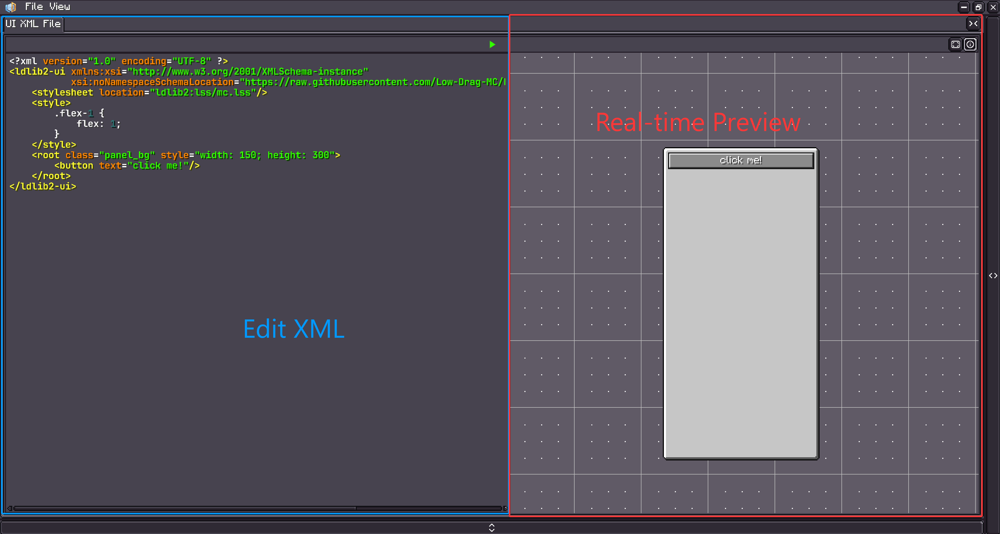
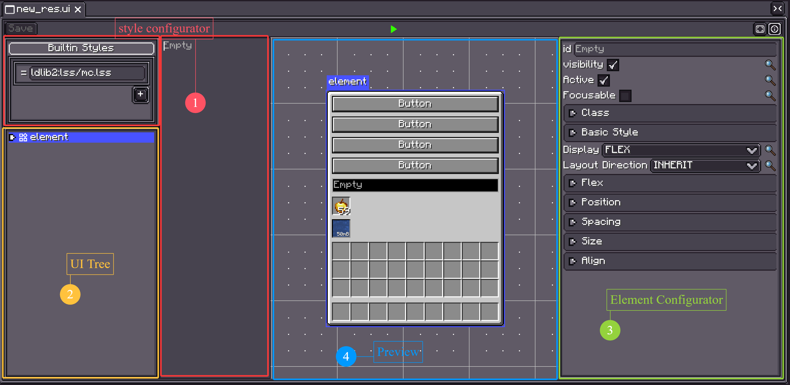
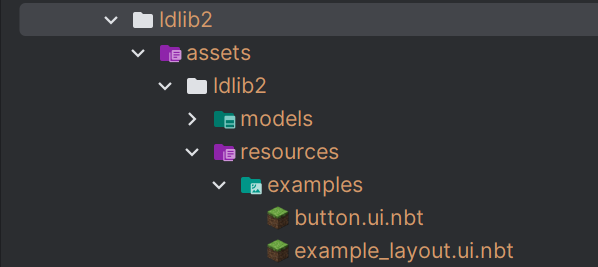
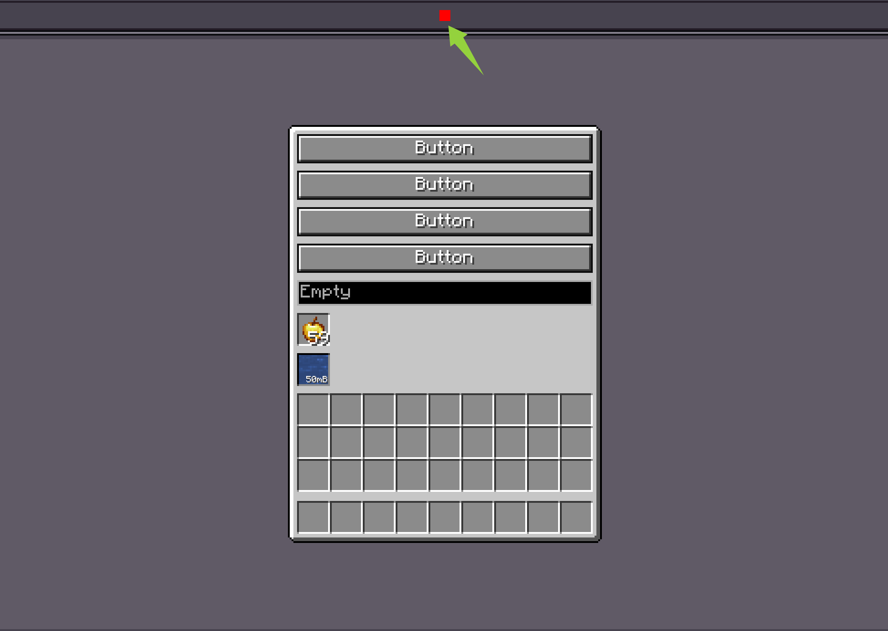

# UI 编辑器

{{ version_badge("2.1.5", label="自", icon="tag") }}

!!! warning inline end
    该命令只能在 `单人游戏` 世界中使用。

LDLib2 提供了一个可视化编辑器来支持 UI 创建。使用以下命令打开 UI 编辑器：

```shell
/ldlib2_ui_editor
```

<figure markdown="span">
  { width="80%" }
</figure>

UI 编辑器支持两种通过可视化方式创建 UI 的方法：

* `UI XML`
* `UI 模板`

---

## UI XML

点击 **`文件 → 新建 → UI XML 文件`** 以创建一个新的 UI XML 文件。  
你也可以点击 **`打开`** 来加载一个已有的 XML 文件。

<figure markdown="span">
  { width="80%" }
</figure>

<figure markdown="span">
  { width="80%" }
</figure>

打开后，你可以直接编辑 XML，并在编辑器中查看 UI 的**实时预览**。有关更多 XML 的详细信息，请查看 [UI XML](./xml.md){ data-preview }

!!! tip
    你也可以使用外部 IDE（例如 VS Code 或 IntelliJ IDEA）来编辑 XML 文件。  
    保存更改后，预览将自动更新。

---

## UI 模板

**UI 模板** 与 **UI XML** 类似，用于定义 UI 内容  
（包括**样式**和**组件树**）。

主要区别如下：

- UI 模板可以通过 **UI 编辑器**进行**可视化编辑**。
- 保存后的 UI 模板可以在其他 **UI XML** 文件或 **UI 模板**中作为**模板组件**重复使用。

与 UI XML 文件不同，**UI 模板由 LDLib2 的资源系统管理**。  
要创建一个 UI 模板，请使用**资源面板**：

<figure markdown="span">
  { width="100%" }
</figure>

**步骤：**

1. 选择 **UI** 资源分类。
2. 选择或创建一个**资源提供器**。
3. 右键创建一个 **UI 模板**，然后双击进入编辑模式。

### 编辑你的模板

打开 UI 模板后，你将看到如下编辑器界面：

<figure markdown="span">
  { width="100%" }
</figure>

1. **样式配置器**  
   编辑内置样式，添加或移除外部样式表，并检查已应用的样式。

2. **UI 树**  
   显示完整的 UI 层级结构。  
   你可以通过右键菜单创建或删除组件，多选元素，或拖拽以重新排序层级。

3. **元素配置器**  
   显示当前选中元素的可配置属性。

4. **预览**  
   提供 UI 的实时预览。

使用 UI 编辑器，你可以可视化地配置**布局**、**样式**和其他设置。  
如果你理解了 *预备知识* 部分介绍的概念，那么编辑器应该易于上手。  
对于具有特殊配置选项的组件，请参考它们的单独文档页面。

### 加载 UI 模板并进行设置

有两种方法可以加载并使用你的 UI 模板。

1. 你也可以将其移动到你的 assets 文件夹中，并通过 `ResourceLocation` 来加载它。
2. 如果资源位于 ldlib2 文件夹下，你可以右键点击该资源来获取资源路径并加载它。

<figure markdown="span">
  { width="100%" }
</figure>

=== "Java"

    ```java
    @Override
    public ModularUI createUI(Player player) {
        var ui = Optional.ofNullable(UIResource.INSTANCE.getResourceInstance()
                // 基于资源位置
                .getResource(new FilePath(ResourceLocation.parse("ldlib2:resources/examples/example_layout.ui.nbt"))))

                // 基于文件
                //.getResource(new FilePath(new File(LDLib2.getAssetsDir(), "ldlib2/resources/examples/example_layout.ui.nbt"))) // LDLib2.getAssetsDir() = ".minecraft/ldlib2/assets"

                .map(UITemplate::createUI)
                .orElseGet(UI::empty);

        // 查找元素并在此处进行数据绑定或逻辑设置
        var buttons = ui.select(".button_container > button").toList(); // 通过选择器
        var container = ui.selectRegex("container").findFirst().orElseThrow(); // 通过 ID 正则表达式

        return ModularUI.of(ui, player);
    }
    ```

=== "KubeJS"

    ```js
    function createUIFromUIResource(path) {
        return UIResource.INSTANCE.getResourceInstance().getResource(path).createUI();
    }

    function createUI(player) {
        // 基于文件
        let ui = createUIFromUIResource("file(./ldlib2/assets/ldlib2/resources/global/modern_styles.ui.nbt)")

        // 基于资源位置
        // let ui = createUIFromUIResource("pack(ldlib2:resources/global/modern_styles.ui.nbt)")

        // 查找元素并在此处进行数据绑定或逻辑设置
        let buttons = ui.select(".button_container > button").toList(); // 通过选择器
        let container = ui.selectRegex("container").findFirst().orElseThrow(); // 通过 ID 正则表达式

        return ModularUI.of(ui, player)
    }
    ```

### 加载事件

已保存的 **UI 模板** 仅定义了视觉结构和样式 —— 默认情况下不包含运行时逻辑。  
在大多数情况下，你需要加载模板，然后在代码中手动附加处理程序或绑定。

但是，如果你希望在**不同的上下文中复用同一个 UI**，每次都重复相同的设置逻辑会变得非常繁琐。

为了解决这个问题，**LDLib2 提供了一个钩子事件**，允许你在 **UI 模板调用 `createUI()` 时注入逻辑**，从而在创建过程中自动配置返回的 `UI`。

```java
@SubscribeEvent
public static void onUICreated(UITemplate.CreateUI event) {
    var template = event.template;
    var ui = event.ui;
    // 在此处进行初始化
}
```

---

## UI 模拟

点击编辑器顶部的**绿色播放按钮**以进入**模拟模式**。  
这允许你与 UI 交互并验证其行为。

<figure markdown="span">
  { width="100%" }
</figure>
