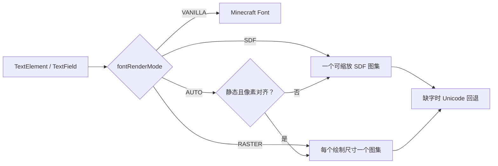

# 平滑字体渲染

<VersionBadge version="2.2.31" label="Since" icon="tag" />

LDLib2 可以通过自己的字体管线渲染 UI 文本。它会为每次绘制选择渲染器、维护字形图集，并在缺少字形时回退到 Minecraft Unicode 字体。`Label`、`TextField`、`TextArea` 与 `CodeEditor` 会自动使用该机制。



<figure>

<figcaption>
在真实客户端中以 <code>AUTO</code> 模式捕获。画面同时检查 Unicode 回退、文本样式、多种字号，以及 Minecraft 与 LDLib2 字体族。
</figcaption>
</figure>

## 选择模式

客户端配置项为 `font.fontRenderMode`，默认 `AUTO`。

| 模式 | 适用场景 | 取舍 |
| --- | --- | --- |
| `VANILLA` | 兼容性或与 Minecraft 输出对比 | LDLib2 不参与文本渲染。 |
| `SDF` | 缩放、旋转、倾斜或动画文本 | 任意变换下平滑；小号静态字可能更柔和，尖角略圆。 |
| `RASTER` | 像素网格对齐的静态文本 | 最清晰；每个绘制尺寸都需要图集，首次使用要烘焙。 |
| `AUTO` | 大多数 UI | 小号、静态、像素对齐时使用 raster，其余使用 SDF。 |

开发环境可用 `/ldlib2_font mode` 循环切换模式并重建当前屏幕；持久配置请修改客户端配置。

::: warning

安装 Modern UI 时，LDLib2 会主动走回退路径。不要在该环境中依赖 LDLib2 专有字形图集。

:::

## 配置参考

| 配置项 | 默认值 | 作用 |
| --- | --- | --- |
| `fontAtlasSize` | `1024` | 字形图集页面边长。更大可减少 draw call，但增加 GPU 内存。 |
| `sdfEmSize` | `48` | 生成 SDF 字形时的分辨率。提高可改善大字尖角，但占更多图集空间。 |
| `sdfSharpness` | `1.0` | 抗锯齿宽度倍率。大于 `1` 更锐利，小于 `1` 更柔和。 |
| `sdfWeight` | `0.0` | 笔画加粗像素值；小字偏细时可略微提高。 |
| `fontRasterMaxSize` | `256` | raster 路径允许的最大设备像素行高；更大文本改用 SDF。 |
| `fontRasterEvictSeconds` | `30` | 未使用的 raster 尺寸图集的释放时间。 |
| `textLayoutCache` | `true` | 复用帧间相同文本的字形布局；仅排查陈旧样式时关闭。 |

## 自定义绘制

需要与 LDLib2 UI 使用同一字体选择时调用 `LDLibFonts.font()`。绘制 `Component` 或持续复用的 `FormattedCharSequence` 时使用 `LDLibFonts.drawText(...)`，可利用布局缓存。

```java
var font = LDLibFonts.font();
LDLibFonts.drawText(graphics, font, Component.literal("Status"), 8, 8, 0xFFFFFFFF, true);
```
