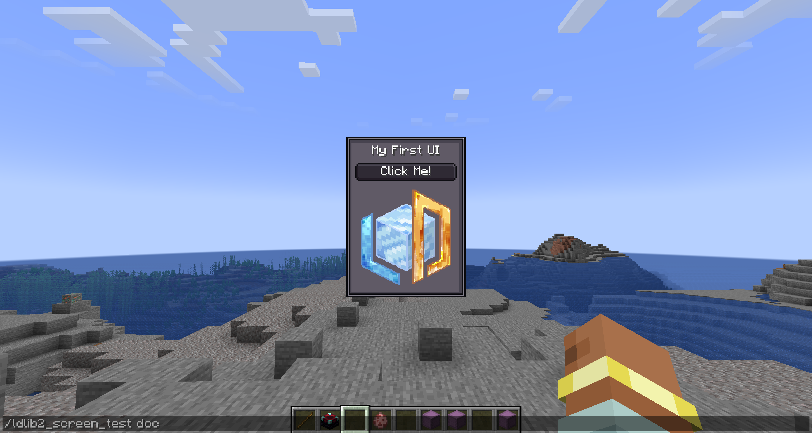

# 快速开始
{{ version_badge("2.1.0", label="自", icon="tag") }}

在本节中，我们将逐步为您提供一些示例。

### 教程 1：在您的屏幕中创建并显示 `ModularUI`

让我们从一个简单的 UI 开始。
`ModularUI` 作为 UI 的运行时管理器 —— 处理您定义的所有元素的生命周期、渲染和交互。
它接受一个 `UI` 实例和一个可选的 `Player` 作为输入。
查看 [ModularUI 页面](./preliminary/modularui.md){ data-preview } 了解更多详情。

```java
private static ModularUI createModularUI() {
    // 创建根元素
    var root = new UIElement();
    root.addChildren(
            // 添加标签显示文本
            new Label().setText("My First UI"),
            // 添加带文本的按钮
            new Button().setText("Click Me!"),
            // 添加基于资源位置显示图片的元素
            new UIElement().layout(layout -> layout.width(80).height(80))
                    .style(style -> style.background(
                            SpriteTexture.of("ldlib2:textures/gui/icon.png"))
                    )
    ).style(style -> style.background(Sprites.BORDER)); // 为根元素设置背景
    // 创建 UI
    var ui = UI.of(root);
    // 返回用于运行时实例的模块化 UI
    return ModularUI.of(ui);
}
```

接下来，我们需要显示我们的 UI。
与大多数强制您使用专用屏幕类的 UI 库不同，
LDLib2 提供了一种通用解决方案，用于在您选择的任何屏幕内渲染和交互 `ModularUI`。
这意味着您可以在屏幕的初始化阶段创建和初始化 `ModularUI`，如下所示。

```java
@OnlyIn(Dist.CLIENT)
public class MyScreen extends Screen {
    // .....

    // 初始化
    @Override
    public void init() {
        super.init();
        var modularUI = createModularUI();
        modularUI.setScreenAndInit(this);
        this.addRenderableWidget(modularUI.getWidget());
    }

    // .....
}
```

!!! info "快速测试"
    如果您不想处理 `screen` 和显示的代码。我们还为您提供了 `ModularUIScreen`。
    查看 [屏幕与菜单页面](./preliminary/screen_and_menu.md){ data-preview } 了解更多详情。

    ```java
    public static void openScreenUI() {
        var modularUI = createModularUI();
        minecraft.setScreen(new ModularUIScreen(modularUI, Component.empty()));
    }
    ```
    
<figure markdown="span">
  { width="80%" }
</figure>

---

### 教程 2：更好的布局和样式

很好，它能工作了 —— 但布局和样式仍然不太理想。
例如，我们希望为根元素添加内边距，在组件之间引入一些间距，并将标签居中对齐。
感谢 yoga，我们确实需要处理布局代码。查看 [布局页面](./preliminary/layout.md){ data-preview } 了解更多详情。
让我们通过优化布局和样式来改进 UI。

```java hl_lines="7-8 17-18" 
private static ModularUI createModularUI() {
    // 创建根元素
    var root = new UIElement();
    root.addChildren(
            // 添加标签显示文本
            new Label().setText("My First UI")
                    // 居中对齐文本
                    .textStyle(textStyle -> textStyle.textAlignHorizontal(Horizontal.CENTER)),
            // 添加带文本的按钮
            new Button().setText("Click Me!"),
            // 添加基于资源位置显示图片的元素
            new UIElement().layout(layout -> layout.width(80).height(80))
                    .style(style -> style.background(
                            SpriteTexture.of("ldlib2:textures/gui/icon.png"))
                    )
    ).style(style -> style.background(Sprites.BORDER)); // 为根元素设置背景
    // 为子元素设置内边距和间距
    root.layout(layout -> layout.paddingAll(7).gapAll(5));
    // 创建 UI
    var ui = UI.of(root);
    // 返回用于运行时实例的模块化 UI
    return ModularUI.of(ui);
}
```

<figure markdown="span">
  { width="80%" }
</figure>

---

### 教程 3：组件交互和 UI 事件

让我们看看如何与组件交互。这里以按钮为例，`#!java setOnClick()` 由按钮提供。
我们引入两个按钮，将图片旋转 ±45°。

```java hl_lines="15-26"
private static ModularUI createModularUI() {
    // 创建根元素
    var root = new UIElement();
    // 添加基于资源位置显示图片的元素
    var image = new UIElement().layout(layout -> layout.width(80).height(80))
            .style(style -> style.background(
                    SpriteTexture.of("ldlib2:textures/gui/icon.png"))
            );
    root.addChildren(
            // 添加标签显示文本
            new Label().setText("Interaction")
                    // 居中对齐文本
                    .textStyle(textStyle -> textStyle.textAlignHorizontal(Horizontal.CENTER)),
            image,
            // 添加带有行 flex 方向的容器
            new UIElement().layout(layout -> layout.flexDirection(YogaFlexDirection.ROW)).addChildren(
                    // 旋转图片 -45° 的按钮
                    new Button().setText("-45°")
                            .setOnClick(e -> image.transform(transform -> 
                                    transform.rotation(transform.rotation()-45))),
                    new UIElement().layout(layout -> layout.flex(1)), // 占据剩余空间
                    // 旋转图片 45° 的按钮
                    new Button().setText("+45°")
                            .setOnClick(e -> image.transform(transform -> 
                                    transform.rotation(transform.rotation() + 45)))
            )
    ).style(style -> style.background(Sprites.BORDER)); // 为根元素设置背景
    // 为子元素设置内边距和间距
    root.layout(layout -> layout.paddingAll(7).gapAll(5));
    // 创建 UI
    var ui = UI.of(root);
    // 返回用于运行时实例的模块化 UI
    return ModularUI.of(ui);
}
```

<figure markdown="span">
  { width="80%" }
</figure>

在上一步中，我们使用 `Button#setOnClick()` 来处理交互。
虽然这很方便，但它只是 Button 组件提供的 API 方法。

LDLib2 本身公开了一个完整且灵活的 UI 事件系统。
任何 UIElement 都可以监听输入事件，如鼠标点击、悬停、命令、生命周期、拖动、焦点、键盘输入等。查看 [事件页面](./preliminary/event.md){ data-preview } 了解更多详情。

通过将基本 UIElement 与事件监听器和样式相结合，您可以实现完全自定义的交互式组件 —— 包括按钮。


```java hl_lines="17-26"
private static ModularUI createModularUI() {
    // 创建根元素
    var root = new UIElement();
    // 添加基于资源位置显示图片的元素
    var image = new UIElement().layout(layout -> layout.width(80).height(80))
            .style(style -> style.background(
                    SpriteTexture.of("ldlib2:textures/gui/icon.png"))
            );
    root.addChildren(
            // 添加标签显示文本
            new Label().setText("UI Event")
                    // 居中对齐文本
                    .textStyle(textStyle -> textStyle.textAlignHorizontal(Horizontal.CENTER)),
            image,
            // 添加带有行 flex 方向的容器
            new UIElement().layout(layout -> layout.flexDirection(YogaFlexDirection.ROW)).addChildren(
                    // 使用 UI 事件实现按钮
                    new UIElement().addChild(new Label().setText("-45°").textStyle(textStyle -> textStyle.adaptiveWidth(true)))
                            .layout(layout -> layout.justifyItems(YogaJustify.CENTER).paddingHorizontal(3))
                            .style(style -> style.background(Sprites.BORDER1))
                            .addEventListener(UIEvents.MOUSE_DOWN, e -> image.transform(transform ->
                                    transform.rotation(transform.rotation()-45)))
                            .addEventListener(UIEvents.MOUSE_ENTER, e ->
                                    e.currentElement.style(style -> style.background(Sprites.BORDER1_DARK)), true)
                            .addEventListener(UIEvents.MOUSE_LEAVE, e ->
                                    e.currentElement.style(style -> style.background(Sprites.BORDER1)), true),
                    new UIElement().layout(layout -> layout.flex(1)), // 占据剩余空间
                    // 旋转图片 45° 的按钮
                    new Button().setText("+45°")
                            .setOnClick(e -> image.transform(transform ->
                                    transform.rotation(transform.rotation() + 45)))
            )
    ).style(style -> style.background(Sprites.BORDER)); // 为根元素设置背景
    // 为子元素设置内边距和间距
    root.layout(layout -> layout.paddingAll(7).gapAll(5));
    // 创建 UI
    var ui = UI.of(root);
    // 返回用于运行时实例的模块化 UI
    return ModularUI.of(ui);
}
```

<figure markdown="span">
  { width="80%" }
</figure>

---

## 教程 4：UI 样式表

在 [教程 2](#tutorial-2-better-layout-and-style) 中，我们通过直接在代码中配置布局和样式来改进布局和视觉外观。
虽然这很有效，但随着 UI 的增长，内联布局和样式定义可能会变得冗长且难以维护。

为了解决这个问题，LDLib2 引入了一个名为 `LSS`（LDLib2 StyleSheet）的样式表系统。
LSS 允许您以声明式、类似 CSS 的方式描述布局和样式属性，将视觉设计与 UI 结构分离。查看 [样式表页面](./preliminary/stylesheet.md){ data-preview } 了解更多详情。

在下面的示例中，我们使用 LSS 重新实现了步骤 3 的布局和样式逻辑：

* 示例 1 演示直接在 UI 元素上使用 LSS 绑定
* 示例 2 展示如何定义独立的样式表并将其应用到 UI

=== "示例 1"

    ```java
    private static ModularUI createModularUI() {
        var root = new UIElement();
        root.addChildren(
                new Label().setText("LSS example")
                        .lss("horizontal-align", "center"),
                new Button().setText("Click Me!"),
                new UIElement()
                        .lss("width", 80)
                        .lss("height", 80)
                        .lss("background", "sprite(ldlib2:textures/gui/icon.png)")
        );
        root.lss("background", "built-in(ui-gdp:BORDER)");
        root.lss("padding-all", 7);
        root.lss("gap-all", 5);
        var ui = UI.of(root);
        return ModularUI.of(ui);
    }
    ```

=== "示例 2"

    ```java
    private static ModularUI createModularUI() {
        // 为根元素设置 ID
        var root = new UIElement().setId("root");
        root.addChildren(
                new Label().setText("LSS example"),
                new Button().setText("Click Me!"),
                // 为元素设置类
                new UIElement().addClass("image")
        );
        var lss = """
            // ID 选择器
            #root {
                background: built-in(ui-gdp:BORDER);
                padding-all: 7;
                gap-all: 5;
            }
            
            // 类选择器
            .image {
                width: 80;
                height: 80;
                background: sprite(ldlib2:textures/gui/icon.png);
            }
            
            // 元素选择器
            #root label {
                horizontal-align: center;
            }
            """;
        var stylesheet = Stylesheet.parse(lss);
        // 添加样式表到 UI
        var ui = UI.of(root, stylesheet);
        return ModularUI.of(ui);
    }
    ```

!!! info "内置样式表"
    除了自定义 LSS 定义外，LDLib2 还提供了多个**内置样式表**主题，涵盖大多数常见 UI 组件：

    - `#!java StylesheetManager.GDP`
    - `#!java StylesheetManager.MC`
    - `#!java StylesheetManager.MODERN`

    这些内置样式表允许您以最少的设置将整个 UI 应用一致的视觉样式。
    您可以通过 `StylesheetManager` 访问和管理它们，它充当所有可用样式表包的中央注册表。

```java
private static ModularUI createModularUI() {
    var root = new UIElement();
    root.layout(layout -> layout.width(100));
    root.addChildren(
            new Label().setText("Stylesheets"),
            new Button().setText("Click Me!"),
            new ProgressBar().setProgress(0.5f).label(label -> label.setText("Progress")),
            new Toggle().setText("Toggle"),
            new TextField().setText("Text Field"),
            new UIElement().layout(layout -> layout.setFlexDirection(YogaFlexDirection.ROW)).addChildren(
                    new ItemSlot().setItem(Items.APPLE.getDefaultInstance()),
                    new FluidSlot().setFluid(new FluidStack(Fluids.WATER, 1000))
            ),
            // 列出所有样式表
            new Selector<ResourceLocation>()
                    .setSelected(StylesheetManager.GDP, false)
                    .setCandidates(StylesheetManager.INSTANCE.getAllPackStylesheets().stream().toList())
                    .setOnValueChanged(selected -> {
                        // 切换到选中的样式表
                        var mui = root.getModularUI();
                        if (mui != null) {
                            mui.getStyleEngine().clearAllStylesheets();
                            mui.getStyleEngine().addStylesheet(StylesheetManager.INSTANCE.getStylesheetSafe(selected));
                        }
                    })
    );
    root.addClass("panel_bg");
    // 默认使用 GDP 样式表
    var ui = UI.of(root, StylesheetManager.INSTANCE.getStylesheetSafe(StylesheetManager.GDP)));
    return ModularUI.of(ui);
}
```

<figure markdown="span">
  { width="80%" }
</figure>

---

## 教程 5：数据绑定

LDLib2 为大多数数据驱动的 UI 组件提供内置的数据绑定支持。
这使 UI 元素能够与底层数据保持同步，无需手动更新逻辑。
绑定系统基于 `#!java IObserver<T>` 和 `#!java IDataProvider<T>`。
查看 [数据绑定页面](./preliminary/data_bindings.md){ data-preview } 了解更多详情。

在此示例中：

- 一个共享的 AtomicInteger 作为单一数据源
- 按钮直接修改值
- TextField 通过 observer 更新值
- 当数据变化时，标签和进度条会自动刷新

```java
private static ModularUI createModularUI() {
    // 值持有者
    var valueHolder = new AtomicInteger(0);

    var root = new UIElement();
    root.addChildren(
            new Label().setText("Data Bindings")
                    .textStyle(textStyle -> textStyle.textAlignHorizontal(Horizontal.CENTER)),
            new UIElement().layout(layout -> layout.flexDirection(YogaFlexDirection.ROW)).addChildren(
                    // 减少值的按钮
                    new Button().setText("-")
                            .setOnClick(e -> {
                                if (valueHolder.get() > 0) {
                                    valueHolder.decrementAndGet();
                                }
                            }),
                    new TextField()
                            .setNumbersOnlyInt(0, 100)
                            .setValue(String.valueOf(valueHolder.get()))
                            // 绑定 Observer 来更新值持有者
                            .bindObserver(value -> valueHolder.set(Integer.parseInt(value)))
                            // 绑定 DataSource 来通知值变化
                            .bindDataSource(SupplierDataSource.of(() -> String.valueOf(valueHolder.get())))
                            .layout(layout -> layout.flex(1)),
                    // 增加值的按钮
                    new Button().setText("+")
                            .setOnClick(e -> {
                                if (valueHolder.get() < 100) {
                                    valueHolder.incrementAndGet();
                                }
                            })
            ),
            // 绑定 DataSource 来通知标签和进度条的值变化
            new Label().bindDataSource(SupplierDataSource.of(() -> Component.literal("Binding: ").append(String.valueOf(valueHolder.get())))),
            new ProgressBar()
                    .setProgress(valueHolder.get() / 100f)
                    .bindDataSource(SupplierDataSource.of(() -> valueHolder.get() / 100f))
                    .label(label -> label.bindDataSource(SupplierDataSource.of(() -> Component.literal("Progress: ").append(String.valueOf(valueHolder.get())))))
    ).style(style -> style.background(Sprites.BORDER));
    root.layout(layout -> layout.width(100).paddingAll(7).gapAll(5));
    return ModularUI.of(UI.of(root));
}
```

<figure markdown="span">
  { width="80%" }
</figure>

---

## 教程 6：用于 Menu 的 `ModularUI`

在之前的教程中，我们专注于在客户端屏幕内渲染 `ModularUI`。
这对于纯视觉或仅客户端的界面非常有效。

然而，Minecraft 中大多数真实世界的 GUI 都是服务器-客户端同步的。
当 GUI 涉及游戏逻辑或持久数据时，服务器必须保持权威性。
在原版 Minecraft 中，这是通过 `Menu` 来管理的，它负责服务器和客户端之间的同步。

与仅支持客户端渲染的 UI 库不同，LDLib2 为服务器支持的 Menu 提供了一流的支持。
您可以直接将 `ModularUI` 与 Menu 一起使用，无需额外的网络或同步代码。

让我们创建一个简单的基于 Menu 的 UI，显示玩家的物品栏。

```java
private static ModularUI createModularUI(Player player) {
    var root = new UIElement();
    root.addChildren(
            new Label().setText("Menu UI"),
            // 添加玩家物品栏
            new InventorySlots()
    ).addClass("panel_bg");

    var ui = UI.of(root, StylesheetManager.INSTANCE.getStylesheetSafe(StylesheetManager.GDP));
    // 将玩家传递给 Modular UI
    return ModularUI.of(ui, player);
}
```

您必须创建一个带有 `Player` 的 `ModularUI`，这对于基于菜单的 UI 是必需的。此外，除了屏幕，您还应该为您的 `Menu` 初始化 `ModularUI`：

* 初始化应在创建之后、写入额外数据缓冲区之前完成。
* 如有必要，不要忘记设置屏幕的正确图片大小。

```java
public class MyContainerMenu extends AbstractContainerMenu {
    // 您可以在构造函数中进行初始化
    public MyContainerMenu(...) {
        super(...)
        
        var modularUI = createModularUI(player)
        // 我们添加了 mixin 使 AbstractContainerMenu 实现该接口
        if (this instanceof IModularUIHolderMenu holder) {
            holder.setModularUI(modularUI);
        }
    }

    // .....
}

public class MyContainerScreen extends AbstractContainerScreen<MyContainerMenu> {
    @Override
    public void init() {
        // 模块化部件已经通过事件添加 + 初始化
        this.imageWidth = (int) getMenu().getModularUI().getWidth();
        this.imageHeight = (int) getMenu().getModularUI().getHeight();
        super.init();
    }

    // .....
}
```

!!! info "快速测试"
    要使用并打开基于菜单的 UI，您需要注册自己的 `MenuType`，LDLib2 还提供了 `ModularUIContainerScreen` 和 `ModularUIContainerMenu` 来帮助您快速设置。查看 [屏幕与菜单页面](./preliminary/screen_and_menu.md){ data-preview } 了解更多详情。

    或者，您可以通过使用提供的 [工厂类](./factory.md){ data-preview } 更快地开始。
    它们允许您以最少的设置为方块、物品或玩家创建基于菜单的 UI —— 无需处理手动注册或样板代码。
    在这种情况下，我们使用 `PlayerUIMenuType` 进行快速演示。

    ```java
    public static final ResourceLocation UI_ID = LDLib2.id("unique_id");

    // 在某处注册您的 UI，例如在模组初始化期间。
    public static void registerPlayerUI() {
        PlayerUIMenuType.register(UI_ID, ignored -> player -> createModularUI(player));
    }
    
    public static void openMenuUI(Player player) {
        PlayerUIMenuType.openUI(player, UI_ID);
    }
    ```

<figure markdown="span">
  { width="80%" }
</figure>

---

## 教程 7：Screen 和 Menu 之间的通信

虽然 `InventorySlots` 开箱即用，但它们是预先打包的内置组件。
在实际项目中，您通常需要更好地控制数据和事件如何在客户端屏幕和服务器端菜单之间流动。

ModularUI 为客户端和服务器之间的 `数据绑定` 和 `事件分发` 提供完整支持。
这使客户端的 UI 交互能够安全地触发服务器端的逻辑，并且服务器端的状态更改会自动更新 UI。
查看 [数据绑定页面](./preliminary/data_bindings.md){ data-preview } 了解更多详情。

在这里，我们专注于实用的模式，帮助您快速入门。

```java
// 表示服务器上的数据
private final ItemStackHandler itemHandler = new ItemStackHandler(2);
private final FluidTank fluidTank = new FluidTank(2000);
private boolean bool = true;
private String string = "hello";
private float number = 0.5f;

private static ModularUI createModularUI(Player player) {
    // 创建根元素
    var root = new UIElement();
    root.addChildren(
            // 添加标签显示文本
            new Label().setText("Data Between Screen and Menu"),
            // 绑定存储到槽位
            new UIElement().addChildren(
                    new ItemSlot().bind(itemHandler, 0),
                    new ItemSlot().bind(new ItemHandlerSlot(itemHandler, 1).setCanTake(p -> false)),
                    new FluidSlot().bind(fluidTank, 0)
            ).layout(l -> l.gapAll(2).flexDirection(YogaFlexDirection.ROW)),
            // 绑定值到组件
            new UIElement().addChildren(
                    new Switch().bind(DataBindingBuilder.bool(() -> bool, value -> bool = value).build()),
                    new TextField().bind(DataBindingBuilder.string(() -> string, value -> string = value).build()),
                    new Scroller.Horizontal().bind(DataBindingBuilder.floatVal(() -> number, value -> number = value).build()),
                    // 只读（s->c），始终从服务器获取数据并在客户端显示
                    new Label().bind(DataBindingBuilder.componentS2C(() -> Component.literal("s->c only: ")
                            .append(Component.literal(String.valueOf(bool)).withStyle(ChatFormatting.AQUA)).append(" ")
                            .append(Component.literal(string).withStyle(ChatFormatting.RED)).append(" ")
                            .append(Component.literal("%.2f".formatted(number)).withStyle(ChatFormatting.YELLOW)))
                            .build())
            ).layout(l -> l.gapAll(2)),
            // 在服务器端触发 UI 事件
            new Button().addServerEventListener(UIEvents.MOUSE_DOWN, e -> {
                if (fluidTank.getFluid().getFluid() == Fluids.WATER) {
                    fluidTank.setFluid(new FluidStack(Fluids.LAVA, 1000));
                } else {
                    fluidTank.setFluid(new FluidStack(Fluids.WATER, 1000));
                }
            }),
            // 您也可以使用 button.setOnServerClick(e -> { ... })
            new InventorySlots()
    );
    root.addClass("panel_bg");

    // 将玩家传递给 Modular UI
    return ModularUI.of(UI.of(root, StylesheetManager.INSTANCE.getStylesheetSafe(StylesheetManager.MODERN)), player);
}
```

<figure markdown="span">
  { width="80%" }
</figure>

---

## 结语

这还远未结束。为什么不试试强大的 [UI 编辑器](./ui_editor/index.md){ data-preview } 呢？
