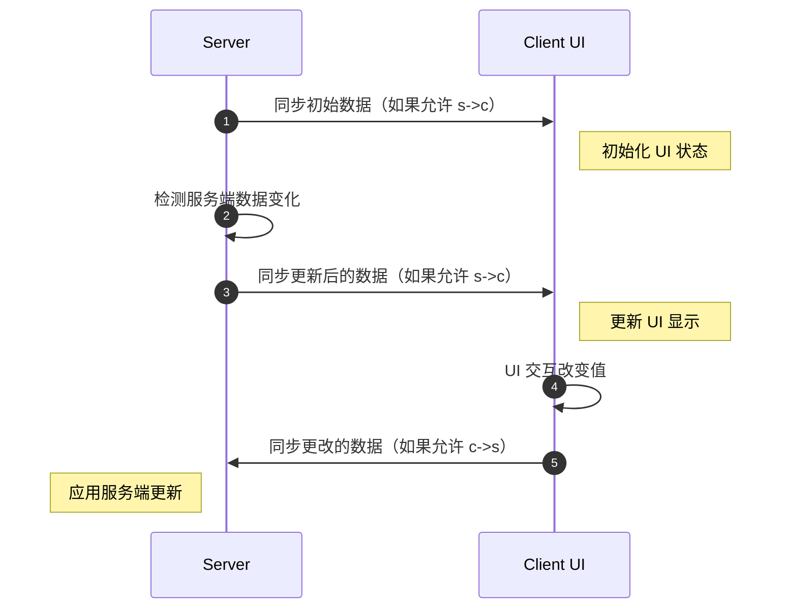

# 数据绑定、RPCEvent 与 Message

<VersionBadge version="2.2.7" label="自" icon="tag" />

在学习 **Data Bindings**、**RPCEvent** 和 **message** 之前，重要的是理解 **UI 组件**与**数据**之间的关系。

---

## 客户端上的数据绑定

::: info 仅客户端
`bindDataSource` 和 `bindObserver` 是**纯客户端**机制。
它们在 UI 组件与本地变量之间连接数据流——不涉及网络数据包。
有关**服务端和客户端**之间的同步，请参阅下面的[客户端与服务端之间的数据绑定](#_2)。
:::

如果 UI 组件是数据驱动的，它在数据模型中的角色通常属于以下几类之一：

- **数据消费者**：被动接收数据并进行渲染。
- **数据生产者**：产生可能变化的数据（纯生产者在实际中较为少见）。
- **数据消费者 + 生产者**：既显示数据又修改数据。


### 使用 `IDataConsumer&lt;T&gt;` 的**数据消费者**

**被动接收数据**的组件实现了 `IDataConsumer&lt;T&gt;` 接口，
例如 `Label` 和 `ProgressBar`。

此接口允许你绑定一个 `IDataProvider&lt;T&gt;`，
它负责**提供更新后的数据值**。

当你想显示**动态文本**或**变化的进度值**时，这非常有用。


<DocTabs>
<DocTab title="Java">

```java
var valueHolder = new AtomicInteger(0);
// 绑定一个 DataSource，以通知 Label 和 ProgressBar 的值变化
new Label().bindDataSource(SupplierDataSource.of(() ->
    Component.literal("Binding: ").append(String.valueOf(valueHolder.get())))),
new ProgressBar()
        .bindDataSource(SupplierDataSource.of(() -> valueHolder.get() / 100f))
        .label(label -> label.bindDataSource(SupplierDataSource.of(() ->
            Component.literal("Progress: ").append(String.valueOf(valueHolder.get())))))
```

</DocTab>
<DocTab title="Kotlin">

```kotlin
var value = 0

// 直接 API（在 DSL 构建器外部）
Label().bindDataSource(SupplierDataSource.of {
    Component.literal("Binding: $value")
})

// Kotlin DSL（在 UIContainer init 块内部）
label { dataSource({ Component.literal("Binding: $value") }) }
progressBar { dataSource({ value / 100f }) }
```

</DocTab>
<DocTab title="KubeJS">

```js
let valueHolder = {
    "value": 0
}
// 绑定一个 DataSource，以通知 Label 和 ProgressBar 的值变化
new Label().bindDataSource(SupplierDataSource.of(() => `Binding: ${valueHolder.value}`)),
new ProgressBar()
    .bindDataSource(SupplierDataSource.of(() => valueHolder.value / 100))
    .label(label => label.bindDataSource(SupplierDataSource.of(() => `Progress: ${valueHolder.value}`)))
```

</DocTab>
</DocTabs>
### 使用 `IObservable&lt;T&gt;` 的**数据生产者**

产生可变数据的组件实现了 `IObservable&lt;T&gt;` 接口。
大多数数据驱动组件都属于此类，例如 `Toggle`、`TextField`、`Selector`

此接口允许你绑定一个 `IObserver&lt;T&gt;`，
当组件的值发生变化时，它会收到通知。

例如，要观察 `TextField` 的变化：

<DocTabs>
<DocTab title="Java">

```java
var valueHolder = new AtomicInteger(0);
// 绑定一个 Observer，以观察文本框的值变化
new TextField()
    .setNumbersOnlyInt(0, 100)
    .setValue(String.valueOf(valueHolder.get()))
    // 绑定一个 Observer，以更新值持有者
    .bindObserver(value -> valueHolder.set(Integer.parseInt(value)))
    // 实际上，等同于 setTextResponder
    //.setTextResponder(value -> valueHolder.set(Integer.parseInt(value)))
```

</DocTab>
<DocTab title="Kotlin">

```kotlin
var value = 0

// 直接 API
TextField()
    .setNumbersOnlyInt(0, 100)
    .setValue(value.toString())
    .bindObserver { value = it.toIntOrNull() ?: value }

// Kotlin DSL（在 UIContainer init 块内部）
textField {
    observer { value = it.toIntOrNull() ?: value }
    dataSource { value.toString() }
}.setNumbersOnlyInt(0, 100)
```

</DocTab>
<DocTab title="KubeJS">

```js
let valueHolder = {
    "value": 0
}
// 绑定一个 Observer，以观察文本框的值变化
new TextField()
    .setNumbersOnlyInt(0, 100)
    .setValue(valueHolder.value)
    // 绑定一个 Observer，以更新值持有者
    .bindObserver(value => valueHolder.value = int(value))
    // 实际上，等同于 setTextResponder
    //.setTextResponder(value => valueHolder.value = int(value))
```

</DocTab>
</DocTabs>
::: info
`Toggle`、`Selector` 和 `TextField` 等组件同时支持
`IDataConsumer&lt;T&gt;` 和 `IObservable&lt;T&gt;`，
因为它们同时负责显示数据和修改数据。
:::

### `TrackData&lt;T&gt;` — 响应式值（Kotlin）

`TrackData&lt;T&gt;` 是一个对 Kotlin 友好的响应式持有者，它**同时**实现了 `IDataProvider&lt;T&gt;` 和 `IObserver&lt;T&gt;`。你可以同时将它绑定到组件的两侧：组件既从中读取数据，又向其回写数据。

在 Kotlin 中，`TrackData` 支持使用 `by` 进行**属性委托**，因此你可以像读写普通变量一样读写其持有的值。

```kotlin
// 创建一个响应式字符串值
val trackData = TrackData("10.4")

// 将其映射视图委托为一个有类型的属性
var trackNumber by trackData.map(
    { it.toFloatOrNull() ?: 1f },   // String -> Float
    { it.toString() }               // Float -> String
)

// 绑定一个文本框：该文本框显示 trackData 并回写数据
 textField {
    observer(trackData)    // 文本框变化时更新 trackData
    dataSource(trackData)  // trackData 变化时推送到文本框
}.asNumeric(0.3f, 100f)

// 修改 trackNumber 会自动通知文本框
button({
    text("track data + 10")
    onClick = { trackNumber += 10f }
})
```

::: info
`TrackData` 是一个**客户端**工具。与 `bindDataSource`/`bindObserver` 一样，它不进行网络同步。请使用 [`bind`](./data_bindings.md) 进行服务端–客户端同步。
:::

---

## 客户端与服务端之间的数据绑定

如果你的 UI **仅在客户端工作**，`IDataConsumer&lt;T&gt;` 和 `IObservable&lt;T&gt;` 通常就足够了。
它们涵盖了观察和更新本地数据的大部分需求。

然而，许多 UI 是**基于容器的 UI**，实际数据存储在**服务端**上。
在这种情况下，你通常需要：

- 在客户端 UI 组件中**显示服务端数据**。
- 将客户端 UI 上所做的更改**同步回服务端**。

这被称为**双向数据绑定**



这听起来可能很复杂，但 LDLib2 完全抽象了这一过程。

---

### 使用 `DataBindingBuilder&lt;T&gt;`

使用 `DataBindingBuilder&lt;T&gt;`，你**无需自己编写任何同步逻辑**。
你只需要描述：

* **数据存储在哪里**
* **如何读取它**
* **如何应用更新**

#### 简单的双向绑定

<DocTabs>
<DocTab title="Java">

```java
// 服务端值
// boolean bool = true;
// String string = "hello";
// ItemStack item = new ItemStack(Items.APPLE);

new Switch()
    .bind(DataBindingBuilder.bool(() -> bool, value -> bool = value).build());

new TextField()
    .bind(DataBindingBuilder.string(() -> string, value -> string = value).build());

new ItemSlot()
    .bind(DataBindingBuilder.itemStack(() -> item, stack -> item = stack).build());
```

</DocTab>
<DocTab title="Kotlin">

```kotlin
// 存储为类字段的服务端值：
// private var bool = true
// private var string = "hello"
// private var item = ItemStack(Items.APPLE)

// 最简洁的方式：直接绑定 Kotlin 属性引用
switch { bind(::bool) }
textField { bind(::string) }
itemSlot { bind(::item) }

// 等价的显式 getter/setter 写法
switch { bind({ bool }, { bool = it }) }
```

</DocTab>
<DocTab title="KubeJS">

```js
// 服务端值
// let bool = true;
// let string = "hello";
// let item = new ItemStack(Items.APPLE);

new Switch()
    .bind(DataBindingBuilder.bool(() => bool, v => bool = v).build());

new TextField()
    .bind(DataBindingBuilder.string(() => string, v => string = v).build());

new ItemSlot()
    .bind(DataBindingBuilder.itemStack(() => item, v => item = v).build());
```

</DocTab>
</DocTabs>
例如，在：

```java
DataBindingBuilder.bool(() -> bool, value -> bool = value).build()
```

* **第一个 Lambda 表达式**定义服务端如何向客户端提供数据。
* **第二个 Lambda 表达式**定义客户端的更改如何更新服务端数据。

---

### 单向绑定（仅服务端 → 客户端）

有时，你**不希望客户端的更改影响服务端**，
例如对于仅用于显示的 `Label`。

LDLib2 允许你显式控制同步策略。

::: details SyncStrategy 概览
- `NONE`
完全不做同步。
- `CHANGED_PERIODIC`
仅在数据变化时同步（默认：每 tick 一次）。
- `ALWAYS`
每 tick 强制同步，即使没有变化（谨慎使用）。
:::

<DocTabs>
<DocTab title="Java">

```java
// 阻止客户端 -> 服务端更新
new Label().bind(
    DataBindingBuilder.component(() -> Component.literal(data), c -> {})
        .c2sStrategy(SyncStrategy.NONE)
        .build()
);

// 仅服务端 -> 客户端的简写形式
new Label().bind(
    DataBindingBuilder.componentS2C(() -> Component.literal(data)).build()
);
```

</DocTab>
<DocTab title="Kotlin">

```kotlin
// bindS2C 简写 —— 仅服务端 → 客户端
label { bindS2C({ Component.literal(data) }) }

// 仅客户端 → 服务端
textField { bindC2S({ newValue -> serverData = newValue }) }

// 通过 bindings() 辅助函数显式指定策略
label {
    bind({ Component.literal(data) })
}
```

</DocTab>
<DocTab title="KubeJS">

```js
// 阻止客户端 -> 服务端更新
new Label().bind(
    DataBindingBuilder.component(() => data, c => {})
        .c2sStrategy("NONE")
        .build()
);

// 仅服务端 -> 客户端的简写形式
new Label().bind(
    DataBindingBuilder.componentS2C(() => data).build()
);
```

</DocTab>
</DocTabs>
---

### 自定义 `IBinding&lt;T&gt;`

`DataBindingBuilder&lt;T&gt;` 为常见数据类型提供了内置绑定。
对于自定义类型（例如 `int[]`），你可以创建自己的绑定。

<DocTabs>
<DocTab title="Java">

```java
// 服务端值
// int[] data = new int[]{1, 2, 3};

new BindableValue<int[]>().bind(
    DataBindingBuilder.create(
        () -> data,
        v -> data = v
    ).build()
);
```

</DocTab>
<DocTab title="Kotlin">

```kotlin
// bindings() 是 Kotlin DSL 中等价于 DataBindingBuilder.create() 的函数
// 它会根据具体化类型参数自动推断同步类型
// int[] data = intArrayOf(1, 2, 3)

// 在 UIContainer init 块内部：
bind({ data }, { data = it })
```

</DocTab>
</DocTabs>
::: warning
并非所有类型都受默认支持。
请参阅[类型支持](../../sync/types_support.md)。
不受支持的类型需要自定义类型访问器。
:::

如果类型是**只读的**（请参阅[类型支持](../../sync/types_support.md)）：

* getter **必须返回一个稳定的、非空实例**。
* 你必须定义类型和初始值。

使用 `INBTSerializable` 的示例：

<DocTabs>
<DocTab title="Java">

```java
// 服务端值
// INBTSerializable<CompoundTag> data = ...;

new BindableValue<INBTSerializable>().bind(
    DataBindingBuilder.create(
        () -> data,
        v -> {
            // 实例已经更新，只需在此处做出响应
        }
    )
    .initialValue(data).syncType(INBTSerializable.class)
    .build()
);
```

</DocTab>
<DocTab title="Kotlin">

```kotlin
// INBTSerializable data = ...
bind({ data }, data))
```

</DocTab>
</DocTabs>
这确保了正确的同步，并避免了对只读对象的歧义。

### 客户端上的 `Getter` 和 `Setter`

你可能想知道为什么我们只在服务端定义 getter 和 setter 逻辑，而不在客户端定义。

这是因为所有支持 `bind` 方法的组件都继承自 `IBindable&lt;T&gt;`。
**默认情况下**，LDLib2 使用组件自身的 `IBindable` 实现来自动连接客户端：

- 当服务端将数据同步到客户端时，它会调用组件上的 **`bindDataSource`**，因此组件的显示会自动更新。
- 当组件的值在客户端发生变化时，它会回调 **`bindObserver`**，因此更改会被发送到服务端。

在大多数情况下，这种默认行为已经足够——你只需要描述数据在服务端上的位置，LDLib2 会处理其余的事情。

::: warning 当设置了 `remoteGetter` / `remoteSetter` 时
如果你在构建器上提供了 `remoteGetter` 或 `remoteSetter`，LDLib2 **不会**自动调用 `bindDataSource`/`bindObserver`。
你需要完全负责客户端如何读取或应用数据。
仅当你需要自定义客户端逻辑时才使用此功能，例如将同步的值转发给另一个本身不是 `IBindable` 的元素。
:::

<DocTabs>
<DocTab title="Java">

```java
// 服务端值
// Block data = ...;

var label = new Label();
new BindableValue<Block>().bind(
    DataBindingBuilder.blockS2C(() -> data)
        .remoteSetter(block -> label.setText(block.getDescriptionId())).build()
);
```

</DocTab>
<DocTab title="Kotlin">

```kotlin
// 服务端值：Block data = ...

// api {} 允许在 DSL 内部访问原始元素
var labelElement: Label? = null
label { api { labelElement = this } }

dsl({ BindableValue<Block>() }) {
    api {
        bind(
            bindings({ data }) { /* c2s no-op */ }
                .c2sStrategy(SyncStrategy.NONE)
                .remoteSetter { block -> labelElement?.setText(block.descriptionId) }
                .build()
        )
    }
}
```

</DocTab>
<DocTab title="KubeJS">

```js
// 服务端值
// Block data = ...;

let label = new Label();
new BindableValue().bind(
    DataBindingBuilder.blockS2C(() => data)
        .remoteSetter(block => label.setText(block.getDescriptionId())).build()
);
```

</DocTab>
</DocTabs>
### 一站式解决方案 - `BindableUIElement&lt;T&gt;`

你可能已经注意到，几乎所有数据驱动组件——例如 `TextArea`、`SearchComponent`、`Switch` 等——都建立在 `BindableUIElement&lt;T&gt;` 之上。
`BindableUIElement&lt;T&gt;` 是一个包装过的 UI 元素，它实现了以下所有接口：
这意味着它既可以**显示数据**又可以**产生数据更改**，同时支持**客户端–服务端同步**。

::: details
`BindableValue&lt;T&gt;` 实际上是一个工具组件，并设置 `display: CONTENTS;`，这意味着在它存在期间不会影响布局。
:::

如果你想实现自己的 UI 组件并支持客户端与服务端之间的双向数据绑定，你可以简单地继承这个类。
对于**不**实现 `IBindable&lt;T&gt;` 的组件——例如基础的 `UIElement`——你仍然可以通过在内部附加一个 `BindableValue&lt;T&gt;` 来实现数据绑定。
下面的示例展示了如何将服务端数据同步到客户端，并用它来控制元素的宽度：

<DocTabs>
<DocTab title="Java">

```java
// 服务端值
// var widthOnTheServer = 100f;

var element = new UIElement();
element.addChildren(
    new BindableValue<Float>().bind(DataBindingBuilder.floatValS2C(() -> widthOnTheServer)
        .remoteSetter(width -> element.getLayout().width(width))
        .build())
);
```

</DocTab>
<DocTab title="Kotlin">

```kotlin
// 服务端值：var widthOnTheServer = 100f

element({}) {
    dsl({ BindableValue<Float>() }) {
        api {
            bind(
                bindings({ widthOnTheServer }) { /* c2s no-op */ }
                    .c2sStrategy(SyncStrategy.NONE)
                    .remoteSetter { width -> element.layout.width(width) }
                    .build()
            )
        }
    }
}
```

</DocTab>
<DocTab title="KubeJS">

```js
// 服务端值
// let widthOnTheServer = 100;

let element = new UIElement();
element.addChildren(
    new BindableValue().bind(DataBindingBuilder.floatValS2C(() => widthOnTheServer)
        .remoteSetter(width => element.getLayout().width(width))
        .build())
);
```

</DocTab>
</DocTabs>
### 复杂用法示例

好的，让我们再做一个更复杂的例子，我们将为 `Selector` 绑定一个存储在服务端上的 `String` 列表（作为候选项）。
```java
// 方法 1，我们同步 String[]
// 代表存储在服务端上的值
// var candidates = new ArrayList<>(List.of("a", "b", "c", "d"));

var selector1 = new Selector<String>();
selector1.addChild(
    // 一个用于同步候选项的占位元素值，它不会影响布局
    new BindableValue<String[]>().bind(DataBindingBuilder.create(
            () -> candidates.toArray(String[]::new), Consumers.nop())
            .c2sStrategy(SyncStrategy.NONE) // 仅 s -> c
            .remoteSetter(candidates -> {
                selector1.setCandidates(Arrays.stream(candidates).toList());
            })
            .build()
    )
);

// 方法 2，我们同步 List<String>
// 代表存储在服务端和客户端上的值
// var candidates = new ArrayList<>(List.of("a", "b", "c", "d"));

var selector2 = new Selector<String>();
// 因为 List 对于 ldlib2 同步系统来说是一个只读值。你必须获取 List<String> 的真实类型
Type type = new TypeToken<List<String>>(){}.getType();
selector2.addChild(
    // 一个用于同步候选项的占位元素值，它不会影响布局
    new BindableValue<List<String>>().bind(DataBindingBuilder.create(
            () -> candidates, Consumers.nop())
            .syncType(type)
            .initialValue(candidates)
            .c2sStrategy(SyncStrategy.NONE) // 仅 s -> c
            .remoteSetter(selector2::setCandidates)
            .build()
    )
);

root.addChildren(selector1, selector2);
```
如果你理解了这段代码中展示的两种方法，你基本上就掌握了数据绑定。

- **方法 1** 同步一个 `String[]`，简单直接，按预期工作。
- **方法 2** 同步一个 `List&lt;String&gt;`。由于 `Collection&lt;T&gt;` 在 LDLib2 中被视为**只读类型**，你必须显式提供 `initialValue` 并指定实际类型（包括泛型）。

这确保了绑定系统能够正确识别和跟踪数据。


---

## UI RPCEvent

乍一看，数据绑定系统似乎处理了大部分同步需求，但在实践中，并非总是如此。

例如，如果你想在用户点击按钮时执行服务端逻辑，数据绑定显然不适用。

现在考虑一个更复杂的场景：将一个 `FluidSlot` 绑定到服务端的 `IFluidHandler`。
这看起来似乎可以用数据绑定实现。如果仅用于服务端到客户端的显示，效果也不错。
然而，一旦涉及交互，双向同步就变得危险。

如果允许客户端修改值，它很容易发送恶意数据包来操纵服务端的 `IFluidHandler`。

::: details 正确的方法是
* 仅使用**服务端到客户端**的数据绑定进行显示
* 将**客户端交互**（例如点击 `FluidSlot`）发送到服务端
* 在服务端处理交互
* 如果服务端状态发生变化，通过数据绑定将其同步回客户端
:::

简而言之，我们需要一种在客户端和服务端之间发送交互数据的机制。
这种机制被称为 **`UI RPCEvent`**。

现在的 `RPCEvent` 是**双向**的：

- 如果你在**客户端**调用 `send(...)`，事件会以 **客户端 → 服务端** 的方向发送。
- 如果你在**服务端**调用 `send(...)`，事件会以 **服务端 → 客户端** 的方向发送。
- 如果该事件定义了返回值，响应会自动返回给调用方。

也就是说，方向由**事件从哪一端发出**决定，而不是由事件定义本身决定。

以按钮为例，如果你已经阅读了 [UI 事件](./event.md#register-event-listeners) 部分，你已经知道 UI 事件可以发送到服务端并触发逻辑。
在内部，这是使用 `RPCEvent` 实现的。

<DocTabs>
<DocTab title="Java">

```java
// 在服务端上触发 UI 事件
var button = new UIElement().addServerEventListener(UIEvents.MOUSE_DOWN, e -> {
    // 在服务端上执行某些操作
});
```

</DocTab>
<DocTab title="Kotlin">

```kotlin
button {
    serverEvents {
        UIEvents.MOUSE_DOWN on { event ->
            // 在服务端上执行某些操作
        }
    }
}
```

</DocTab>
</DocTabs>
使用 `RPCEvent` 直接实现的等价方式：

<DocTabs>
<DocTab title="Java">

```java
var clickEvent = RPCEventBuilder.simple(UIEvent.class, event -> {
    // 在服务端上执行某些操作
});
var emitter = element.addRPCEvent(clickEvent);

element.addEventListener(UIEvents.MOUSE_DOWN, e -> {
   emitter.send(e);
});
```

</DocTab>
<DocTab title="Kotlin">

```kotlin
button {
    // element.rpcEvent { ... } 是 Kotlin 的简写形式
    val rpcEvent = element.rpcEvent { event: UIEvent ->
        // 在服务端上执行某些操作
    }
    events {
        UIEvents.MOUSE_DOWN on { rpcEvent.send(it) }
    }
}
```

</DocTab>
</DocTabs>
你可以使用 `RPCEventBuilder` 来构造一个 `RPCEvent`，并在需要时发送数据。

::: info
发送 RPC 事件时，**传递给 `RPCEmitter#send` 的参数必须与 `RPCEventBuilder` 中定义的参数完全匹配**，包括它们的顺序和类型，并且不要忘记 `addRPCEvent`。
否则，事件将无法正确分发。
:::


### 带返回值的 RPCEvent

有时你可能想向另一端发送一个请求，并期望得到返回结果。
例如，要求服务端执行加法并返回结果，你可以这样定义：

```java
var queryAdd = RPCEventBuilder.simple(int.class, int.class, int.class, (a, b) -> {
    // 在服务端上计算结果并返回
    return a + b;
});
var emitter = element.addRPCEvent(queryAdd);

element.addEventListener(UIEvents.MOUSE_DOWN, e -> {
    emitter.<Integer>send(result -> {
        // 在客户端上接收结果
        assert result == 2;
    }, 1, 2);
});

```

### 向客户端发送事件
现在已经可以直接用 `RPCEvent` 支持**服务端主动发送 UI 事件**。

下面这个例子改编自 `TestSync.java`：服务端切换流体槽中的流体，然后通过一个 UI RPC 事件把新流体推送到客户端按钮文本。

```java
var button = new Button();

// 这个执行器运行在接收端。
// 在这个流程里，是服务端发送，客户端接收。
var s2cEvent = button.addRPCEvent(RPCEventBuilder.simple(Fluid.class, fluid -> {
    assert LDLib2.isRemote();
    button.setText(fluid.getFluidType().getDescription());
}));

button.addServerEventListener(UIEvents.MOUSE_DOWN, e -> {
    if (fluidTank.getFluid().getFluid() == Fluids.WATER) {
        fluidTank.setFluid(new FluidStack(Fluids.LAVA, fluidTank.getFluid().getAmount()));
        s2cEvent.send(Fluids.LAVA); // server -> client
    } else {
        fluidTank.setFluid(new FluidStack(Fluids.WATER, fluidTank.getFluid().getAmount()));
        s2cEvent.send(Fluids.WATER); // server -> client
    }
});
```

这是 `2.2.7` 中更推荐的 UI 层做法。

::: info 在 2.2.6 之前
在 `2.2.6` 之前，如果想让服务端主动驱动客户端 UI，常见的变通做法是使用通用的 [RPC 数据包](../../sync/rpc_packet.md) 系统，然后在客户端手动定位目标 UI。
对于正常的 UI RPC 工作流，这种做法现在已经不再必要；不过对于非 UI 或更全局的网络任务，`RPCPacket` 仍然是有效方案。
:::

### 如何在数据绑定与 RPCEvent 之间选择

- 对于持续存在的同步状态，使用**数据绑定**。
- 对于交互、命令、查询以及需要在另一端执行的动作，使用 **RPCEvent**。
- 需要时可以组合使用：RPC 负责触发动作，数据绑定负责回显结果状态。

## UI Message

在很多 UI 场景里，专门定义一个带类型签名的 `RPCEvent` 还是会显得有点重，尤其是在 KubeJS 里，或者只是想快速发一个命名数据包时。

因此 LDLib2 还提供了 **message**，这是一个内部构建在 `RPCEvent` 之上的轻量封装。

- 使用 `UIElement.onMessage(...)` 注册接收器
- 使用 `UIElement.sendMessage(...)` 发送数据包
- 方向同样取决于发送端：
  - 从客户端调用 -> 客户端 → 服务端
  - 从服务端调用 -> 服务端 → 客户端
- 负载类型固定为 `CompoundTag`

这在 **KubeJS** 中尤其方便，因为你可以直接使用“消息名 + NBT 负载”的形式同步数据，而不必每次都定义一个自定义的强类型事件。

### message 基础用法

<DocTabs>
<DocTab title="Java">

```java
var button = new Button()
    .setOnServerClick(e -> {
        e.currentElement.sendMessage(
            "test_message",
            TagBuilder.compound().add("text", "Message from server!").build()
        );
    })
    .onMessage("test_message", (self, message) -> {
        assert LDLib2.isRemote();
        ((Button) self).setText(message.getString("text"));
    });
```

</DocTab>
<DocTab title="Kotlin">

```kotlin
button {
    api {
        setOnServerClick { event ->
            event.currentElement.sendMessage(
                "test_message",
                TagBuilder.compound()
                    .add("text", "Message from server!")
                    .build()
            )
        }
        onMessage("test_message") { _, message ->
            setText(message.getString("text"))
        }
    }
}
```

</DocTab>
<DocTab title="KubeJS">

```js
let button = new Button()
    .onMessage("test_message", (self, message) => {
        self.setText(message.getString("text"));
    });

// 从当前拥有逻辑的一端发送
button.sendMessage("test_message", TagBuilder.compound()
    .add("text", "Hello from the other side!")
    .build());
```

</DocTab>
</DocTabs>
### 什么时候使用 `message`

在以下场景使用 `message`：

- 你只想在 UI 两端之间快速发送一个命名数据包
- 你的负载天然适合用 `CompoundTag`
- 你正在使用 KubeJS，并希望有一个低成本的同步原语

在以下场景使用自定义 `RPCEvent`：

- 你希望参数和返回值都是强类型的
- 你希望事件签名本身就能明确表达用途
- 这套流程本身属于更大型的强类型 API 的一部分

::: tip
在使用 **`FluidSlot`** 与容器绑定时，实现已经使用了
**服务端 → 客户端（s→c）只读数据同步**结合**RPC 事件**进行交互。

你无需自己处理同步策略。
`FluidSlot.bind(...)` 的实现也是学习数据同步和基于 RPC 的交互如何协同工作的一个很好的参考。
:::
