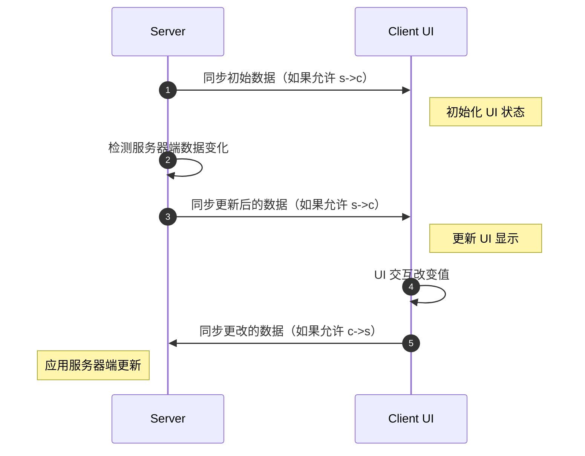

# 数据绑定与 RPCEvent

{{ version_badge("2.1.5", label="自", icon="tag") }}

在学习**数据绑定**和**RPCEvent**之前，理解**UI 组件**与**数据**之间的关系非常重要。

---

## 客户端的数据绑定

如果 UI 组件是数据驱动的，它在数据模型中的角色通常属于以下几类之一：

- **数据消费者**：被动接收数据并进行渲染。
- **数据生产者**：产生可能变化的数据（纯生产者在实际中较为少见）。
- **数据消费者 + 生产者**：既显示数据又修改数据。


### 使用 `IDataConsumer<T>` 的**数据消费者**

**被动接收数据**的组件实现了 `IDataConsumer<T>` 接口，例如 `Label` 和 `ProgressBar`。

此接口允许你绑定一个 `IDataProvider<T>`，它负责**提供更新后的数据值**。

当你想显示**动态文本**或**变化的进度值**时，这非常有用。


=== "Java"

    ```java
    var valueHolder = new AtomicInteger(0);
    // 绑定 DataSource 以通知 Label 和 ProgressBar 的值变化
    new Label().bindDataSource(SupplierDataSource.of(() -> 
        Component.literal("Binding: ").append(String.valueOf(valueHolder.get())))),
    new ProgressBar()
            .bindDataSource(SupplierDataSource.of(() -> valueHolder.get() / 100f))
            .label(label -> label.bindDataSource(SupplierDataSource.of(() -> 
                Component.literal("Progress: ").append(String.valueOf(valueHolder.get())))))
    ```

=== "KubeJS"
   
    ```js
    let valueHolder = {
        "value": 0
    }
    // 绑定 DataSource 以通知 Label 和 ProgressBar 的值变化
    new Label().bindDataSource(SupplierDataSource.of(() => `Binding: ${valueHolder.value}`)),
    new ProgressBar()
        .bindDataSource(SupplierDataSource.of(() => valueHolder.value / 100))
        .label(label => label.bindDataSource(SupplierDataSource.of(() => `Progress: ${valueHolder.value}`)))
    ```

### 使用 `IObservable<T>` 的**数据生产者**

产生可变数据的组件实现了 `IObservable<T>` 接口。大多数数据驱动组件都属于此类，例如 `Toggle`、`TextField`、`Selector`

此接口允许你绑定一个 `IObserver<T>`，当组件的值发生变化时，它会收到通知。

例如，要观察 `TextField` 的变化：

=== "Java"

    ```java
    var valueHolder = new AtomicInteger(0);
    // 绑定 Observer 以观察文本框的值变化
    new TextField()
        .setNumbersOnlyInt(0, 100)
        .setValue(String.valueOf(valueHolder.get()))
        // 绑定 Observer 以更新值持有者
        .bindObserver(value -> valueHolder.set(Integer.parseInt(value)))
        // 实际上，等同于 setTextResponder
        //.setTextResponder(value -> valueHolder.set(Integer.parseInt(value)))
    ```

=== "KubeJS"
   
    ```js
    let valueHolder = {
        "value": 0
    }
    // 绑定 Observer 以观察文本框的值变化
    new TextField()
        .setNumbersOnlyInt(0, 100)
        .setValue(valueHolder.value)
        // 绑定 Observer 以更新值持有者
        .bindObserver(value => valueHolder.value = int(value))
        // 实际上，等同于 setTextResponder
        //.setTextResponder(value => valueHolder.value = int(value))
    ```

!!! note
    `Toggle`、`Selector` 和 `TextField` 等组件同时支持
    `IDataConsumer<T>` 和 `IObservable<T>`，
    因为它们同时负责显示数据和修改数据。

---

## 客户端与服务器之间的数据绑定

如果你的 UI **仅在客户端工作**，`IDataConsumer<T>` 和 `IObservable<T>` 通常就足够了。它们涵盖了观察和更新本地数据的大部分需求。

然而，许多 UI 是**基于容器(Container)的 UI**，实际数据存储在**服务器**上。在这种情况下，你通常需要：

- 在客户端 UI 组件中**显示服务器端数据**。
- 将客户端 UI 上所做的更改**同步回服务器**。

这被称为**双向数据绑定**



这听起来可能很复杂，但 LDLib2 完全抽象了这一过程。

---

### 使用 `DataBindingBuilder<T>`

使用 `DataBindingBuilder<T>`，你**无需自己编写任何同步逻辑**。你只需要描述：

* **数据存储在哪里**
* **如何读取它**
* **如何应用更新**

#### 简单的双向绑定

=== "Java"

    ```java
    // 服务器端值
    // boolean bool = true;
    // String string = "hello";
    // ItemStack item = new ItemStack(Items.APPLE);

    new Switch()
        .bind(DataBindingBuilder.bool(() -> bool, value -> bool = value).build());

    new TextField()
        .bind(DataBindingBuilder.string(() -> string, value -> string = value).build());

    new ItemSlot()
        .bind(DataBindingBuilder.itemStack(() -> item, stack -> item = stack).build());
    ```

=== "KubeJS"

    ```js
    // 服务器端值
    // let bool = true;
    // let string = "hello";
    // let item = new ItemStack(Items.APPLE);

    new Switch()
        .bind(DataBindingBuilder.bool(() => bool, v => bool = v).build());

    new TextField()
        .bind(DataBindingBuilder.string(() => string, v => string = v).build());

    new ItemSlot()
        .bind(DataBindingBuilder.itemStack(() => item, v => item = v).build());
    ```

例如，在：

```java
DataBindingBuilder.bool(() -> bool, value -> bool = value).build()
```

* **第一个 Lambda 表达式**定义服务器如何向客户端提供数据。
* **第二个 Lambda 表达式**定义客户端的更改如何更新服务器数据。

---

### 单向绑定（仅服务器 → 客户端）

有时，你**不希望客户端的更改影响服务器**，例如对于仅用于显示的 `Label`。

LDLib2 允许你显式控制同步策略。

??? info "SyncStrategy 概览"
    - `NONE`
    完全不做同步。
    - `CHANGED_PERIODIC`
    仅在数据变化时同步（默认：每 tick 一次）。
    - `ALWAYS`
    每 tick 强制同步，即使没有变化（谨慎使用）。

=== "Java"

    ```java
    // 阻止客户端 -> 服务器更新
    new Label().bind(
        DataBindingBuilder.component(() -> Component.literal(data), c -> {})
            .c2sStrategy(SyncStrategy.NONE)
            .build()
    );

    // 仅服务器 -> 客户端的简写形式
    new Label().bind(
        DataBindingBuilder.componentS2C(() -> Component.literal(data)).build()
    );
    ```

=== "KubeJS"

    ```js
    // 阻止客户端 -> 服务器更新
    new Label().bind(
        DataBindingBuilder.component(() => data, c => {})
            .c2sStrategy("NONE")
            .build()
    );

    // 仅服务器 -> 客户端的简写形式
    new Label().bind(
        DataBindingBuilder.componentS2C(() => data).build()
    );
    ```

---

### 自定义 `IBinding<T>`

`DataBindingBuilder<T>` 为常见数据类型提供了内置绑定。对于自定义类型（例如 `int[]`），你可以创建自己的绑定。

```java
// 服务器端值
// int[] data = new int[]{1, 2, 3};

new BindableValue<int[]>().bind(
    DataBindingBuilder.create(
        () -> data,
        v -> data = v
    ).build()
);
```

!!! warning inline end
    并非所有类型都受默认支持。
    请参阅[类型支持](../../sync/types_support.md){ data-preview }。
    不受支持的类型需要自定义类型访问器。

如果类型是**只读的**（请参阅[类型支持](../../sync/types_support.md){ data-preview }）：

* getter **必须返回一个稳定的、非空实例**。
* 你必须定义类型和初始值。

使用 `INBTSerializable` 的示例：

```java
// 服务器端值
// INBTSerializable<CompoundTag> data = ...;

new BindableValue<INBTSerializable>().bind(
    DataBindingBuilder.create(
        () -> data,
        v -> {
            // 实例已经更新，只需在此处做出响应
        }
    )
    .initialValue(data).syncType(INBTSerializable.class)
    .build()
);
```

这确保了正确的同步，并避免了对只读对象的歧义。

### 客户端上的 `Getter` 和 `Setter`

你可能想知道为什么我们只在服务器端定义 getter 和 setter 逻辑，而不在客户端端定义。

这是因为所有支持 bind 方法的组件都继承自 `IBindable<T>`。对于这些组件，LDLib2 会自动为数据同步设置相应的客户端 getter 和 setter 逻辑。

在大多数情况下，这种默认行为已经足够，无需额外配置。

但是，如果你想完全控制客户端如何处理传入数据，或者它向服务器发送什么数据，你可以手动定义自己的客户端 getter 和 setter 逻辑。

=== "Java"

    ```java
    // 服务器端值
    // Block data = ...;

    var label = new Label();
    new BindableValue<Block>().bind(
        DataBindingBuilder.blockS2C(() -> data)
            .remoteSetter(block -> label.setText(block.getDescriptionId())).build()
    );
    ```
=== "KubeJS"

    ```js
    // 服务器端值
    // Block data = ...;

    let label = new Label();
    new BindableValue().bind(
        DataBindingBuilder.blockS2C(() => data)
            .remoteSetter(block => label.setText(block.getDescriptionId())).build()
    );
    ```

### 一站式解决方案 - `BindableUIElement<T>`

你可能已经注意到，几乎所有数据驱动组件——例如 `TextArea`、`SearchComponent`、`Switch` 等——都建立在 `BindableUIElement<T>` 之上。
`BindableUIElement<T>` 是一个包装过的 UI 元素，它实现了以下所有接口：
这意味着它既可以**显示数据**又可以**产生数据更改**，同时支持**客户端-服务器同步**。

??? info inline end
    `BindableValue<T>` 实际上是一个工具组件，并设置 `display: CONTENTS;`，这意味着在它存在期间不会影响布局。

如果你想实现自己的 UI 组件并支持客户端与服务器之间的双向数据绑定，你可以简单地继承这个类。
对于**不**实现 `IBindable<T>` 的组件——例如基础的 `UIElement`——你仍然可以通过在内部附加一个 `BindableValue<T>` 来实现数据绑定。
下面的示例展示了如何将服务器端数据同步到客户端，并用它来控制元素的宽度：

=== "Java"

    ```java
    // 服务器端值
    // var widthOnTheServer = 100f;

    var element = new UIElement();
    element.addChildren(
        new BindableValue<Float>().bind(DataBindingBuilder.floatS2C(() -> widthOnTheServer)
            .remoteSetter(width -> element.getLayout().width(width))
            .build())
    );
    ```
=== "KubeJS"

    ```js
    // 服务器端值
    // let widthOnTheServer = 100;

    let element = new UIElement();
    element.addChildren(
        new BindableValue().bind(DataBindingBuilder.floatS2C(() => widthOnTheServer)
            .remoteSetter(width => element.getLayout().width(width))
            .build())
    );
    ```

### 复杂用法示例

好的，让我们再做一个更复杂的例子，我们将为 `Selector` 绑定一个存储在服务器上的 `String` 列表（作为候选项）。
```java
// 方法 1，我们同步 String[]
// 代表存储在服务器上的值
// var candidates = new ArrayList<>(List.of("a", "b", "c", "d"));

var selector1 = new Selector<String>();
selector1.addChild(
    // 一个用于同步候选项的占位元素值，它不会影响布局
    new BindableValue<String[]>().bind(DataBindingBuilder.create(
            () -> candidates.toArray(String[]::new), Consumers.nop())
            .c2sStrategy(SyncStrategy.NONE) // 仅 s -> c
            .remoteSetter(candidates -> {
                selector1.setCandidates(Arrays.stream(candidates).toList());
            })
            .build()
    )
);

// 方法 2，我们同步 List<String>
// 代表存储在服务器和客户端上的值
// var candidates = new ArrayList<>(List.of("a", "b", "c", "d"));

var selector2 = new Selector<String>();
// 因为 List 对于 ldlib2 同步系统来说是一个只读值。你必须获取 List<String> 的真实类型
Type type = new TypeToken<List<String>>(){}.getType();
selector2.addChild(
    // 一个用于同步候选项的占位元素值，它不会影响布局
    new BindableValue<List<String>>().bind(DataBindingBuilder.create(
            () -> candidates, Consumers.nop())
            .syncType(type)
            .initialValue(candidates)
            .c2sStrategy(SyncStrategy.NONE) // 仅 s -> c
            .remoteSetter(selector2::setCandidates)
            .build()
    )
);

root.addChildren(selector1, selector2);
```
如果你理解了这段代码中展示的两种方法，你基本上就掌握了数据绑定。

- **方法 1** 同步一个 `String[]`，简单直接，按预期工作。
- **方法 2** 同步一个 `List<String>`。由于 `Collection<T>` 在 LDLib2 中被视为**只读类型**，你必须显式提供 `initialValue` 并指定实际类型（包括泛型）。

这确保了绑定系统能够正确识别和跟踪数据。


---

## UI RPCEvent

乍一看，数据绑定系统似乎处理了大部分同步需求，但在实践中，并非总是如此。

例如，如果你想在用户点击按钮时执行服务器端逻辑，数据绑定显然不适用。

现在考虑一个更复杂的场景：将一个 `FluidSlot` 绑定到服务器端的 `IFluidHandler`。
如果仅用于服务器到客户端的显示，这看起来似乎可以用数据绑定实现，效果也不错。
然而，一旦涉及交互，双向同步就变得危险。

如果允许客户端修改值，它很容易发送恶意数据包来操纵服务器端的 `IFluidHandler`。

??? "正确的方法"
    * 仅使用**服务器到客户端**的数据绑定进行显示
    * 将**客户端交互**（例如点击 `FluidSlot`）发送到服务器
    * 在服务器端处理交互
    * 如果服务器状态发生变化，通过数据绑定将其同步回客户端

简而言之，我们需要一种在客户端和服务器之间发送交互数据的机制。
这种机制被称为 **`UI RPCEvent`**。

以按钮为例，如果你已经阅读了 [UI 事件](./event.md#register-event-listeners) 部分，你已经知道 UI 事件可以发送到服务器并触发逻辑。
在内部，这是使用 `RPCEvent` 实现的。

```java
// 在服务器上触发 ui 事件
var button = new UIElement().addServerEventListener(UIEvents.MOUSE_DOWN, e -> {
    // 在服务器上执行某些操作
});
```

```java
// 使用 RPCEvent 的等效实现

var clickEvent = RPCEventBuilder.simple(UIEvent.class, event -> {
    // 在服务器上执行某些操作
});

new UIElement().addEventListener(UIEvents.MOUSE_DOWN, e -> {
    e.currentElement.sendEvent(clickEvent, e);
}).addRPCEvent(clickEvent);
```

你可以使用 `RPCEventBuilder` 来构造一个 `RPCEvent`，并在需要时将数据发送到服务器。

!!! note
    发送 RPC 事件时，**传递给 `sendEvent` 的参数必须与 `RPCEventBuilder` 中定义的参数完全匹配**，包括它们的顺序和类型，并且不要忘记 `addRPCEvent`。
    否则，事件将无法正确分发。


### 带返回值的 RPCEvent

有时你可能想向服务器发送请求以查询数据，并期望服务器返回结果。
例如，要求服务器执行加法并返回结果，你可以这样定义：

```java
var queryAdd = RPCEventBuilder.simple(int.class, int.class, int.class, (a, b) -> {
    // 在服务器上计算结果并返回
    return a + b;
});

new UIElement().addEventListener(UIEvents.MOUSE_DOWN, e -> {
    e.currentElement.<Integer>sendEvent(queryAdd, result -> {
        // 在客户端接收结果
        assert result == 2;
    }, 1, 2);
}).addRPCEvent(queryAdd);
```

### 向客户端发送事件

在实践中，**UI RPC 事件主要用于客户端 → 服务器通信**，可选地将响应发送回客户端。
这符合大多数实际用例，其中**服务器拥有数据和逻辑**，客户端只发送交互请求。

因此，LDLib2 **没有**为服务器 → 客户端 RPC 事件提供专门的 UI 级 API。

但是，**如果你确实需要主动从服务器向客户端发送事件**，你可以通过使用通用的 [RPC 数据包](../../sync/rpc_packet.md) 系统来实现。

下面是一个示例，展示了服务器如何向客户端发送 RPC 数据包，以及客户端如何定位并操作特定的 UI 元素。

```java
var element = new UIElement().setId("my_element");

// 在你想要的任何地方注解你的数据包方法
@RPCPacket("rpcEventToClient")
public static void rpcPacketTest(RPCSender sender, String message, boolean message2) {
    if (sender.isRemote()) {
        var player = Minecraft.getInstance().player;
        if (player != null && player.containerMenu instanceof IModularUIHolderMenu uiHolderMenu) {
            uiHolderMenu.getModularUI().select("#my_element").findFirst().ifPresent(element -> {
                // 在客户端对元素执行某些操作。
            });
        } 
    }
}

// 向远程/服务器发送数据包
RPCPacketDistributor.rpcToAllPlayers("rpcEventToClient", "Hello from server!", false)
```

这种方法让你可以完全控制服务器发起的客户端逻辑，同时保持 UI RPC 系统简单且专注于交互驱动的工作流。

!!! tip
    在使用 **`FluidSlot`** 与容器绑定时，实现已经使用了
    **服务器 → 客户端（s→c）只读数据同步**结合**RPC 事件**进行交互。

    你无需自己处理同步策略。
    `FluidSlot.bind(...)` 的实现也是学习数据同步和基于 RPC 的交互如何协同工作的一个很好的参考。
