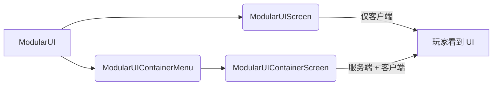
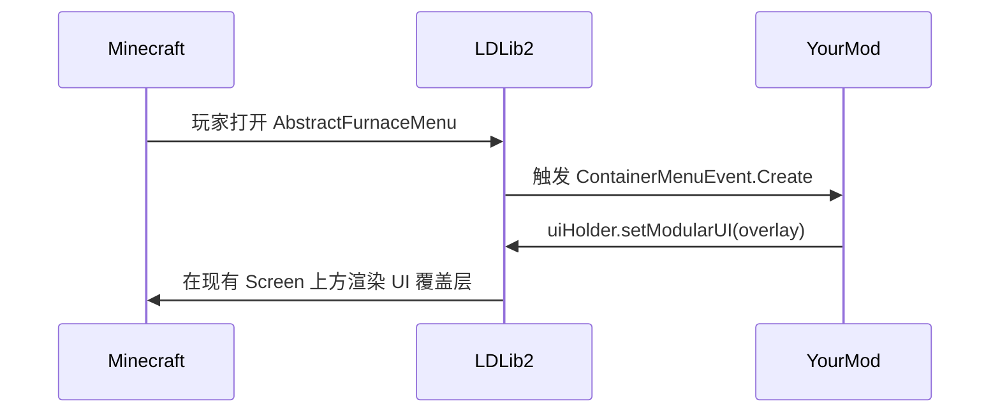

# Screen 与 Menu

{{ version_badge("2.2.1", label="自", icon="tag") }}

`ModularUI` 是一个 UI 树——它描述了 UI 的*外观*和*行为*。要将其实际展示给玩家，必须将其托管在 Minecraft 的 **Screen** 或 **Menu** 中。

LDLib2 提供了两个现成的宿主以及一组工厂辅助方法，以尽可能简化这一过程。

---

## 概述



| 宿主 | 同步 | 适用场景 |
| ---- | ---- | -------- |
| `ModularUIScreen` | 仅客户端 | 纯展示型覆盖层、HUD 控件，或不需要服务器数据的编辑器窗口 |
| `ModularUIContainerMenu` + `ModularUIContainerScreen` | 服务端 ↔ 客户端 | 任何需要读取或写入服务端数据的 UI（物品栏、机器配置等） |

---

## 仅客户端的 Screen

`ModularUIScreen` 直接继承自 Minecraft 的 `Screen`。它仅存在于客户端——不会在服务端的 Menu 中打开，且需要服务端同步的数据绑定将无法工作。

```java
// 构建你的 UI
var modularUI = ModularUI.of(UI.of(root));

// 将其包装为 Screen 并打开
Minecraft.getInstance().setScreen(new ModularUIScreen(modularUI, Component.literal("My UI")));
```

```kotlin
val modularUI = ModularUI(UI.of(root))
Minecraft.getInstance().setScreen(ModularUIScreen(modularUI, Component.literal("My UI")))
```

!!! note
    对于客户端工具（如编辑器、配置覆盖层）或任何不需要与服务器交互的 UI，请使用 `ModularUIScreen`。

---

## 服务端同步的 Screen 与 Menu

对于需要读取或写入服务端数据的 UI，LDLib2 采用标准的 Minecraft **Menu**（容器）系统。服务端创建 `ModularUIContainerMenu`，客户端会自动打开配对的 `ModularUIContainerScreen`。

### `IContainerUIHolder`

你可以在任何服务端对象（BlockEntity、Item 或普通类）上实现 `IContainerUIHolder` 来描述你的 UI：

```java
public class MyBlockEntity extends BlockEntity implements IContainerUIHolder {

    @Override
    public ModularUI createUI(Player player) {
        // 在服务端调用以构建 UI
        return ModularUI.of(UI.of(
            element({ cls = { +"panel_bg" } }) {
                // ... 你的元素
            }
        ), player);
    }

    @Override
    public boolean isStillValid(Player player) {
        // 返回 false 以关闭 UI，例如方块已被破坏时
        return !isRemoved();
    }
}
```

```kotlin
class MyBlockEntity : BlockEntity(...), IContainerUIHolder {

    override fun createUI(player: Player): ModularUI {
        // 在服务端调用以构建 UI
        val root = element({ cls = { +"panel_bg" } }) {
            // ... 你的元素
        }
        return ModularUI(UI.of(root, StylesheetManager.MODERN), player)
    }

    override fun isStillValid(player: Player) = !isRemoved
}
```

!!! note ""
    `createUI` 在**服务端**被调用。生成的 `ModularUI` 会自动同步到客户端。你在其中设置的任何 `DataBindingBuilder` 绑定都会在两端保持同步。

### 打开 Menu

一旦你拥有了 `IContainerUIHolder`，就可以使用 `player.openMenu(menuProvider)` 配合一个创建 `ModularUIContainerMenu` 的标准 `MenuProvider` 来打开菜单。下方的[内置工厂](#built-in-menu-factories)可以帮你处理所有这些操作。

---

## 内置 Menu 工厂

LDLib2 为最常见的使用场景提供了三种预置的工厂辅助类——`BlockUIMenuType`、`HeldItemUIMenuType` 和 `PlayerUIMenuType`。KubeJS 用户可以通过 `LDLib2UI` 事件组和 `LDLib2UIFactory` 绑定来访问这三种工厂。

详见 [UI Factory](../factory.md){ data-preview } 获取完整文档，包括 KubeJS 示例和脚本放置指南。

---

## 注入到现有 Menu 中

LDLib2 会在**每次打开任何 `AbstractContainerMenu` 时**触发 `ContainerMenuEvent.Create` 事件，包括原版和其他模组的菜单。
通过处理此事件，你可以将 `ModularUI` 覆盖层附加到任何现有 Screen 上，而无需修改其原始代码。

```java
@SubscribeEvent
public static void onContainerMenuCreate(ContainerMenuEvent.Create event) throws Exception {
    if (event.menu instanceof SomeVanillaMenu menu
            && menu instanceof IModularUIHolderMenu uiHolder) {
        var player = event.player;

        // 构建你想要的 UI 并注入
        var mui = ModularUI.of(UI.of(
            // 你的覆盖层根元素
        ), player);
        uiHolder.setModularUI(mui);
    }
}
```

!!! warning ""
    菜单必须实现 `IModularUIHolderMenu` 才能进行注入。
    LDLib2 会通过 Mixin 自动将此接口附加到所有 `AbstractContainerMenu` 的子类上，因此游戏中的所有菜单都已支持该操作。

### 示例：增强原版熔炉

以下示例（取自 `CommonListeners`）为标准熔炉 Screen 添加了一个显示剩余燃烧时间的覆盖层标签，并为 AE2 驱动器 Screen 添加了一个优先级文本框——均未直接修改这些 Screen：

```java
@SubscribeEvent
public static void onContainerMenuCreateEvent(ContainerMenuEvent.Create event) throws Exception {
    // 为任何熔炉 Screen 附加燃烧时间标签
    if (event.menu instanceof AbstractFurnaceMenu furnaceMenu
            && furnaceMenu instanceof IModularUIHolderMenu uiHolderMenu) {
        var player = event.player;
        var field = AbstractFurnaceMenu.class.getDeclaredField("data");
        field.setAccessible(true);
        ContainerData data = (ContainerData) field.get(furnaceMenu);

        var mui = ModularUI.of(UI.of(
            new UIElement().layout(l -> l.width(176).height(166)).addChildren(
                new UIElement()
                    .addChildren(
                        new Label().bind(DataBindingBuilder.componentS2C(() ->
                            Component.literal("burn time: %.2f / %.2f s"
                                .formatted(data.get(2) / 20f, data.get(3) / 20f))
                        ).build())
                    )
                    .layout(l -> l.positionType(TaffyPosition.ABSOLUTE)
                                  .widthPercent(100).paddingAll(5).top(-15))
                    .style(s -> s.background(MCSprites.BORDER))
            )
        ), player);
        uiHolderMenu.setModularUI(mui);
    }
}
```



!!! tip
    这种模式非常强大，可用于为游戏中的任何 Screen（包括其他模组的 Screen）添加上下文信息覆盖层、快速访问控件或调试面板。
