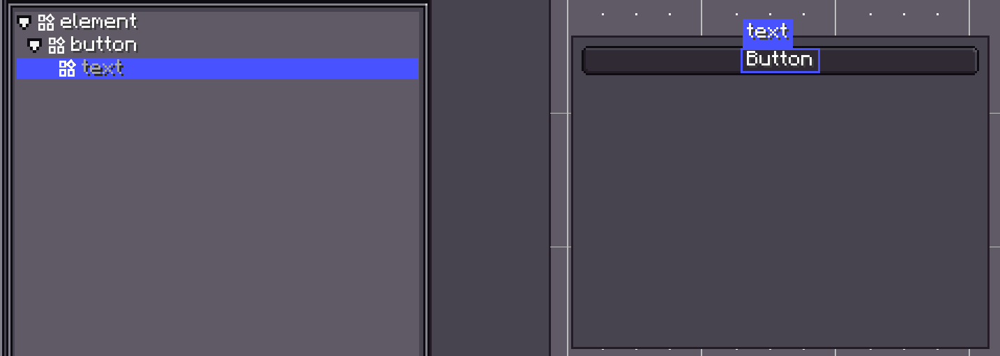
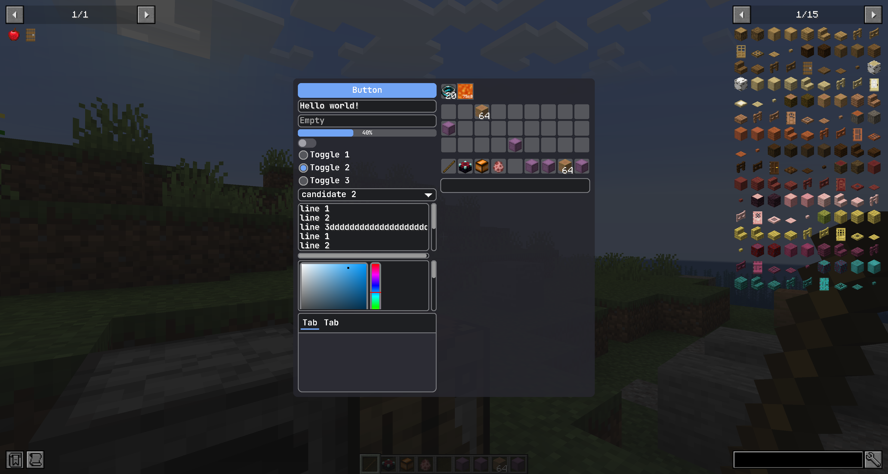

# StyleSheet

你可以使用 `LDLib Style Sheet`（LSS）为 UI 设置样式。LSS 文件是受 HTML 中 CSS 启发的文本文件。LSS 语法与 CSS 语法相同，但 LSS 包含了一些覆盖和自定义，以更好地适配 LDLib2 UI。

LSS 允许你将**表现**与**逻辑**分离，使 UI 代码更简洁、更易于维护。

---

## LDLib2 中的 Style 是什么

在介绍 LSS 本身之前，理解 LDLib2 中 **Style** 的含义以及样式在内部如何工作是至关重要的。

如果你熟悉 CSS，这些概念应该会让你感到很自然。

LDLib2 中的 **Style** 指的是任何影响 UI 元素渲染方式的视觉或布局相关配置，**与服务器端逻辑无关**。示例包括：

- `layout`（大小、位置、flex 行为）
- `background`
- `font-size`、`alignment` 等等

事实上，你已经了解的 `layout` 系统本身就是一种 **Style**。

每个 `UIElement` 可以定义多个样式，单个样式属性可以有来自不同来源的多个候选值。

在内部，每个 UI 元素维护一个 **StyleBag**，它：

- 存储应用于元素的所有样式值
- 解决样式之间的冲突
- 计算最终用于渲染的有效样式

最终样式由**优先级**决定，而不是应用顺序。

---

### Style Origin 与优先级

每个样式值都有一个 **StyleOrigin**，它定义了**样式来自哪里**以及**它的强度**。

??? info "StyleOrigin"
    ```java
    public enum StyleOrigin {
        /**
         * 由 UI 组件本身定义的默认样式
         */
        DEFAULT(0),

        /**
         * 在外部样式表（LSS）中定义的样式
         */
        STYLESHEET(2),

        /**
         * 直接在代码中设置的内联样式
         */
        INLINE(3),

        /**
         * 动画应用的样式
         */
        ANIMATION(4),

        /**
         * 覆盖所有其他样式的重要样式
         */
        IMPORTANT(5);
    }
    ```

优先级较高的样式会覆盖优先级较低的样式：

> `DEFAULT` < `STYLESHEET` < `INLINE` < `ANIMATION` < `IMPORTANT`

这种设计确保：

- 组件具有合理的默认值
- 样式表定义全局外观
- 内联样式可以覆盖样式表
- 动画可以临时覆盖视觉效果
- `IMPORTANT` 样式总是优先


### 可自定义的样式

LDLib2 提供多种方式来自定义 UI 样式。
你可以根据需要自由混合使用这些方法。

!!! note inline end
    在本页中，我们不会介绍所有支持的样式及其行为。每个 UI 组件在其自己的 wiki 页面上记录了它所支持的样式。

每个 UI 组件公开它支持的 `Style` 对象，允许你直接通过代码配置样式。

例如，在 [`layout`](./layout.md#setting-layout-properties) 中，`#layout(...)` 和 `#getLayout()` 都基于相同的底层 `Style` 系统。
`layout` 是一个在所有 UI 元素上都可用的共享样式。

此外，一些组件提供自己的专用样式。
例如，`Button` 公开了一个 `buttonStyle(...)` API，用于配置按钮特定的视觉属性。

---

## 通过代码自定义样式

有许多方法可以设置样式。

=== "Java"

    ```java
    var button = new Button();

    // 直接调用
    button.getStyle()
        // 设置背景纹理
        .background(SpriteTexture.of("photon:textures/icon.png"));
        // 设置悬停提示
        .tooltips("This is my tooltips")
        // 设置不透明度
        .opacity(0.5);

    // 链式调用，返回 button 本身以支持链式调用
    button.buttonStyle(style -> {}).style(style -> style
        .background(SpriteTexture.of("photon:textures/icon.png"));
        .tooltips("This is my tooltips")
        .opacity(0.5)
    );

    // lss 文本
    button.lss("background", "sprite(ldlib2:textures/gui/icon.png)");
    button.lss("tooltips", "This is my tooltips");
    button.lss("opacity", 0.5);
    ```
=== "KubeJS"

    ```js
    let button = new Button();

    // 直接调用
    button.getStyle()
        // 设置背景纹理
        .background(SpriteTexture.of("photon:textures/icon.png"));
        // 设置悬停提示
        .tooltips("This is my tooltips")
        // 设置不透明度
        .opacity(0.5);

     // 链式调用，返回 button 本身以支持链式调用
    button.buttonStyle(style => {}).style(style => style
        .background(SpriteTexture.of("photon:textures/icon.png"));
        .tooltips("This is my tooltips")
        .opacity(0.5)
    );

    // lss 文本
    button.lss("background", "sprite(ldlib2:textures/gui/icon.png)");
    button.lss("tooltips", "This is my tooltips");
    button.lss("opacity", 0.5);
    ```

以上所有方法都可以用来设置样式，但它们**并不等价**。

* 使用 `getStyle()` 或 `style(...)` 默认设置 `INLINE` 来源的样式。
* 使用 `lss(...)` 默认设置 `STYLESHEET` 来源的样式。

如果你想使用这些 API **以不同的 `StyleOrigin`** 分配样式，可以在应用样式时显式指定来源，如下所示：

=== "Java"

    ```java
    Style.pipeline(StyleOrigin.IMPORTANT, button.getStyle(), style -> style
        .tooltips("This is my tooltips")
    );

    // lss 文本
    button.lss("tooltips", "This is my tooltips", StyleOrigin.DEFAULT);
    ```
=== "KubeJS"

    ```js
    Style.pipeline("IMPORTANT", button.getStyle(), style => style
        .tooltips("This is my tooltips")
    );

    // lss 文本
    button.lss("tooltips", "This is my tooltips", "DEFAULT");
    ```

---

## 通过样式表自定义样式

虽然在代码中直接设置 UI 元素的样式很方便，但当你的项目涉及大量 UI 设计时，这很快就会变得**繁琐且重复**。

特别是：

* 将相同样式应用于多个 UI 元素需要重复代码。
* 更新共享样式（例如，更改背景纹理）可能需要手动修改每个相关的 UI 元素。

更重要的是，如果你希望你的 UI 样式可以被**玩家自定义**——例如，允许通过资源包覆盖样式——纯粹在代码中管理样式就变得不切实际。

使用**样式表（LSS）**允许你：

* 在多个 UI 元素之间集中和重用样式。
* 从单个位置修改整个 UI 的外观。
* 将 UI 样式暴露给资源包以便于自定义。

因此，对于大型项目，样式表是管理和统一 UI 样式的推荐方式。

### 语法
如果你熟悉 CSS，你会对 LSS 的语法非常熟悉。

LSS 包括以下内容：

* 包含 `selector` 和 `declaration block` 的样式规则。
* 用于识别样式规则影响哪个 UI 元素的选择器。
* 在大括号内的声明块，包含一个或多个样式声明。每个样式声明都有一个属性和一个值。每个样式声明以分号结尾。

**使用规则匹配样式**

以下是样式规则的一般语法：

```css
selector {
    property1: value;
    property2: value;
}
```

当你定义一个样式表时，你可以将其应用到 UI 树。选择器根据 LSS 匹配元素以确定哪些属性适用。如果选择器匹配一个元素，则样式声明适用于该元素。

例如，以下规则匹配任何 `Button` 对象：
```css
button {
  base-background: built-in(ui-mc:RECT_BORDER);
  hover-background: built-in(ui-mc:RECT_3);
  pressed-background: built-in(ui-mc:RECT_3) color(#dddddd);
  padding-all: 3;
  height: 16;
}
```

**支持的选择器类型**
LSS 支持多种类型的简单和复杂选择器，这些选择器基于不同的条件匹配元素，例如：

- 组件类型名称
- 分配的 `id`
- LSS `classes` 列表
- 元素在 UI 树中的位置及其与其他元素的关系

如果一个元素匹配多个选择器，LSS 会应用具有更高优先级的选择器中的样式。

LSS 支持一组简单选择器，这些选择器与 CSS 中的简单选择器类似但不完全相同。下表提供了 LSS 简单选择器的快速参考。

| 选择器类型 | 语法 | 匹配目标 |
| ---- | ----------- | ----------- |
| 组件选择器 | `type {...}` | 特定组件类型的元素。<br>（例如 `button`、`text-field`、`toogle`） |
| 类选择器 | `.class {...}` | 具有分配 LSS 类的元素。<br>（例如 `.__focused__`） |
| 内置状态选择器 | `:state {...}` | 处于内置运行时状态的元素。<br>`:xxx` 映射到 `.__xxx__`（例如 `:disabled` = `.__disabled__`，`:focused` = `.__focused__`，`:hover` = `.__hovered__`）。 |
| ID 选择器 | `#root {...}` | 具有分配 `id` 的元素。<br>（例如 `#root`） |
| 通用选择器 | `* {...}` | 任何元素。 |

内置状态选择器可以与组件选择器组合，以实现类似 CSS 的可读性：

```css
button:disabled {
}

button:focused {
}

button:hover {
}
```

LSS 支持 CSS 复杂选择器的一个子集。下表提供了 LSS 复杂选择器的快速参考。

| 选择器类型 | 语法 | 匹配目标 |
| ---- | ----------- | ----------- |
| Not 选择器 | `:not(selector) {...}` | 不匹配该选择器的元素。 |
| Host 选择器 | `selector:host {...}` | 必须是 `host` 的元素。 |
| Internal 选择器 | `selector:internal {...}` | 必须是 `internal` 的元素。 |
| 后代选择器 | `selector1 selector2 {...}` | 在 UI 树中是另一个元素后代的元素。 |
| 子元素选择器 | `selector1 > selector2 {...}` | 在 UI 树中是另一个元素子元素的元素。 |
| 多个选择器 | `selector1, selector2 {...}` | 匹配所有简单选择器的元素。 |

!!! info "`Host` 和 `Internal` 元素"
    一个 UI 树可以包含 **host 元素** 和 **internal 元素**。

    以 **`button`** 为例：

    * `button` 本身是一个 **host 元素**。它是你直接创建和交互的组件。
    * 在内部，`button` 包含其他 UI 元素，例如用于渲染其标签的 `text`。

    

    这些内部元素是组件实现的一部分，称为 **internal 元素**，它们不能从 UI 树中移除，并以灰色显示。

    你通常不需要手动创建或管理它们，但它们仍然存在于 UI 树中，可以参与布局、样式和事件传播。

    这种区分允许 LDLib2 组件既**可组合**又**可自定义**，同时保持其内部结构的封装。


??? note "支持的字符"
    -  必须以字母（`A–Z` 或 `a–z`）或下划线（`_`）开头。
    - 可以包含字母、数字（`0–9`）、连字符（`-`）和下划线（`_`）。
    - 选择器区分大小写。例如，myClass 和 MyClass 是不同的。
    - 选择器不能以数字或连字符后跟数字开头（例如，`.1class` 或 `.-1class`）。

**测验**

这里会选择什么样的元素？
```css
button:host :not(.my_label#my_id > text:internal) > .my_class:host, text-field {
    // ...
}
```

??? info "答案"
    1. **所有 `text-field` 元素**，无论它们在 UI 树中的位置如何。

    2. **具有 `my_class` 类的 host 元素**，具有以下约束：
        - 该元素必须是 **host 元素**。
        - 它的**直接父元素**必须**不是**一个 internal `text` 元素，该元素的父元素是具有 `my_label` 类且 ID 为 `my_id` 的元素。
        - 该元素必须在 UI 树中有一个 **host `button` 祖先**。


### 应用样式表

要应用你的样式表，你可以在创建 `UI` 时追加它们。

=== "Java"

    ```java hl_lines="30-32"
    private static ModularUI createModularUI() {
        // 设置带有 ID 的根元素
        var root = new UIElement().setId("root");
        root.addChildren(
                new Label().setText("LSS example"),
                new Button().setText("Click Me!"),
                // 为元素设置类
                new UIElement().addClass("image")
        );
        var lss = """
            // id 选择器
            #root {
                background: built-in(ui-gdp:BORDER);
                padding-all: 7;
                gap-all: 5;
            }
            
            // 类选择器
            .image {
                width: 80;
                height: 80;
                background: sprite(ldlib2:textures/gui/icon.png);
            }
            
            // 元素选择器
            #root label {
                horizontal-align: center;
            }
            """;
        var stylesheet = Stylesheet.parse(lss);
        // 添加样式表到 UI
        var ui = UI.of(root, stylesheet);
        return ModularUI.of(ui);
    }
    ```
=== "KubeJS"

    ```js hl_lines="30-32"
    function createModularUI() {
        // 设置带有 ID 的根元素
        let root = new UIElement().setId("root");
        root.addChildren(
                new Label().setText("LSS example"),
                new Button().setText("Click Me!"),
                // 为元素设置类
                new UIElement().addClass("image")
        );
        let lss = `
            // id 选择器
            #root {
                background: built-in(ui-gdp:BORDER);
                padding-all: 7;
                gap-all: 5;
            }
            
            // 类选择器
            .image {
                width: 80;
                height: 80;
                background: sprite(ldlib2:textures/gui/icon.png);
            }
            
            // 元素选择器
            #root label {
                horizontal-align: center;
            }
        `;
        let stylesheet = Stylesheet.parse(lss);
        // 添加样式表到 UI
        let ui = UI.of(root, stylesheet);
        return ModularUI.of(ui);
    }
    ```

你也可以在运行时修改样式表。

=== "Java"

    ```java
    var mui = elem.getModularUI();
    if (mui != null) {
        mui.getStyleEngine().addStylesheet(stylesheet);
    }
    ```

=== "KubeJS"

    ```js
    let mui = elem.getModularUI();
    if (mui != null) {
        mui.getStyleEngine().addStylesheet(stylesheet);
    }
    ```

### 局部样式表（子树作用域）

除了 `UI` 上的全局样式表外，你还可以将**局部样式表**附加到特定的 `UIElement`。

局部样式表仅影响：

* 元素本身
* 其所有后代元素

它们不会影响父元素或兄弟子树。

=== "Java"

    ```java
    var panel = new UIElement().setId("panel");
    panel.addLocalStylesheet("""
        button {
            width: 80;
        }
    """);
    ```
=== "KubeJS"

    ```js
    let panel = new UIElement().setId("panel");
    panel.addLocalStylesheet(`
        button {
            width: 80;
        }
    `);
    ```

### 内置样式表

LDLib2 提供了三个内置样式表 `gdp`、`mc` 和 `modern`，允许你灵活地切换主题。
使用 LDLib2 组件时，`gdp` 是默认样式表。

你可以使用 `StylesheetManager` 来访问所有已注册的样式表。

=== "Java"

    ```java hl_lines="30-32"
    private static ModularUI createModularUI() {
        // ...
        var stylesheet = StylesheetManager.INSTANCE.getStylesheetSafe(StylesheetManager.MC)
        return ModularUI.of(UI.of(root, stylesheet));
    }
    ```
=== "KubeJS"

    ```js hl_lines="30-32"
    function createModularUI() {
        // ...
        let stylesheet = StylesheetManager.INSTANCE.getStylesheetSafe(StylesheetManager.MC)
        return ModularUI.of(UI.of(root, stylesheet));
    }
    ```

所有三种内置样式表如下所示：

<figure markdown="span">
    
    <figcaption>
    GDP
    </figcaption>
    
    <figcaption>
    MC
    </figcaption>
    
    <figcaption>
    MODERN
    </figcaption>
</figure>

### 来自资源包的样式表

!!! note inline end
    

    在运行时修改后别忘了按 `F3 + T` 重新加载资源。

在实践中，样式表可以通过资源包添加或覆盖。
通过将你的 `LSS` 文件放置在指定路径，`StylesheetManager` 将在重新加载资源时自动发现并注册它们。

你应该将样式表放置在 `.assets/<namespace>/lss/<name>.lss` 路径下。

注册后，你可以使用 `StylesheetManager` 来访问它们。

=== "Java"

    ```java
    // 将 <namespace> 和 <name> 替换为你自己的。
    StylesheetManager.INSTANCE.getStylesheetSafe(
        ResourceLocation.parse("<namespace>:lss/<name>.lss")
    );
    ```
=== "KubeJS"

    ```js
    // 将 <namespace> 和 <name> 替换为你自己的。
    StylesheetManager.INSTANCE.getStylesheetSafe(
        "<namespace>:lss/<name>.lss"
    );
    ```