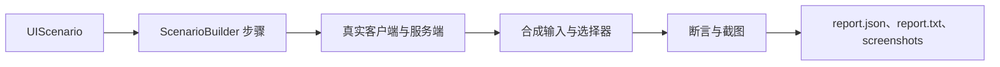

# UI 自动化测试

<VersionBadge version="2.2.34" label="Since" icon="tag" />

UI 测试框架在真实 Minecraft 客户端中运行场景：创建独立世界、打开真实 UI、通过普通 Screen 路径发送输入、等待服务端同步、记录断言，并输出截图和报告。



<figure>

<figcaption>
真实 <code>snake_hud</code> 场景生成的截图。测试框架在客户端中打开此 HUD、操作控件，并将图片与 <code>report.txt</code>、<code>report.json</code> 一并输出。
</figcaption>
</figure>

## 1. 注册场景

场景放入 `src/main/java`，不要放在 `src/test`，并注册到仅客户端的场景 registry。

```java
@LDLRegisterClient(name = "furnace_ui", group = "mymod", registry = UIScenario.REGISTRY,
        environment = RegistrationEnvironment.DEV_ONLY)
public class FurnaceUiScenario implements UIScenario {
    private static final BlockPos POS = new BlockPos(8, 65, 8);

    @Override
    public void configure(ScenarioOptions options) {
        options.tags("machine").guiScale(3);
    }

    @Override
    public void define(ScenarioBuilder s) {
        s.clearArea(POS, 2)
         .setBlock(POS, MyBlocks.FURNACE.get())
         .awaitClientBlockEntity(POS)
         .useBlock(POS)
         .awaitScreen(ModularUIContainerScreen.class)
         .awaitModularUI()
         .click("#btn_start")
         .waitForTextContains("#status_label", "Burning")
         .screenshot("running")
         .teardown("close", ctx -> ctx.requirePlayer().closeContainer());
    }
}
```

`RegistrationEnvironment.DEV_ONLY` 确保场景不会进入生产构建。

## 2. 运行

```text
gradlew runClient -PldTest=furnace_ui
```

| 选项 | 作用 |
| --- | --- |
| `-PldTest=all` | 运行所有已注册场景。 |
| `-PldTest=name1,name2` | 运行指定场景。 |
| `-PldTest=group:mymod` / `tag:fast` / `regex:.*_ui` | 按 group、tag 或名称模式选择。 |
| `-PldTestKeepOpen` | 保持客户端打开，便于迭代。 |
| `-PldTestGuiScale=3` | 设置整个运行的 GUI scale。 |
| `-PldTestInputMode=REAL` | 使用物理鼠标；需要前台焦点。 |

报告写入 `build/ldlib2-uitest/`：`report.json`、`report.txt` 和 `screenshots/`。`verifyUiTest` 会在 `runClient` 后执行；缺少报告也会失败。

快速迭代时，使用 `-PldTestKeepOpen`，然后在游戏内执行 `/ldlib2_autotest list` 或 `/ldlib2_autotest run furnace_ui`。

## 3. 编写可靠步骤

| 目标 | 常用方法 |
| --- | --- |
| 准备世界 | `setBlock`、`clearArea`、`withBlockEntity`、`giveItem` |
| 打开 UI | `openScreen`、`openModularUI`、`useBlock`、`awaitScreen`、`awaitModularUI` |
| 交互 | `hover`、`click`、`drag`、`scroll`、`typeInto`、`key` |
| 等待 | `frames`、`ticks`、`waitUntil`、`waitForText`、`waitForSync` |
| 断言 | `check`、`checkText`、`checkVisible`、`checkValue`、`checkBounds` |
| 截图 | `screenshot`、`screenshotElement` |

目标使用 LDLib2 CSS 选择器：标签名、`.class`、`#id`、后代和子选择器以及状态伪类。优先使用稳定 ID，例如 `#btn_start`。不支持选择器列表、属性选择器和 `:nth-child`；这些场景使用 `ctx.query(...)`。

::: tip 后台运行

默认合成输入不夺取焦点也不移动物理鼠标。只有测试操作系统级行为时才用 `REAL`；运行期间框架还会阻止意外 OS 输入。

:::

::: warning 等待状态，不等待任意帧数

每个 builder step 在一帧中运行，但游戏和数据绑定 UI 可能每秒只更新 20 tick。优先使用 `waitForSync`、`waitForText` 或 `waitUntil`，不要依赖任意帧延迟。

:::
