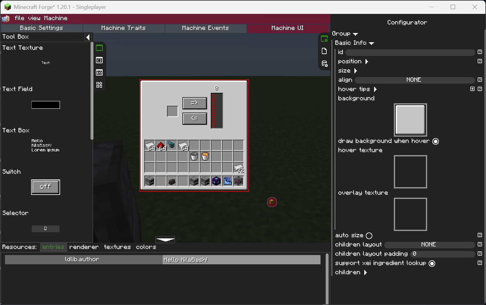
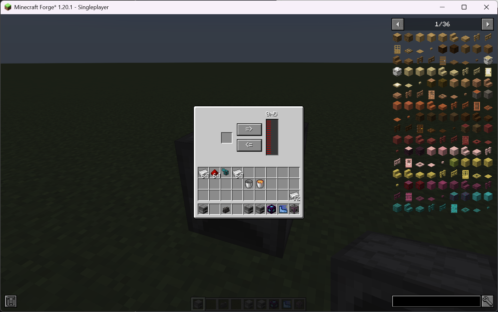

# UI

你可能已经使用过 mbd2 的可视化编辑器来创建 UI，但你可能已经注意到，除了 trait widget 之外，其他 widget 实际上都无法工作。这是因为我们还没有设置 UI 逻辑，例如按下按钮时应该发生什么。正如 [LDLib UI](../../ldlib/ui/index.md) 中提到的，我们推荐使用 UI 编辑器来创建和编辑 UI 布局，并使用 [`KubeJS`](../../ldlib/ui/code/index.md) / <del>`NodeGraph (W.I.P)`</del> 来设置交互逻辑。

在这里，我们实现了一个简单的、基于 UI 的手动岩浆填充机。

!!! note inline end
    示例可以在<a href="../assets/example.zip" download>这里</a>下载！
    
    将其放在 `.minecraft` 文件夹下。

首先，我们将机器配置为具有一个物品 trait 和一个流体 trait，并准备好我们的 UI：

1. 一个与 trait 对应的 UI。
2. 两个与填充方向对应的 [`Button`](../../ldlib/ui/widget/Button.md)。
3. 一个用于显示储罐中流体量的 [`TextTexture`](../../ldlib/ui/widget/TextTexture.md)。

{ width="80%" style="display: block; margin: 0 auto;" }

当你完成所有设置后，打开机器的 UI 应该是这样的：

{ width="80%" style="display: block; margin: 0 auto;" }


## KubeJS 控制
接下来，我们使用 KubeJS 为 UI 添加交互逻辑。
我们提供了一个事件 [`MBDMachineEvents.onUI`](https://github.com/Low-Drag-MC/Multiblocked2/blob/1.20.1/src/main/java/com/lowdragmc/mbd2/integration/kubejs/events/MBDServerEvents.java) 供你设置根 widget。该事件在 [`MBDMachineEvents.onOpenUI`](https://github.com/Low-Drag-MC/Multiblocked2/blob/1.20.1/src/main/java/com/lowdragmc/mbd2/integration/kubejs/events/MBDServerEvents.java) 之后触发，此时除逻辑外一切均已准备就绪。

```javascript
MBDMachineEvents.onUI("mbd2:kjs_ui_test", e => {
    const { machine, root } = e.event;
    const slot = root.getFirstWidgetById("ui:item_slot_0") // SlotWidget
    const tank = root.getFirstWidgetById("ui:fluid_tank_0") // FluidTankWidget
    const fill_button = root.getFirstWidgetById("fill_button") // Button
    const drain_button = root.getFirstWidgetById("drain_button") // Button
    const label = root.getFirstWidgetById("tank_label") // TextWidget

    // 设置标签以显示流体量
    label.setTextProvider(() => Component.string(tank.fluid.amount + "mB"))

    // 按钮点击时
    fill_button.setOnPressCallback(clickData => {
        if (clickData.isRemote) {
            // 在远程端触发
            // 因为所有内容都从服务器同步到客户端，所以你在远程端无法执行任何操作
        } else {
            var stored = slot.item
            // 检查是否存储了岩浆桶
            if (stored && stored.id === "minecraft:lava_bucket") {
                // 检查储罐中是否有足够的空间
                if (tank.lastTankCapacity - tank.fluid.amount >= 1000) {
                    // 移除岩浆桶
                    slot.item = { item: "minecraft:bucket", count: 1 }
                    // 向储罐中添加 1000mB 岩浆
                    tank.fluid = { fluid: "minecraft:lava", amount: tank.fluid.amount + 1000 }
                }
            }
        }
    })

    drain_button.setOnPressCallback(clickData => {
        if (!clickData.isRemote) {
            // 检查储罐中是否有岩浆
            if (tank.fluid.amount >= 1000 && slot.item.id === "minecraft:bucket") {
                // 从储罐中移除 1000mB 岩浆
                tank.fluid = { fluid: "minecraft:lava", amount: tank.fluid.amount - 1000 }
                // 添加一个岩浆桶
                slot.item = { item: "minecraft:lava_bucket", count: 1 }
            }
        }
    })

})
```

让我们看看最终结果！

<div>
  <video controls>
    <source src="../../assets/kjs_ui_result.mp4" type="video/mp4">
    Your browser does not support video.
  </video>
</div>

我们这里只使用了四个 widget（`TextTexture`、`Button`、`Slot` 和 `Tank`）。有关其他 widget 的更多详细信息，请查看[页面](../../ldlib/ui/widget/index.md)。


## 在控制器中显示部件的 trait UI / 在部件中显示控制器的 trait UI
MBD2 支持代理能力，允许你使用部件来代理控制器的能力。然而，你可能还想在部件中显示在控制器中定义的 trait 的 UI，或者反过来——在控制器的 UI 中显示来自部件的 trait。这是可能的，但需要一些额外的设置。

例如，假设你的部件有一个名为 `item_slot` 的物品 trait，只有一个槽位。它的 UI ID 将是 `ui:item_slot_0`。要在控制器的 UI 中显示它，你需要手动向控制器 UI 添加一个物品槽位 widget，并将其 ID 设置为 `part:item_slot@ui:item_slot_0`。

同样，假设你的控制器有一个名为 `air_handler` 的 PneumaticCraft 空气 trait。要在部件的 UI 中显示它，你需要手动添加一个进度条 widget（你也可以临时添加一个 trait 来自动生成 UI，然后移除该 trait），并将 widget 的 ID 设置为 `controller:air_handler@ui:air_handler`。
