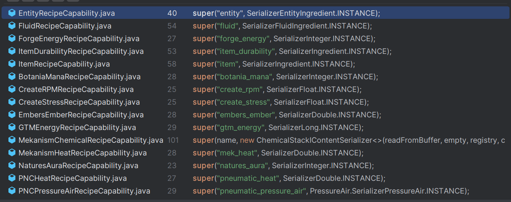

# 动态实时配方

## 升级系统

致谢：@yellowcake3d 
如果你正在寻找一种实现此类升级系统的方法，可以参考以下内容，这实际上大部分来自 mierno，但我最终使用了 `getTraitByName`，并且需要在 mbd 编辑器中勾选 "Always modify recipe"（始终修改配方）选项
```js
MBDMachineEvents.onBeforeRecipeModify('mbd2:high_pressure_electrolyzer', (event) => {
    const mbdEvent = event.getEvent();
    const { machine, recipe } = mbdEvent;

    let itemTrait = machine.getTraitByName("item_slot");
    if (itemTrait == null) return;
    let storage = itemTrait.storage;
    let upgradeCount = storage.getStackInSlot(0).count;

    //并行配方修改器，升级槽位中的升级物品越多，并行处理的配方数量越多
    let parallelRecipe = machine.applyParallel(recipe, upgradeCount);
    let copyRecipe = parallelRecipe.copy();
    //速度修改器，每安装一个新升级物品，配方速度加快1%
    let reductionFactor = Math.max(1 - 0.01 * upgradeCount, 0.1);
    copyRecipe.duration = Math.ceil(recipe.duration * reductionFactor);

    mbdEvent.setRecipe(copyRecipe);
});
```

## 通过 KubeJS 配方构建器创建动态配方

你可以通过使用 `onBeforeRecipeModify` 事件来应用修改器并替换原始配方，从而动态修改配方。在大多数情况下，这种方法已经足够。
然而，有时你可能需要更大的灵活性——例如删除、替换或追加原料。为此，我们提供了一种替代方法，允许你以类似于 KJS 配方事件的方式定义配方。

```js
MBDMachineEvents.onBeforeRecipeModify('machine:id', (event) => {
    const mbdEvent = event.getEvent();
    const { machine, recipe } = mbdEvent;
    
    // 创建一个空构建器
    // let newEmptyRecipeBuilder = recipe.recipeType.recipeBuilder();
    // 使用当前配方创建构建器
    let builder = recipe.toBuilder();

    builder.duration(412) // 修改持续时间
    builder.inputItems("apple") // 追加原料
    
    let fluidCap = MBDRegistries.RECIPE_CAPABILITIES.get("fluid")
    builder.removeOutputs(fluidCap) // 移除所有输出流体原料

    let newRecipe = builder.buildMBDRecipe();
    mbdEvent.setRecipe(newRecipe );
});
```
