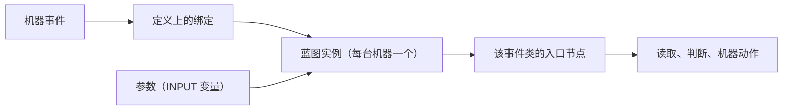

# 蓝图核心概念

<VersionBadge version="21.1.1" label="MBD2" icon="tag" />

决定一张蓝图行为的有五件事：它挂在哪些事件上、节点作用于哪台机器、外部能改哪些值、它怎么被挂到机器上、以及它出错时会发生什么。

## 入口节点

蓝图只能从**事件入口节点**开始执行。`mbd2/event` 分组里每个机器事件各有一个；没有入口节点的图是死图，MBD2 在加载时会警告：

> `Machine blueprint … has no event entry nodes — it will never run.`

[KubeJS 事件页](../KubeJS/event.md)列出的每个事件都有对应入口节点，另外还有一个 KubeJS 没有的：**Use Item On**（手持物品右键）。有两点要记住：

- **Fuel Burning Finish** 在 `21.1.1` 中永远不会触发，原因和它的 KubeJS handler 一样。
- `Client Tick`、`Custom Data Update` 和 `Custom Keyframe` 在客户端执行，`Build UI` **两端都会执行**——机器 UI 在服务端和每个打开它的客户端上各构建一次。写服务端状态的节点在客户端会被跳过而不是抛异常，`Play State Sound` 这类仅客户端节点在服务端也会被跳过；每个动作节点都声明了自己适用的 side。

同一个事件挂多个入口节点是允许的，而且**全部都会执行**，顺序是节点创建顺序，并且画布上看不出来。MBD2 会就此警告；不要让其中两个写同一样东西。

## 节点作用于哪台机器

机器节点带一个可选的 `machine` 输入。不连线时节点作用于**蓝图自己的机器**——这也是绝大多数情况想要的。连线则可以指向别的机器：

| 节点 | 得到 |
| --- | --- |
| **This Machine** | 本蓝图的机器，作为显式值 |
| **Machine At Position** | 某个世界坐标上的机器（如果有） |
| **As Multiblock Controller** / **As Multiblock Part** | 机器的控制器视图或部件视图 |
| **Controller Machine** / **Part Machine** | 跨已成型结构，位于 `mbd2/multiblock` 分组 |

Info 节点的 `target` 同理：不连线就是本机器、本机器的配方逻辑、本事件的配方。

## 参数

蓝图通过声明一个 **`INPUT` 图变量**来暴露参数。没有额外的清单文件。变量本身带名字、类型和默认值，这正好是 Inspector 里一行配置项所需要的全部信息，所以整合包作者不用打开图就能配置它。

<figure>

<figcaption>**Machine Settings → Blueprints** 下的每条绑定。`Parameters` 由图里的 `INPUT` 变量生成。</figcaption>
</figure>

参数值以序列化后的图常量形式保存，所以一个 `BlockPos` 参数和一个 `BlockPos` 常量节点走的是同一套 codec。

其他种类的变量是普通图状态：一次 `SetVar` 是**这台机器**在**这张蓝图**里的值，只要机器还加载着就会跨 tick 保留。它不随方块存盘——需要在区块卸载后仍然存在的东西，请写进机器的自定义数据，`heat_buildup` 就是这么做的。

## 引用还是内嵌

| 模式 | 保存的内容 | 适用 |
| --- | --- | --- |
| 引用（默认） | 资源路径，如 `built-in(mbd2:overclock)` | 蓝图被多台机器共用、需要集中修改 |
| **Embed a copy** | 整张图的快照 | 机器必须自包含——发给没有你 `.bp` 文件的人 |

引用的蓝图找不到文件时，Inspector 显示 `Missing: <path>`，且什么都不做。内置蓝图总能解析成功，包括在没有内容目录的专用服务器上。

## 执行顺序

机器的蓝图列表是一条**有序流水线**。对可改值的事件，每张蓝图读到的是前一张写下的结果，所以「红石控制 + 超频 + 额外产出」是三条绑定，而不是一张带开关的图。对可取消事件，取消是并集：任何一张都可以取消，且全部仍会执行。

把**重写配方**的蓝图排在**选择配方**的蓝图之后、**读取最终时长**的蓝图之前。

## 执行与失败

每台机器的每张蓝图各有一个执行器，在收到第一个事件时构建——不是在定义加载时，因为图里的常量（物品、方块、流体）要等注册表冻结后才能解码。

节点抛出的异常会被捕获。蓝图只记录一次（带堆栈），之后保持沉默：

> `Machine blueprint … failed handling MachineTickEvent; further failures from this blueprint will not be logged`

所以一张坏掉的蓝图代价是失去它的行为，而不是机器的 tick 或整个服务器。每次改图之后都看一眼 `logs/latest.log`——失败只在第一次出现时上报，机器重新加载之前不会再报。

## 用图搭 UI

蓝图可以挂在 `Build UI` 事件上，用通用 UI 节点搭建机器界面——加载模板、按 id 选中、添加子元素、附加样式表、设置 class、监听点击。[Auto IO 面板](./built-in.md#auto-io-面板)内置蓝图就是完整示例，而且它完全由通用节点搭成：不存在什么「auto IO 面板节点」。

任何 UI 蓝图都受两条约束：

- **客户端读不到 runtime value。**[Runtime value](../editor/runtime-values.md) 是服务端的，从不同步。面板要画的东西请通过机器的 `@DescSynced` 自定义数据发布。
- **合并，不要替换。**另一张蓝图或编辑器创作的 UI 可能已经占用了这块界面。用已知 id 加载共享容器，然后往里追加。
