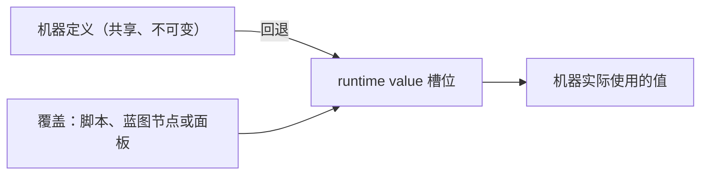

# Runtime Value（运行时值）

<VersionBadge version="21.1.1" label="Since" icon="tag" />

机器定义由从它放置出来的每一台机器共享。**runtime value** 是对定义上某一项设置的、只属于单台机器的覆盖：*这一台*粉碎机的 tier、*这一个*罐子的 auto IO 面、*这一块*电池的传输速率。

不需要事先声明什么。每一项可覆盖的设置都已经有一个槽位；在有东西写入之前，机器读到的仍然是定义里的值。



## 一个槽位存什么

一个叶子值——布尔、数字、枚举、字符串列表、包围盒。auto IO 这类复合设置是**一组叶子槽位**，所以覆盖其中一面，其余五面仍然读定义。

| 行为 | 说明 |
| --- | --- |
| 回退 | 没有覆盖时读定义里创作的值 |
| 持久化 | 随方块实体存盘 |
| 同步 | **从不在两端之间传输**，见下 |
| 开销 | 零带宽；不参与每 tick 的脏值扫描 |
| 未知键 | 本版本不认识的键会原样保留并写回 |

::: warning 仅服务端
覆盖从不同步。没有写过任何值的客户端读到的是定义值，也就是这套系统出现之前它给出的同一个答案。客户端侧写入对客户端专属的值（渲染开关）是合理的，但它只存活到那个客户端方块实体被丢弃为止——区块重载就没了。

需要**显示**覆盖值的 UI（[auto IO 面板](../blueprints/built-in.md#auto-io-面板)就是）必须改为通过机器的 `@DescSynced` 自定义数据发布。
:::

## 机器上的槽位

| 键 | 类型 | 覆盖 |
| --- | --- | --- |
| `machine_level` | int | 机器 tier |
| `drop_machine_item` | bool | 破坏时是否掉落机器物品 |
| `signal_connection.{front,back,left,right,top,bottom}` | bool | 各面红石连接 |
| `part.can_share` | bool | 该部件能否被多个控制器共用 |
| `recipe_logic.enable` | bool | 配方逻辑是否运行 |
| `recipe_logic.damping` | int | 每个等待 tick 损失的进度 |
| `recipe_logic.always_search` | bool | 每次配方结束后重新搜索 |
| `recipe_logic.always_modify` | bool | 每轮重新应用修饰器 |
| `recipe_logic.consume_inputs_after_working` | bool | 把输入消耗推迟到完成时 |
| `multiblock.show_ui_when_click_structure` | bool | 仅多方块控制器 |

## Trait 上的槽位

每个 Trait 都带配方 handler 三件套；支持的 Trait 还带 capability IO 和 auto IO：

| 键 | 类型 | 出现在 |
| --- | --- | --- |
| `recipe_handler_io` | `IO` | 所有配方 capability Trait |
| `distinct` | bool | 同上 |
| `slot_names` | 字符串列表 | 同上 |
| `capability_io.{internal,front,back,left,right,top,bottom}` | `IO` | 暴露方块 capability 的 Trait |
| `auto_io.{enable,front,back,left,right,top,bottom,interval}` | bool / `IO` / int | 支持 auto IO 的 Trait |
| `auto_world_input.{enable,range,interval,speed}` | bool / 包围盒 / int | 物品与流体 Trait |
| `auto_world_output.{enable,range,interval,speed}` | 同上 | 同上 |

另外还有各 Trait 自己的设置：

| Trait | 键 |
| --- | --- |
| `item_slot` | `allow_same_items`、`slot_limit`、`filter.enable` |
| `fluid_tank` | `allow_same_fluids`、`capacity`、`filter.enable` |
| `forge_energy_storage` | `capacity`、`max_receive`、`max_extract` |
| `entity_handler` | `area` |
| `chemical_tank` | `allow_same_chemicals`、`capacity`、`filter.enable` |
| `ars_source_storage` | `capacity`、`max_receive`、`max_extract`、`expose_to_devices` |
| `ars_nearby_source` | `radius`、`scan_interval`、`particles` |
| `aura_handler` | `radius` |
| `ae2_me_interface`、`ae2_me_pattern_provider` | `item_capacity`、`fluid_capacity` |
| `pneumatic_pressure_air_handler` | `volume`、`max_pressure`、`danger_pressure`、`critical_pressure`、`connection_io.{...}` |

任何机器的权威清单是 `machine.runtimeValues.slots()`，或者 **Runtime Value Names** 蓝图节点。

## 在蓝图里

`mbd2/machine` 和 `mbd2/machine/action` 分组提供了完整接口，见[节点参考](../blueprints/nodes.md)。包括类型化读取（`Get Runtime Int`、`Get Runtime IO` 等）、类型化写入（`Set Runtime Value (Number)` 等）、`Is Runtime Value Overridden`、`Clear Runtime Value`、`Clear All Runtime Values`，以及 auto IO 和 capability IO 的快捷节点。

## 在 KubeJS 里

机器和任意 Trait 上都有按名字访问的入口：

```js
MBDMachineEvents.onPlaced('example:crusher', wrapper => {
  const machine = wrapper.event.machine

  machine.runtimeValues.set('machine_level', 3)
  console.info(`${machine.getMachineLevel()} (authored ${machine.runtimeValues.authored('machine_level')})`)

  const slots = machine.getTraitByName('item_slot')
  slots.runtimeValues.set('auto_io.enable', true)
  slots.runtimeValues.set('auto_io.front', 'OUT')      // enum by name
  slots.runtimeValues.set('auto_io.interval', 10)
})
```

常用项有便捷方法：

```js
machine.setMachineLevel(5)
machine.clearMachineLevel()

const slots = machine.getTraitByName('item_slot')
slots.setAutoIOEnabled(true)
slots.setAutoIOSide('up', IO.OUT)     // 世界方向，会按机器朝向解析
slots.setAutoIOInterval(7)
slots.setCapabilityIOSide('north', IO.NONE)
slots.clearAutoIO()
```

已经拿到槽位对象时也可以直接走字段链：

```js
slots.autoIO.enable.setValue(false)
slots.autoIO.front.setValue(IO.OUT)
console.info(`${slots.autoIO.interval.get()} ${slots.autoIO.enable.isOverridden()}`)
```

::: warning 槽位对象上用 `setValue`，不要用 `set`
`RuntimeValue.set(T)` 擦除成 `set(Object)`，Rhino 不会把 JS 原始值绑定到它——`slot.set(false)` 会抛 `Can't find method ...set(boolean)`。`setValue(Object)` 会做转换，是给脚本用的入口。`runtimeValues.set(key, value)` 不是泛型方法，可以正常绑定。
:::

## 类型转换与报错

| 写入 | 槽位类型 | 结果 |
| --- | --- | --- |
| `7` 或 `7.0` | int | `7` |
| `7.9` | int | 抛异常——不会静默截断 |
| `'OUT'` | `IO` | `IO.OUT`，忽略大小写 |
| `'true'` / `'false'` | bool | 按写入；其他字符串抛异常 |
| `'input,catalyst'` | 字符串列表 | `["input", "catalyst"]`，去空格、丢空项 |
| `null` | 任意 | 抛异常——请用 `clear()` |

未知的键会抛异常，并在消息里列出可用键，所以拼错会立刻发现而不是悄悄失效。

## 它属于哪一层

| 需求 | 用 |
| --- | --- |
| 这一类机器都这样 | 编辑器里的定义 |
| 这一台机器不一样 | runtime value |
| 玩家在游戏里配置 | runtime value，从[蓝图 UI](../blueprints/built-in.md#auto-io-面板) 写入 |
| 客户端要能看到这个值 | 自定义数据，不是 runtime value |
| 客户端要能持久保存 | 两者都不行——它是服务端状态 |
