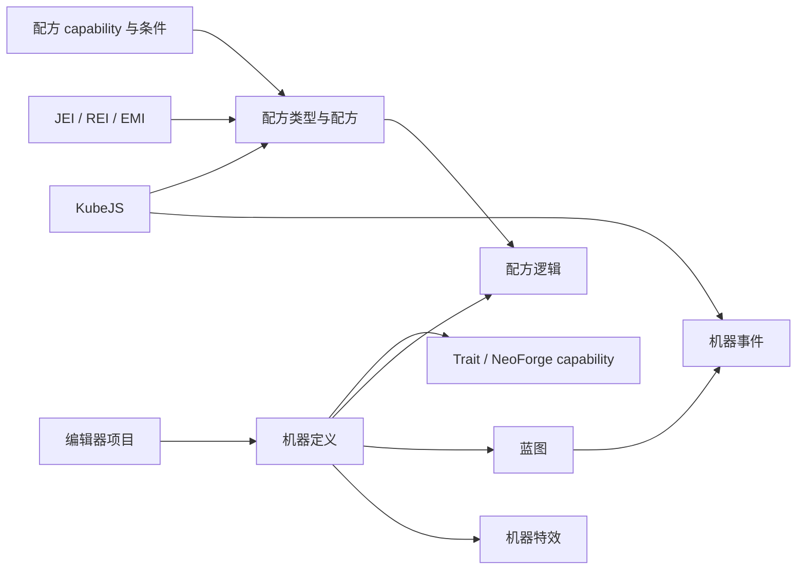

# Multiblocked2

<VersionBadge version="21.1.1" label="文档对应版本" icon="tag" />

Multiblocked2（MBD2）让整合包作者在游戏内编辑器中创建单方块机器和多方块结构，再把它们接到配方、Trait、节点图行为、特效以及可选的模组整合上。

<figure>

<figcaption>打开了一个新建单方块机器项目的 MBD2 1.21.1 编辑器。</figcaption>
</figure>

::: warning 版本范围
本手册面向 Minecraft `1.21.1` 与 MBD2 `21.1.1`。更旧的 1.20.1 示例可能使用已经不再公开的 API 或整合。
:::

## 选择路径

| 目标 | 从这里开始 |
| --- | --- |
| 不写代码做出第一台机器 | [快速开始](./getting-started.md) |
| 端到端注册机器、配方类型和配方 | [教程](./tutorials/) |
| 在编辑器里配置项目 | [编辑器](./editor/) |
| 定义配方与前置条件 | [配方系统](./recipes/) |
| 不写脚本给机器加行为 | [蓝图](./blueprints/) |
| 用脚本写配方或机器行为 | [KubeJS](./KubeJS/) |
| 从模组扩展 MBD2 | [Java 扩展](./java/) |

## 各部分如何组合

## 行为该写在哪一层

| 层 | 随谁发布 | 适合 |
| --- | --- | --- |
| 配方条件与修饰器 | 配方类型 | 资格判断、超频、并行 |
| [蓝图](./blueprints/) | 机器定义 | 整合包应当白拿到的机器行为 |
| [Runtime value](./editor/runtime-values.md) | 单台放置的机器 | 玩家可改的单机配置 |
| [KubeJS](./KubeJS/) | 整合包 | 配方，以及整合包作者需要覆盖的行为 |
| [Java](./java/) | 模组 | 新的存储模型、内容类型、条件 |

## 整合状态

| 整合 | 提供 |
| --- | --- |
| KubeJS | 配方 schema、注册事件、机器事件、脚本渲染器 |
| JEI / REI / EMI | 配方与多方块展示 |
| Mekanism | 化学品与热量 Trait、capability、温度条件 |
| Create | 旋转 capability 与条件、动能机器类型 |
| PneumaticCraft | 压力/空气与热量 Trait、capability、条件 |
| Nature's Aura | Aura Trait 与配方 capability |
| Ars Nouveau | Source 缓冲与附近源罐 Trait、capability、条件 |
| AE2 | ME 接口与样板供应器 Trait |
| GeckoLib | 动画机器渲染与客户端关键帧事件 |
| Jade | 机器信息提供器 |
| Photon | [机器特效](./editor/machine-fx.md) |
| KilaGraph | [蓝图](./blueprints/) |
| Botania、GTCEu、Embers | **未公开**——类还在，注册被注释掉了 |

依赖任何可选模组之前，先读[整合](./integrations/)。
