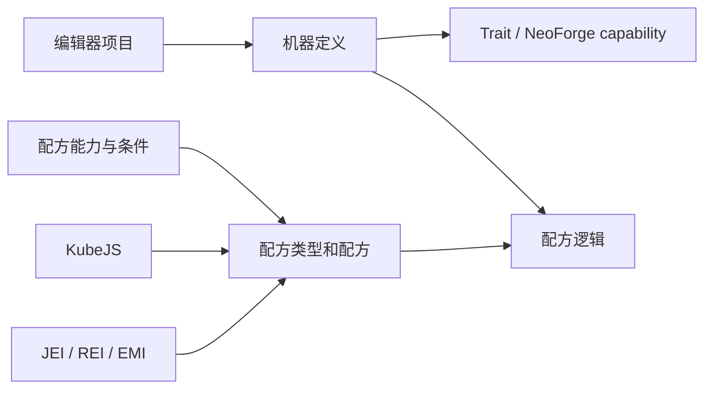

# Multiblocked2

<VersionBadge version="21.0.11" label="文档对应版本" icon="tag" />

Multiblocked2（MBD2）让整合包作者通过游戏内编辑器创建单方块机器和多方块机器，并连接配方、Trait 与可选模组集成。

<figure>

<figcaption>打开新建单方块机器项目后的 MBD2 1.21.1 编辑器工作区。</figcaption>
</figure>

::: warning 版本范围
本文档面向 Minecraft `1.21.1` 和 MBD2 `21.0.11`。旧的 1.20.1 示例可能使用了不再公开的 API 或集成。
:::

## 选择路径

| 目标 | 从这里开始 |
| --- | --- |
| 不写代码创建第一个机器 | [快速开始](./getting-started.md) |
| 端到端注册机器、配方类型与配方 | [Java 与 KubeJS 教程](./tutorials/) |
| 在编辑器中配置项目 | [编辑器](./editor/) |
| 定义配方与运行条件 | [配方系统](./recipes/) |
| 用脚本编写配方或机器行为 | [KubeJS](./KubeJS/) |
| 从模组扩展 MBD2 | [Java 扩展](./java/) |

## 模块如何协作

## 当前集成状态

| 集成 | 21.0.11 状态 | MBD2 提供的内容 |
| --- | --- | --- |
| JEI、REI、EMI | 已支持 | 配方与多方块信息展示 |
| KubeJS | 已支持 | 配方 schema、注册事件、机器事件 |
| Mekanism | 已支持 | 化学品/热 Trait、能力、热条件 |
| Create | 已支持 | 转动能力、条件、动力 Trait |
| PneumaticCraft | 已支持 | 压力/空气与热 Trait、能力、条件 |
| Nature's Aura | 已支持 | 灵气 Trait 和配方能力 |
| AE2 | 已支持 | ME Interface 和 Pattern Provider Trait |
| GeckoLib、Jade | 已支持 | 动画机器渲染；机器信息提供器 |
| Botania、GTCEu、Embers、Photon | 未公开 | 部分源码存在，但关键注册已禁用；请勿依赖它制作整合包内容 |

依赖可选模组前，请阅读[集成](./integrations/)。
