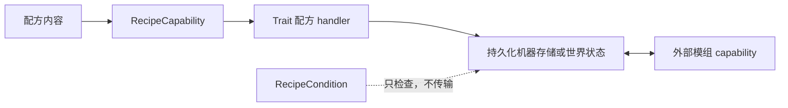

# 集成

<VersionBadge version="21.0.11" label="MBD2" icon="tag" />

MBD2 集成是一条管线，而不是单个开关。配方 capability 描述内容，机器 Trait 提供运行时 handler 和可选的外部 capability，condition 只观察状态。可执行配方通常至少需要前两层。

<figure>

<figcaption>最大化编辑器中的实时 Add Trait 注册表；仅在对应模组已加载时显示可选条目。</figcaption>
</figure>

## 选择页面

| 支持 | 增加内容 | 详细教程 |
| --- | --- | --- |
| 内置 | 物品、耐久、流体、FE、实体 | [内置 capability](./built-in-capabilities.md) |
| Mekanism | 化学品与热 | [Mekanism](./mekanism.md) |
| Create | 转动、RPM/应力内容与条件 | [Create](./create.md) |
| PneumaticCraft | 压力/空气与热 | [PneumaticCraft](./pneumaticcraft.md) |
| Nature's Aura | 世界灵气传输 | [Nature's Aura](./natures-aura.md) |
| Applied Energistics 2 | ME 接口与样板供应器桥接 | [Applied Energistics 2](./applied-energistics-2.md) |

JEI/REI/EMI、Jade、GeckoLib、KubeJS 和休眠源码路径保留在[状态矩阵](./status.md)，不把它们作为内容资源集成展开。

## 通用配置清单

1. 在客户端和服务端安装可选模组并完整重启；只有对应 mod ID 已加载时才会发现可选注册项。
2. 在 `/mbd2_editor` 给机器添加本文指定的 Trait；配方 IO、GUI IO、capability IO、过滤、容量和自动 IO 要分别配置。
3. 给配方类型/配方添加对应 capability 内容。仅有 capability 行不会自动创建槽、罐或网络节点。
4. 多个 handler 应使用不同名称；需要定向路由时，用 `slotName` 绑定内容。
5. 同时测试模拟与实际执行、输入与输出、每 tick 内容、重启后持久化、外部管道/网络以及整合包的准确模组版本。

::: warning 源码存在不等于支持
集成类可能仍在仓库中，但注册注解或启动路径已经禁用。只有状态矩阵标为可用的入口才适合 21.0.11 教程。
:::
