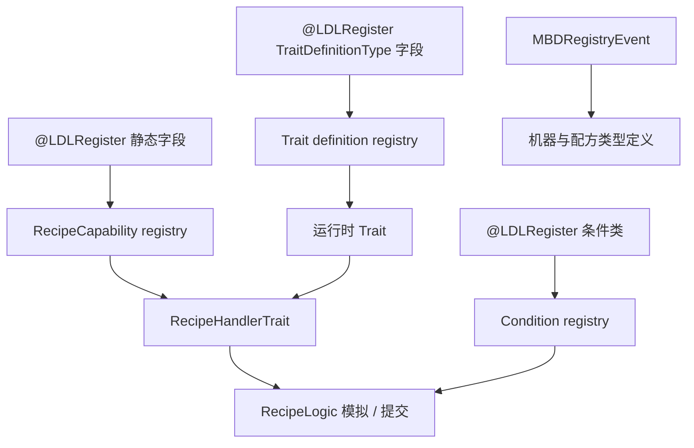

# Java 扩展

<VersionBadge version="21.0.11" label="MBD2" icon="tag" />

当整合包需要新的存储模型、配方内容类型、条件、机器子类或外部模组 capability 时使用 Java。MBD2 将面向编辑器的定义与运行时对象分离，也将配方内容与处理该内容的 Trait 分离。

<figure>

<figcaption>Java TraitDefinitionType 注册成功后会成为编辑器条目；配方 capability 与 condition 使用各自注册表。</figcaption>
</figure>

## 选择扩展点

| 需求 | 实现内容 | 注册方式 |
| --- | --- | --- |
| 从模组 JAR 加载编辑器生成的机器 | `MBDRegistryEvent.Machine` 监听器 | NeoForge mod event bus |
| 添加新的机器项目/定义类别 | `MachineDefinitionType<T>` 和定义子类 | `@LDLRegister` 静态字段 |
| 添加存储、行为或方块 capability | `TraitDefinition` + `Trait` | `TraitDefinitionType` 静态字段 |
| 添加配方内容领域 | `RecipeCapability<T>` + `IContentSerializer<T>` | `RecipeCapability` 静态字段 |
| 让 Trait 消耗/产出该内容 | `IRecipeHandlerTrait<T>` 或 `RecipeHandlerTrait<T>` | 由运行时 Trait 返回 |
| 添加环境/运行时前置条件 | `RecipeCondition` | 在条件类上添加注解 |

请先完成 [Gradle 依赖配置](./dependency-setup.md)，再阅读[注册与生命周期](./registration-and-lifecycle.md)。确认工作区能解析 MBD2 与 LDLib2 后，再依次完成[自定义能力](./custom-recipe-capability.md)、[自定义 Trait](./custom-trait.md)和[自定义条件](./custom-condition.md)教程。

::: warning API 层级
这些页面对应 MBD2 `21.0.11`。MBD2 的构造工作完成后 registry 会冻结；不要在 common setup、服务器启动或 KubeJS server script 中注册这些对象。
:::
