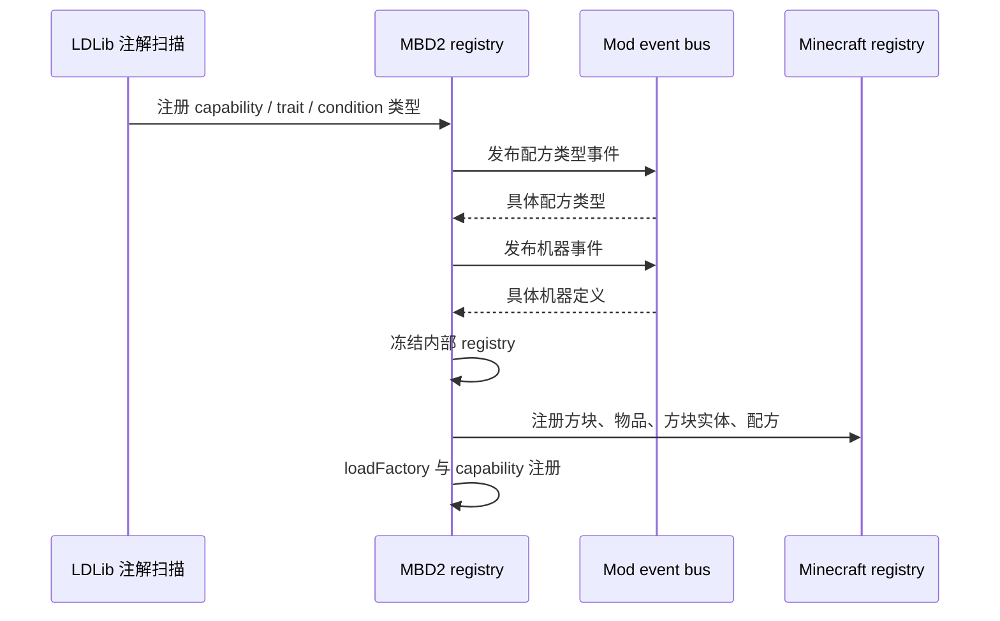

# 注册与生命周期

<VersionBadge version="21.0.11" label="MBD2" icon="tag" />

<figure><figcaption>编辑器构建此注册表菜单之前，注解扫描必须已完成。</figcaption></figure>

MBD2 有两条注册路径。带注解的扩展类型会在 MBD2 冻结内部 registry 前被发现；具体机器与配方类型定义则通过 MBD2 mod-bus 事件提供。

## 注解扫描的 registry

| Registry ID | 注解目标 | 注册值 |
| --- | --- | --- |
| `mbd2:recipe_capability` | `public static` 字段 | `RecipeCapability<?>` |
| `mbd2:trait_definition_type` | `public static` 字段 | `TraitDefinitionType<?>` |
| `mbd2:recipe_condition` | 具有无参构造器的具体类 | `RecipeCondition` 工厂 |
| `mbd2:machine_definition_type` | `public static` 字段 | `MachineDefinitionType<?>` |

```java
@LDLRegister(
    name = "heat_units",
    registry = "mbd2:recipe_capability",
    modID = "examplemod" // 可选的软依赖保护
)
public static final HeatUnitsCapability CAP = new HeatUnitsCapability();
```

注册 `name` 必须稳定。配方、编辑器产品文件、codec 和 KubeJS lookup 都会持久化它。`modID` 表示“仅在该模组已加载时注册”；对于自己始终存在的扩展应省略。

## 定义事件

在 `@Mod` 构造器提供的 NeoForge mod event bus 上注册监听器：

```java
@Mod(ExampleMod.MOD_ID)
public final class ExampleMod {
    public static final String MOD_ID = "examplemod";

    public ExampleMod(IEventBus modBus) {
        modBus.addListener(ExampleMod::registerMachines);
        modBus.addListener(ExampleMod::registerRecipeTypes);
    }

    private static void registerMachines(MBDRegistryEvent.Machine event) {
        event.registerFromResource(
            ExampleMod.class,
            "single_machine",
            "examplemod/mbd/machines/heat_press.sm"
        );
    }

    private static void registerRecipeTypes(MBDRegistryEvent.MBDRecipeType event) {
        event.registerFromResource(
            ExampleMod.class,
            "examplemod/mbd/recipe_types/heat_press.rt"
        );
    }
}
```

JAR 中对应资源为 `/assets/examplemod/mbd/machines/heat_press.sm` 和 `/assets/examplemod/mbd/recipe_types/heat_press.rt`。`.sm` 产品使用 `single_machine`，`.mb` 产品使用 `multiblock`。

## 运行顺序



在 `MBDMachineDefinition#onRegistry` 运行前不要缓存机器方块或方块实体类型。registry 构建完成后再从已注册定义中查询。
