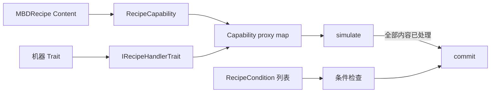

# Capability、Handler 与条件

<VersionBadge version="21.1.1" label="MBD2" icon="tag" />

MBD2 配方不是一次直接的物品栏操作。它包含带类型的 `Content`；配方逻辑将每组内容路由给机器 Trait 提供的兼容 `IRecipeHandler`，再根据机器和世界检查条件。

## 必须匹配的三个概念

| 概念 | 负责内容 | 示例 |
| --- | --- | --- |
| `RecipeCapability<T>` | 内容类型、codec、编辑器/XEI 展示、KubeJS 转换 | `forge_energy` 拥有整数 FE 内容 |
| Trait/handler | 机器存储和真实输入/输出操作 | Forge Energy Trait 提供 `ForgeEnergyRecipeHandler` |
| `RecipeCondition` | 不消耗内容的判断 | 红石信号位于 7 到 15 |

已经注册但没有 handler 的 capability 可以被创作，却永远不能完成。配方 IO 为 `IN` 的 Trait 不能满足输出内容。Condition 也不能代替缺失的输入。

继续阅读[能力参考](./capability-reference.md)、[条件参考](./condition-reference.md)或 [Java 扩展 Engine](../java/)。
