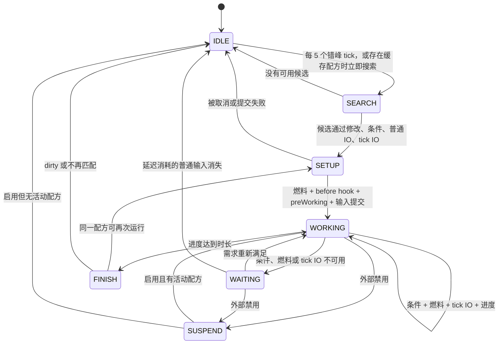
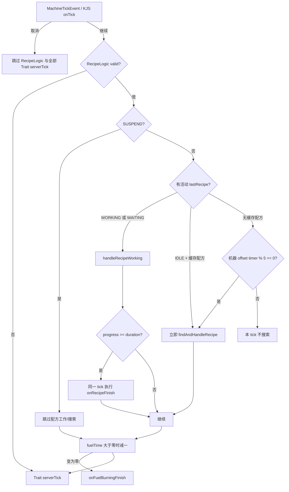

# RecipeLogic 生命周期

<VersionBadge version="21.0.11" label="MBD2" icon="tag" />

<figure><figcaption>生命周期搜索所选类型的配方集合，然后模拟并提交其强类型内容。</figcaption></figure>

`RecipeLogic` 是一台机器的服务端调度器。它负责决定何时搜索，验证并修改候选配方，模拟全部 handler，获取燃料，提交配方 IO，推进进度，进入等待/衰减，完成输出，并决定同一配方能否立即执行下一轮。

本页严格按照 21.0.11 的真实调用顺序描述。`onBeforeRecipeWorking` 等事件名很容易让人误判时机，请以本文注入点表格为准。

## 状态与持久化字段

- `status`

  当前调度状态：`IDLE`、`WORKING`、`WAITING` 或 `SUSPEND`。

- `lastRecipe`

  经机器 modifier 处理后的有效配方。它可能是动态生成的副本，不一定存在于 `RecipeManager`。

- `lastOriginRecipe`

  修改前原始配方的稳定 ID。MBD2 用它为下一轮重新生成有效配方。

- `progress` 与 `duration`

  已完成的工作 tick，以及有效配方的总时长。

- `consumeInputsAfterWorking`

  是否把非 per-tick 输入延迟到配方完成时消耗。

- `fuelTime` 与 `fuelMaxTime`

  剩余燃料 tick，以及提供这些 tick 的燃料配方时长。

- `lastFuelRecipe`

  最近一次实际消耗的有效燃料配方。

- `recipeDirty`

  强制开始新的配方搜索，而不是立即复用 `lastRecipe`。

- `lastFailedMatches`

  已通过初始搜索、但在 modifier、条件或最终验证中失败并等待重试的候选。

这些执行字段会持久化。状态、等待原因、配方进度与燃料进度也用于 UI/Jade 同步。



## 一个服务端 tick

`MBDMachine#serverTick` 先发布可取消的 `MachineTickEvent`。未取消时，`internalServerTick` 先运行 `RecipeLogic#serverTick`，再运行每个附加 Trait 的 `serverTick`。



燃料倒计时位于 `SUSPEND` 判断之外。因此已有燃料在机器 `WAITING`、`SUSPEND`，甚至当前没有加工配方时仍会下降。

## 搜索管线

### 1. 全局搜索前先尝试复用

`recipeDirty == false` 时，`findAndHandleRecipe` 会先尝试 `lastRecipe`。复用要求以下三项全部通过：

1. `lastRecipe.matchRecipe(machine)`：模拟非 per-tick 输入**以及输出容量**。
2. `lastRecipe.matchTickRecipe(machine)`：模拟 per-tick 输入和输出。
3. `lastRecipe.checkConditions(logic)`：计算分组/reverse 条件。

复用失败或配方 dirty 时，会先清除缓存的有效配方与 origin ID，再开始新搜索。

### 2. 配方类型搜索

`MBDRecipeType#searchRecipe`：

1. holder 没有 recipe capability proxy 时直接返回空列表。
2. 从 `RecipeManager` 读取该 `MBDRecipeType` 的全部配方。
3. 通过 `matchRecipe` 模拟普通 IO。
4. 通过 `matchTickRecipe` 模拟 per-tick IO。
5. 按整数 `priority` 升序排列；数值越小越先尝试。

`searchRecipe` 本身不应用条件和机器 modifier；它们属于候选验证阶段。

::: warning 异步搜索
启用 `ConfigHolder.ASYNC_RECIPE_SEARCHING` 时，最初的 `searchRecipe` 模拟会在 `Util.backgroundExecutor` 上运行。自定义 handler 的模拟必须只读，并能安全应对这种访问方式。future 完成后，服务端线程会重新检查候选，并执行全部修改与 setup 提交。
:::

### 3. 候选验证与修改

对于每个搜索结果，`checkMatchedRecipeAvailable` 按以下顺序处理：

```text
原始配方
  -> onBeforeRecipeModify（可修改、可取消）
  -> 配置的 getModifiedRecipe / 并行计算
  -> onAfterRecipeModify（可修改）
  -> 条件
  -> 普通 IO 模拟
  -> per-tick IO 模拟
  -> setupRecipe
```

返回/携带 `null` 会拒绝当前候选。在初始搜索中匹配、但在 modifier、条件或后续验证中失败的候选会保存到 `lastFailedMatches`。机器空闲且没有活动配方时，MBD2 每隔错峰的五个 tick 搜索，并重试这组缓存候选。

只有 setup 真正得到 `WORKING` 配方后才设置 `lastOriginRecipe`。即使 `lastRecipe` 是修改后的副本，它仍保存原始 `RecipeManager` ID。

## Handler 模拟与路由

MBD2 会按 capability 将无标签内容与各 `slotName` 分组分开。先尝试准确请求 `IO` 注册的 handler，再尝试 `IO.BOTH` handler。distinct handler 优先，并且必须独自满足整个适用内容组。

匹配时每个 handler 都收到 `simulate = true`。返回 `null` 表示全部剩余内容已经处理；返回非空列表则继续传给后续 handler。提交阶段以 `simulate = false` 重复相同路由。

输出匹配只是通过模拟预留容量，不会提前插入输出。自定义 handler 对相同状态的模拟和提交必须返回相同 remainder，否则 setup 可能只提交配方的一部分。

## Setup 与普通输入消耗

`setupRecipe(effectiveRecipe)` 的准确顺序为：

1. 需要燃料时由 `handleFuelRecipe()` 获取燃料。
2. `machine.beforeWorking(recipe)` 发布 `onBeforeRecipeWorking`；取消会终止 setup。
3. `recipe.preWorking(machine)` 调用相关输入/输出 handler 的 `preWorking`。
4. 读取机器的 `consumeInputsAfterWorking` 设置。
5. 输入不延迟时，提交非 per-tick `IO.IN`。
6. 保存 `lastRecipe`，设置 `status = WORKING`、`progress = 0`，并复制 `duration`。

::: warning 燃料早于 before-working 事件
取消 `onBeforeRecipeWorking` 时，燃料可能已经被消耗。不要把该事件当作普通资格检查；应使用 `RecipeCondition`，或在配方修改阶段拒绝候选。
:::

启用 `consumeInputsAfterWorking` 时，setup 不会消耗普通输入。之后每个工作 tick 都重新执行 `matchRecipe`；需要的普通输入或输出容量消失时，`interruptRecipe()` 会丢弃进度并回到 `IDLE`。输入最终在普通输出之前提交。

## 一个工作或等待 tick

`handleRecipeWorking` 同时处理 `WORKING` 与 `WAITING` 配方：

1. 普通输入延迟时，重新模拟全部普通 IO；失败会中断配方。
2. 重新检查全部 `RecipeCondition`。
3. 确保存在燃料；`fuelTime == 0` 时获取新燃料配方。
4. 模拟 per-tick IO。
5. 成功后先提交 per-tick `IO.IN`，再提交 per-tick `IO.OUT`。
6. 将状态设为 `WORKING`。
7. 发布 `onRecipeWorking`，其中 progress 是**增加之前**的值。
8. 未取消时增加 `progress` 与 `totalContinuousRunningTime`。
9. 条件/燃料/tick IO 失败时设为 `WAITING`，保存原因，并发布 `onRecipeWaiting`。
10. 启用等待衰减时，以 `recipeDampingValue` 减少进度，但不会低于零。
11. 离开 `WORKING` 时执行 handler `postWorking`；进入/重新进入 `WORKING` 时执行 handler `preWorking`。

::: warning `onRecipeWorking` 位于 tick IO 之后
取消 `onRecipeWorking` 会中断配方，但本 tick 的 per-tick 输入和输出已经提交。需要阻止 tick 执行时应使用条件或 handler 模拟；该事件适合观察或执行 IO 之后的副作用。
:::

等待中的配方每个服务端 tick 都会重试。恢复后的第一个成功 tick 会提交 tick IO 并增加进度；handler `preWorking` 在这次状态切换末尾调用。

## 燃料引擎

主 `MBDRecipeType` 通过 `FuelRecipeConfig` 启用燃料。配置列表保存作为燃料来源的其他 MBD 配方类型 ID。

需要燃料且 `fuelTime == 0` 时，`handleFuelRecipe`：

1. 搜索配置的全部燃料配方类型。
2. 模拟其普通/per-tick IO，并按 priority 升序排列。
3. 发布 `onFuelRecipeModify`；取消或设为 `null` 会跳过该燃料候选。
4. 检查修改后燃料配方的条件。
5. 提交它的**非 per-tick 输入**。
6. 设置 `fuelMaxTime = fuelRecipe.duration`、`fuelTime = fuelMaxTime`，并保存 `lastFuelRecipe`。

当前引擎不会提交燃料配方输出；虽然 tick 内容会参与燃料匹配，`handleFuelRecipe` 只提交普通输入。燃料配方应只依赖 duration 与普通输入，不要依赖燃料输出或 per-tick 燃料内容。

每个有效服务端 tick 结束时，正数 `fuelTime` 都会减一。变成零时会运行 Java hook `onFuelBurningFinish(lastFuelRecipe)`，并向 NeoForge event bus 发布 `MachineFuelBurningFinishEvent`。但 21.0.11 此处没有调用 `postCustomEvent()`，所以已注册的 KubeJS `onFuelBurningFinish` handler **不会运行**。直到主配方 setup/工作 tick 再次调用 `handleFuelRecipe`，才会搜索下一份燃料。

## 完成与下一次执行

`progress >= duration` 时，会在同一个服务端 tick 完成：

1. `machine.afterWorking()` 发布 `onAfterRecipeWorking`。
2. 输入延迟时，提交普通 `IO.IN`、清除标志，再调用 Java hook `onConsumeInputsAfterWorking()`。
3. 对输入/输出 handler 调用 `postWorking`。
4. 提交非 per-tick `IO.OUT`。
5. 调用 Java hook `IMachine#onRecipeFinish()`。
6. 决定下一轮能否复用当前配方。

下一轮选择由两个机器设置控制：

| 设置 | 完成后的效果 |
| --- | --- |
| `alwaysSearchRecipe` | 将缓存配方标为 dirty，强制重新搜索配方类型 |
| `alwaysModifyRecipe` | 从 `RecipeManager` 重新读取 `lastOriginRecipe`，再次应用机器 modifier |

配方不 dirty 时，MBD2 会重新检查普通 IO、tick IO 与条件。成功就立即调用 `setupRecipe(lastRecipe)`；第一步进度在下一个服务端 tick 才发生。否则状态变为 `IDLE`，进度/时长清零；下个 tick 会重试缓存配方或开始新搜索。

每轮结束后可能出现更高优先级配方时启用 `alwaysSearchRecipe`。超频、并行、等级或机器数据可能在两轮之间改变有效配方时启用 `alwaysModifyRecipe`。同一有效配方应持续重复时，两者都关闭开销最低。

## Machine Event 注入点

| Hook/事件 | 准确时机 | 取消/修改 | 推荐用途 |
| --- | --- | --- | --- |
| `onTick` | 配方逻辑与全部 Trait server tick 之前 | 取消会跳过两者 | 粗粒度机器暂停/控制；必须轻量 |
| `onBeforeRecipeModify` | 每个候选的配置 modifier/并行之前 | 可修改配方；取消即拒绝 | 少量动态候选拒绝或预处理 |
| `onAfterRecipeModify` | modifier/并行之后，条件与最终模拟之前 | 可修改配方 | 观察/收尾有效配方；普通超频优先使用配置 modifier |
| `onFuelRecipeModify` | 燃料匹配后、条件与燃料输入提交前 | 可修改/可取消 | 调整燃料时长/输入，或拒绝燃料候选 |
| `onBeforeRecipeWorking` | 已获取燃料后，handler `preWorking` 与普通输入提交前 | 取消 setup | setup 通知；不适合资格检查或无损取消燃料 |
| `onRecipeStatusChanged` | `setStatus` 每次切换状态 | 读取 `oldStatus`/`newStatus` | 动画、声音、统计；不要从尚未赋值的新 logic 字段推断 |
| `onRecipeWorking` | 条件/燃料成功且 per-tick IO 提交后、progress 增加前 | 取消会中断 | 观察已完成的 tick IO，或触发 post-IO 效果 |
| `onRecipeWaiting` | 状态与原因设为 waiting 后 | 只观察 | UI、诊断、限频反馈 |
| `onAfterRecipeWorking` | 完成时位于延迟输入/输出之前；中断时也会调用 | 只观察 | 与 setup 配对清理；涉及输出时必须区分完成/中断 |
| Java/NeoForge `onFuelBurningFinish` | 服务端 tick 末尾燃料计数变零时 | 只观察 | 21.0.11 仅 Java event-bus listener 可用；不会送达 KubeJS |

`MBDServerEvents` 当前注册了 KubeJS 名称 `onFuelBurningFinish`、`onConsumeInputsAfterWorking` 与 `onRecipeFinish`，但 21.0.11 的基础 `MBDMachine` 没有将这三者通过 `postCustomEvent()` 送出。Java hook/event-bus post 可能会运行，但在机器实现真正发布事件前，这三个 KubeJS 订阅都不是注入点。需要精确完成时机时，可结合 `onAfterRecipeWorking` 与状态/配方检查，或实现 Java machine hook。

## 行为应该放在哪里

| 需求 | 首选扩展点 |
| --- | --- |
| 世界/机器资格 | `RecipeCondition` |
| 消耗或产出资源 | `IRecipeHandlerTrait` 模拟/提交 |
| 超频、并行、时长/内容转换 | Recipe modifier / `getModifiedRecipe` |
| 预留/释放外部事务状态 | Handler `preWorking` / `postWorking` |
| 视觉状态与统计 | 状态、等待、燃料结束事件 |
| 一次性的 tick 后行为 | `onRecipeWorking`，并牢记 tick IO 已提交 |
| 精确的输出后 Java 行为 | 重写 `IMachine#onRecipeFinish` |

不要把资源核算放进通用事件。条件可能重复计算，搜索可能异步执行，工作事件也可能发生在 IO 之后；只有 handler 协议专门为“先模拟、后权威提交”设计。
