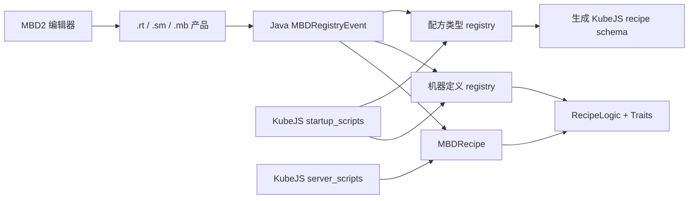

# 端到端注册教程

<VersionBadge version="21.1.1" label="MBD2" icon="tag" />

这些教程把注册阶段、编辑器定义、配方创建、重启/重载行为与运行时验证串成完整流程。建议先从头完成一条路径，再组合不同 API。

<figure>

<figcaption>每个教程最终都会产生一个已注册定义，其编辑体验和行为与此编辑器机器一致。</figcaption>
</figure>

## 选择教程

| 目标 | 教程 |
| --- | --- |
| 在 Java 模组中分发定义与内置配方 | [Java：机器、配方类型与配方](./java-end-to-end.md) |
| 掌握 KubeJS startup/server 阶段划分 | [KubeJS：Registry 与配方脚本](./kubejs-end-to-end.md) |
| 使用完整编辑器机器，同时让整合包配方保持可脚本化 | [编辑器 + Java + KubeJS 混合流程](./hybrid-editor-kubejs.md) |

::: warning KubeJS-only 边界
KubeJS 能创建空壳的 `single` / `multiblock` 定义，但 `21.1.1` 没有公开用于状态、渲染器、Trait、UI、配方逻辑和多方块 Pattern 的创作 API。KubeJS 壳可以验证注册；真正能加工的机器来自编辑器或 Java。
:::

::: tip 不走这些路也能给机器加行为
如果你要的只是行为而不是一台新机器——红石控制、超频、额外产出——直接绑一张[内置蓝图](../blueprints/built-in.md)。不用脚本、不用模组、不用重启。
:::
