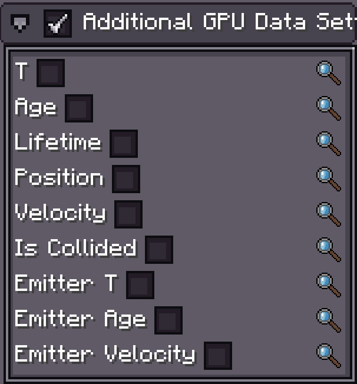

# 额外 GPU 数据

{{ version_badge("2.0.0", label="自版本", icon="tag", href="/changelog/#2.0.0") }}

Photon2 允许你向 GPU 发送**额外的逐粒子顶点属性**——例如 `age`、`T` 或速度。

> **注意：**
> - 此功能**需要 GPU 实例**模式。
> - 目前**仅支持粒子发射器**（其他 FX 对象的支持将在后续添加）。
> - 修改原版顶点格式较为困难，且发送大量逐顶点数据效率较低，因此采用此独立系统。

---

## 粒子发射器

{ width="30%" align=right }

在 `Particle Emitter` 的 **Inspector** 面板中，启用 **Additional GPU Data** 并选择你需要的数据字段。

### 支持的数据类型

| 数据                  | 类型     | 描述                                 |
| --------------------- | -------- | ------------------------------------ |
| `Random`              | `float`  | [0, 1) 范围内的随机值   `since 2.1.3`   |
| `T`                   | `float`  | **归一化生命周期**：`age / lifetime` |
| `Age`                 | `float`  | 粒子年龄                             |
| `LifeTime`            | `float`  | 粒子生命周期                         |
| `Position (local)`    | `vec3`   | 粒子**本地位置**                     |
| `Velocity`            | `vec3`   | 粒子速度                             |
| `isCollided`          | `float`  | `1` = 已碰撞，`0` = 未碰撞           |
| `Emitter T`           | `float`  | 发射器归一化生命周期                 |
| `Emitter Age`         | `float`  | 发射器年龄                           |
| `Emitter Position`    | `vec3`   | 发射器世界位置                       |
| `Emitter Velocity`    | `vec3`   | 发射器速度                           |

---

## 🛠 Shader 设置

额外属性在**顶点着色器（vsh）**中，按顺序追加在默认顶点布局之后。

> **⚠ 警告：**
> - 务必将新属性声明放在 `#moj_import <photon:particle.glsl>` **之后**。
> - GPU 和驱动的行为可能有所不同；顺序布局不一定总是可靠——需要时请使用 `layout(location = x)` 显式绑定属性。

**示例：** 如果你启用了 **`T`** 和 **`Velocity`**，将其添加到你的 shader：

```glsl
#version 330 core

#moj_import <photon:particle.glsl>

in float T;
in vec3 velocity;

/*
layout(location = 9) in float T;       // 显式位置绑定
layout(location = 10) in vec3 velocity;
*/

void main() {
    // 在此处使用额外属性...
}
```

---

✅ **专业提示：**
保持你的**布局索引**有序——发射器的属性顺序与 shader 声明不匹配可能导致渲染异常或数值错误。
