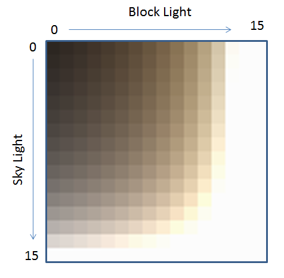
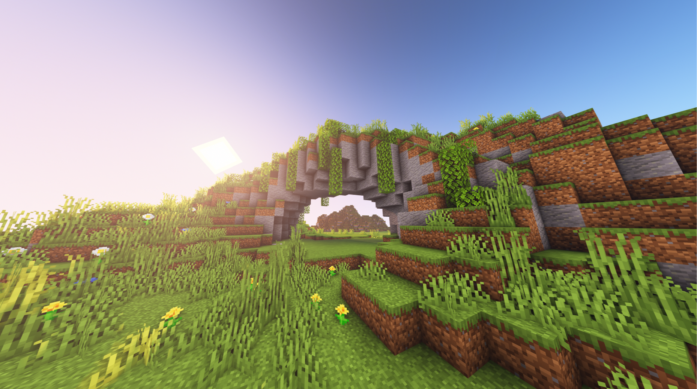
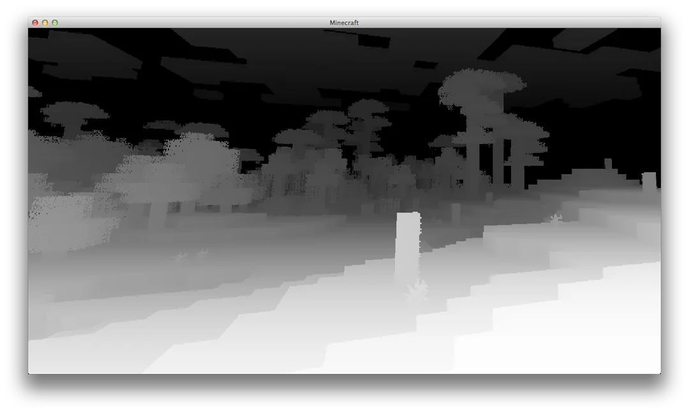

# ExtendedShader

{{ version_badge("2.0.0", label="自", icon="tag", href="/changelog/#2.0.0") }}

在阅读本页前，请确保你已了解 [Minecraft Core Shader](https://minecraft.wiki/w/Shader#Core_shaders)。

Photon2 和 LDLib2 使用 **ExtendedShader** 扩展了原版着色器，添加了：

- 几何着色器 (`attach`) 支持  
- 额外的采样器和 uniform 变量

---

## 📦 如何使用

ExtendedShader JSON 与原版几乎相同。  
这里展示一个使用 `Texture Material` 的示例。

=== "hdr_particle.json"

    ```json
    {
        "vertex": "photon:particle",
        /*
            "geometry": "<namespace>:<name>.gsh" // (1)
        */
        "fragment": "photon:hdr_particle",
        "samplers": [
            { "name": "Sampler2" },
            // 自定义采样器
            { "name": "Texture" }
        ],
        "uniforms": [
            { "name": "ModelViewMat", "type": "matrix4x4", "count": 16, "values": [1,0,0,0,0,1,0,0,0,0,1,0,0,0,0,1] },
            { "name": "ProjMat", "type": "matrix4x4", "count": 16, "values": [1,0,0,0,0,1,0,0,0,0,1,0,0,0,0,1] },
            { "name": "ColorModulator", "type": "float", "count": 4, "values": [1,1,1,1] },
            { "name": "FogStart", "type": "float", "count": 1, "values": [0.0] },
            { "name": "FogEnd", "type": "float", "count": 1, "values": [1.0] },
            { "name": "FogColor", "type": "float", "count": 4, "values": [0,0,0,0] },
            { "name": "FogShape", "type": "int", "count": 1, "values": [0] },
            // 自定义 uniform 变量
            { "name": "DiscardThreshold", "type": "float", "count": 1, "values": [0.01] },
            { "name": "HDR", "type": "float", "count": 4, "values": [0,0,0,1] },
            { "name": "HDRMode", "type": "int", "count": 1, "values": [0] }
        ]
    }
    ```

    1. 如有需要可附加几何着色器。

=== "particle.vsh"

    ```glsl
    // 必须使用 330+ 版本
    #version 330 core

    #moj_import <fog.glsl>
    // Photon2 顶点着色器辅助库
    #moj_import <photon:particle.glsl> 

    uniform sampler2D Sampler2;
    uniform mat4 ModelViewMat;
    uniform mat4 ProjMat;
    uniform int FogShape;

    out float vertexDistance;
    out vec2 texCoord0;
    out vec4 vertexColor;

    void main() {
        ParticleData data = getParticleData();
        gl_Position = ProjMat * ModelViewMat * vec4(data.Position, 1.0);
        vertexDistance = fog_distance(data.Position, FogShape);
        texCoord0 = data.UV;
        vertexColor = data.Color * texelFetch(Sampler2, data.LightUV / 16, 0);
    }
    ```

=== "hdr_particle.fsh"

    ```glsl
    #version 150
    #moj_import <fog.glsl>

    uniform sampler2D Texture;
    uniform vec4 ColorModulator;
    uniform float FogStart;
    uniform float FogEnd;
    uniform vec4 FogColor;
    uniform float DiscardThreshold;
    uniform vec4 HDR;
    uniform int HDRMode;
    uniform float Bits;

    in float vertexDistance;
    in vec2 texCoord0;
    in vec4 vertexColor;

    out vec4 fragColor;

    void main() {
        float bits = max(Bits, 1.0);
        vec2 uv = (floor(texCoord0 * bits) + 0.5) / bits;
        vec4 color = texture(Texture, uv) * vertexColor * ColorModulator;

        if (color.a < DiscardThreshold) discard;

        if (HDRMode == 0) {
            color.rgb += HDR.a * HDR.rgb;
        } else {
            color.rgb *= HDR.a * HDR.rgb;
        }

        fragColor = linear_fog(color, vertexDistance, FogStart, FogEnd, FogColor);
    }
    ```

**与原版粒子着色器的区别：**

- 在 [`vsh`](#__tabbed_1_2) 中，使用 `#moj_import <photon:particle.glsl>` 和 `getParticleData()` 获取顶点数据。
- 在 [`fsh`](#__tabbed_1_3) 中，添加了 HDR 颜色输出。

---

## 🎯 处理顶点数据

不同的 FX 对象和渲染器设置（如 **GPU Instance**、**Additional GPU Data**）可以改变顶点类型和布局。  

Photon2 提供了一个辅助库，通过宏自动解析并转换输入顶点数据为可访问的格式。  

更多信息：[顶点格式](./VertexFormat.md)

```glsl
// 需要 GLSL 版本 330+
#version 330 core

/*
struct ParticleData {
    vec3 Position;
    vec4 Color;
    vec2 UV;
    ivec2 LightUV;
    vec3 Normal;
};

ParticleData getParticleData() {
    // (1)
}
*/

void main() {
    ParticleData data = getParticleData();
    vec3 position = data.Position;
    vec4 color = data.Color;
    vec2 uv = data.UV;
    ivec2 lightUV = data.LightUV;
    vec3 normal = data.Normal;
}
```

1. 内部实现，详见[顶点格式](./VertexFormat.md)。

!!! note "实现细节"
    在顶点着色器中：

    1. 确保 `#version` 为 330 或更高。
    2. 导入 Photon2 顶点库：`#moj_import <photon:particle.glsl>`
    3. 通过 `getParticleData()` 访问数据——无需手动处理内部布局。
    4. Photon2 支持传递额外的 GPU 顶点数据（例如粒子生命周期、速度）。
    参见：[Additional GPU Data](./AdditionalGPUData.md)

---

## 🎨 扩展采样器

Photon2 提供了**超出原版的额外内置采样器**。  
当在 JSON 中声明这些采样器时，它们不会显示在 Inspector 中。

| 采样器名称 | 描述 | 预览 |
| ---------- | ---- | ---- |
| `Sampler2` | 光照贴图 | { width="30%" } |
| `SamplerSceneColor` | 世界颜色 | { width="30%" } |
| `SamplerSceneDepth` | 世界深度 | { width="30%" } |
| `SamplerCurve` | 曲线采样器 | - |
| `SamplerGradient` | 渐变采样器 | - |

---

### 📈 SamplerCurve / SamplerGradient

{ width="30%" align=right }

特殊采样器，仅在分配了曲线或渐变时生效。  
Photon2 将它们编码为 **128×128 纹理**，以便在着色器中采样。

```glsl
#moj_import <photon:particle_utils.glsl>
/* 内部实现
const float INV_TEX_SIZE = 1.0 / 128.0;
const float MAX_U = 1.0 - 0.5 * INV_TEX_SIZE;

float getCurveValue(sampler2D curveTexture, int curveIndex, float x) {
    return texture(curveTexture, vec2(clamp(x, 0.0, MAX_U), (float(curveIndex) + 0.5) * INV_TEX_SIZE)).r;
}

vec4 getGradientValue(sampler2D gradientTexture, int gradientIndex, float x) {
    return texture(gradientTexture, vec2(clamp(x, 0.0, MAX_U), (float(gradientIndex) + 0.5) * INV_TEX_SIZE));
}
*/

uniform sampler2D SamplerCurve;
uniform sampler2D SamplerGradient;

void main() {
    float value = getCurveValue(SamplerCurve, 0, x);
    vec4 color = getGradientValue(SamplerGradient, 0, x);
}
```

使用方法：

* 导入辅助库：

  ```glsl
  #moj_import <photon:particle_utils.glsl>
  ```
  
* 调用 `getCurveValue()` 和 `getGradientValue()` 获取值。

---

## 🛠 扩展 Uniforms

Photon2 在原版核心着色器的基础上添加了更多**内置 uniform 变量**。

---

### 📋 原版内置 Uniforms

| 名称 | 类型 | 描述 |
| ---- | ---- | ---- |
| `ModelViewMat` | mat4 | 模型视图矩阵 |
| `ProjMat` | mat4 | 正交投影矩阵（宽=窗口，高=窗口，近=0.1，远=1000） |
| `ScreenSize` | vec2 | 帧缓冲区宽度和高度（像素） |
| `ColorModulator` | vec4 | 最终颜色乘数 |
| `FogColor` | vec4 | 雾颜色与密度（alpha = 密度） |
| `FogStart` | float | 雾起始距离 |
| `FogEnd` | float | 雾结束距离 |
| `FogShape` | int | 雾模式 |
| `GameTime` | float | 标准化游戏时间（0–1，每 20 分钟循环一次） |
| `GlintAlpha` | float | 闪光强度（0–1） |

---

### 📋 Photon2 内置 Uniforms

| 名称 | 类型 | 描述 |
| ---- | ---- | ---- |
| `U_CameraPosition` | vec3 | 摄像机世界坐标 |
| `U_InverseProjectionMatrix` | mat4 | 预计算的 `ProjMat` 逆矩阵 |
| `U_InverseViewMatrix` | mat4 | 预计算的 `ModelViewMat` 逆矩阵 |
| `U_ViewPort` | vec4 | 视口(x, y, w, h) `自 2.1.3.a 起` |
