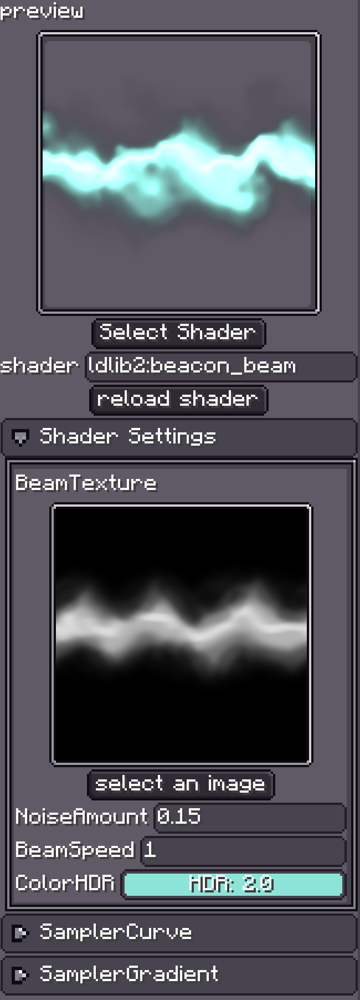
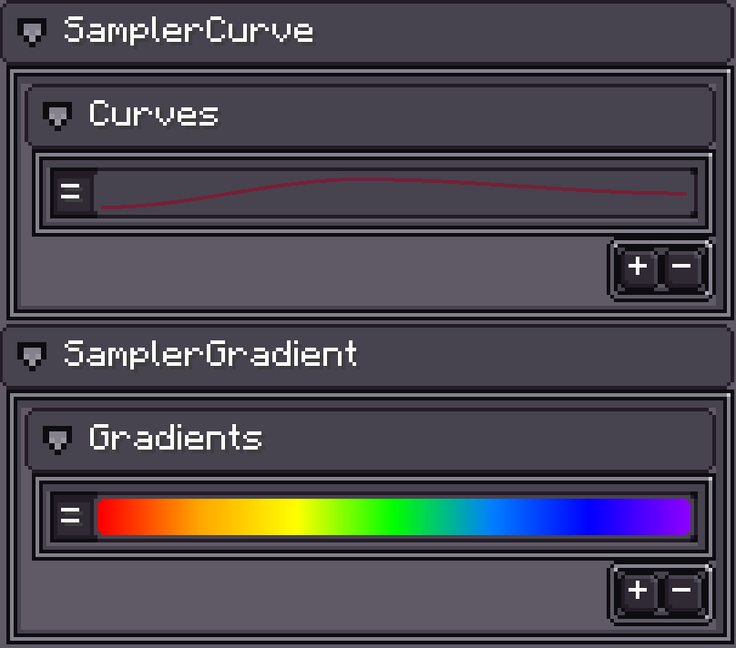

# 预备知识

{{ version_badge("2.0.0", label="自", icon="tag", href="/changelog/#2.0.0") }}

`Custom Shader Material`（自定义着色器材质）让你**完全控制**渲染的执行方式。
Photon2 允许你使用 [Minecraft Core Shaders](https://minecraft.wiki/w/Shader#Core_shaders) 来编写材质。

!!! warning
    本维基**不是**着色器编程教程，不会讲解 Minecraft 着色器的基础知识。
    请参考下方的相关链接获取着色器知识。

---

## 📚 相关链接

!!! info ""
    - [Minecraft Shaders](https://minecraft.wiki/w/Shader#Core_shaders)
    - [Minecraft Shaders (Google Doc)](https://docs.google.com/document/d/15TOAOVLgSNEoHGzpNlkez5cryH3hFF3awXL5Py81EMk/edit#heading=h.56iz1ybwmq8e)
    - [Minecraft Shaders (GitHub Wiki)](https://github.com/ShockMicro/Minecraft-Shaders/wiki/)
    - [Post-processing Shaders](https://minecraft.fandom.com/wiki/Shaders#Post-processing_shaders)
    - [Learn OpenGL](https://learnopengl.com/Introduction)

Photon2 和 LDLib2 通过 [ExtendedShader](ExtendedShader.md) 扩展了 **原版 Minecraft Shader**。
该扩展新增了：

- Geometry shader（`attach`）支持
- 额外的 sampler 和 uniform

详情见 **ExtendedShader** 页面。

---

{ width="30%" align=right }

## 使用方法

- 点击 **`Select Shader`** 来选择你的着色器 JSON。
- 或通过其**资源路径**来指定着色器。
- 修改着色器后，点击 **`Reload Shader`** 以重新编译并加载。

!!! note "着色器路径要求"
    Minecraft 要求**所有着色器文件**（GLSL + JSON）必须放置在：
    ```
    assets/<namespace>/shaders/core/
    ```

---

## Shader Settings

**Shader Settings**（着色器设置）面板会显示所有**自定义**（非内置）的 sampler 和 uniform。
你可以直接在 **Inspector**（检查器）中编辑它们。

---

## Sampler Curve / Sampler Gradient

{ width="30%" align=right }

Photon2 允许你将 **Curve**（曲线）或 **Gradient**（渐变）传递给着色器。
它们会被编码为一张 **128×128 的 sampler**，你可以在着色器中采样以获取数值。

详情见 [ExtendedShader](ExtendedShader.md)。
