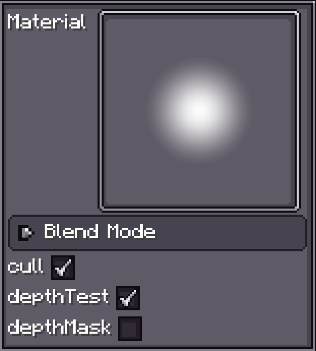
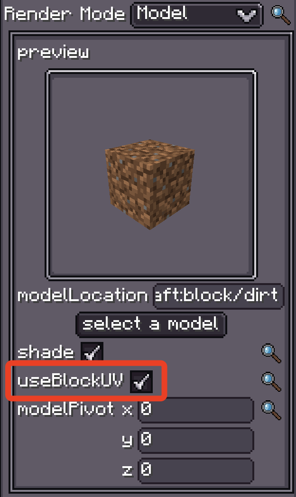

# 简介

{{ version_badge("2.0.0", label="自", icon="tag", href="/changelog/#2.0.0") }}

**Materials 系统** 为粒子系统中的渲染材质提供了一个灵活且可扩展的框架。
它提供了多种具有不同渲染功能的材质类型，从简单的纹理到具有 HDR 支持和高级效果的复杂自定义着色器：

- **Texture Material**
- **Sprite Material**
- **[Custom Shader Material](CustomShaderMaterial/index.md)**

---

## 通用配置

{ width="30%" align=right }

所有材质共享以下设置：

| 属性       | 类型         | 描述 | 默认值 |
| ---------- | ------------ | ---- | ------ |
| `material`     | `IMaterial`  | 特定的材质实现 | 内置圆形纹理 |
| `blendMode`    | `BlendMode`  | 控制粒子与背景的混合方式 | - |
| `cull`         | `boolean`    | 启用/禁用面剔除 | `true` |
| `depthTest`    | `boolean`    | 启用/禁用深度测试 | `true` |
| `depthMask`    | `boolean`    | 启用/禁用深度缓冲区写入 | `false` |

---

=== "Texture Material"
    `Texture Material` 是最常见的类型，专为基于纹理的渲染设计。
    它支持**自定义纹理**、**HDR 颜色处理**、**像素画模式**等功能。
    这使其成为粒子系统中**最通用**的材质选择。

    **配置参数：**

    | 属性             | 类型              | 描述 |
    | ---------------- | ----------------- | ---- |
    | `Texture`            | `ResourceLocation`| 纹理文件的路径 |
    | `Discard Threshold`  | `float`           | Alpha 剔除阈值 |
    | `HDR`                | `Vector4f`        | HDR 颜色向量 |
    | `HDR Mode`           | `HDRMode`         | HDR 混合模式 |
    | `Pixel Art.bits`     | `int`             | 像素画位深度 |

=== "Sprite Material"
    `Sprite Material` 允许你访问 **Minecraft 已注册的粒子纹理**。

=== "Custom Shader Material"
    最**强大**的材质类型，允许你完全控制渲染，
    设置**自定义采样器/Uniform**，甚至**访问粒子数据**。
    事实上，所有材质类型都可以通过自定义着色器来实现。

    更多信息，请参见 [Custom Shader Material](CustomShaderMaterial/index.md)。

---

## 特殊材质：`block_atlas`

!!! info "什么是 Block Atlas？"
    参见官方 Wiki：[Block Atlas](https://minecraft.wiki/w/Blocks-atlas#:~:text=blocks%2Datlas%20was%20a%20texture,atlas%20to%20form%20textures%2Datlas%20。)
    

{ width="30%" align=right }

内置的 `block_atlas` 材质本质上是一种 **Texture Material**，它允许 FX 访问 Minecraft 的 Block Atlas 纹理。

它在以**模型模式**渲染粒子并启用 `useBlockUV` 时特别有用——
UV 可以直接从 Atlas 中访问所需的 Block 纹理。

你也可以将 Block Atlas 作为采样器传递给 **Custom Shader Material**（详情请参见 *sampler* 页面）。
