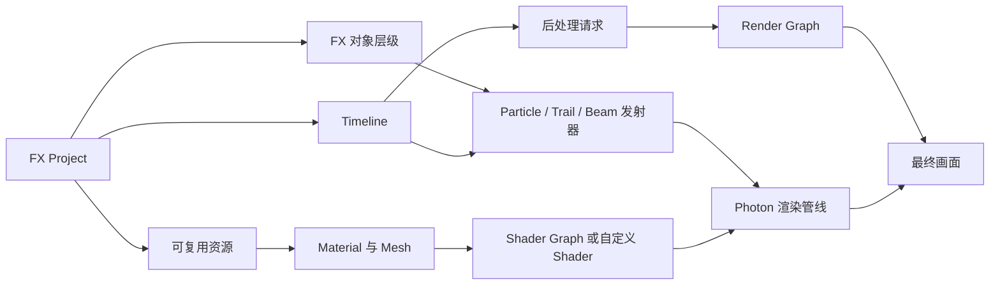

# Photon2

<VersionBadge version="2.0.0" label="自" icon="tag" />

Photon 是一套直接在 Minecraft 客户端内使用的实时 VFX 工具。它把粒子、Trail、Beam、非线性 Timeline、Shader Graph 材质和基于图的后处理整合进同一个编辑器。

<figure>

<figcaption>
最大化的 Photon 编辑器正在运行真实 tornado 项目；Hierarchy、Scene、Inspector、Resources 和 Timeline 可以同时查看。
</figcaption>
</figure>

## Photon 2.2 展示

<iframe width="100%" height="420" src="https://www.youtube.com/embed/jr800pFgZBw" title="Photon 2.2 展示" frameborder="0" allow="accelerometer; autoplay; clipboard-write; encrypted-media; gyroscope; picture-in-picture; web-share" allowfullscreen></iframe>

2.2 将 Photon 从粒子编辑器扩展成了完整的 VFX 管线：Timeline 编排、Shader Graph 材质、Fullscreen Shader Graph、Render Graph 后处理、Custom GPU Data、Force Field、Mesh 粒子和可分发的 FX Pack。

## 经典入门视频

旧视频继续保留。它更集中于基础粒子工作流，可以配合上面的 2.2 Showcase 一起观看；其中的界面和功能范围以当时版本为准。

<iframe width="100%" height="420" src="https://www.youtube.com/embed/1fXFaWheYvc?si=veqThF1redsFnSHm" title="Photon 经典入门视频" frameborder="0" allow="accelerometer; autoplay; clipboard-write; encrypted-media; gyroscope; picture-in-picture; web-share" referrerpolicy="strict-origin-when-cross-origin" allowfullscreen></iframe>

## 选择阅读路径

| 目标 | 从这里开始 |
| --- | --- |
| 在编辑器中制作第一个效果 | [快速开始](./getting-started.md) |
| 学习粒子发射器和模块 | [Particle System](./particle-system/) |
| 编排效果和属性动画 | [Timeline](./timeline/) |
| 制作材质与 GPU 效果 | [Shader 与 GPU](./shaders-and-gpu/) |
| 制作全屏后处理 | [Post Processing](./post-processing/) |
| 从模组代码加载和控制效果 | [Java API](./java-api/) |

## 各部分如何协作

导出的 `.fx` 保存对象树和 Timeline。运行时，`FX#createRuntime()` 会创建一个独立的可播放实例。Runtime 将对象交给客户端粒子引擎，并在每帧提交当前生效的后处理 Clip。

## 主要功能

- **粒子制作：** Particle、Trail、Beam 和 AraTrail 发射器，支持曲线、渐变、碰撞、Sub Emitter、UV Animation、自定义 Renderer 和 Simulation Space。
- **Timeline：** Animation、Activator、Control、Speed、Signal、Audio、Group 和 Post Process Track。
- **Shader Graph：** 使用节点制作 Vertex/Fragment Shader，读取 Scene 与 Particle 数据，支持函数和实时预览。
- **GPU Data：** 每个发射器可以声明自定义数据流，并从 Shader Graph 或 GLSL 读取。
- **后处理：** 使用 Render Graph 组合 Fullscreen Pass，支持权重混合、优先级、自定义 Texture、Mask Group 和 Custom Depth。
- **分发：** 普通 `.fx` 导出和包含依赖资源的 `.fxpack`。
- **Java 集成：** 使用内置方块/实体 Executor，或直接控制 `FXRuntime`。

## 环境要求

- Minecraft `1.21.1`
- NeoForge `21.1+`
- 互相兼容的 Photon `2.2.x` 与 LDLib2
- 客户端环境：Photon 的渲染和播放 API 都在客户端运行

::: warning Photon 1.x
本手册只介绍 Photon 2.x。Photon 1.x 文档仍可在[旧版仓库 Wiki](https://github.com/Low-Drag-MC/Photon/wiki)中查看。
:::
