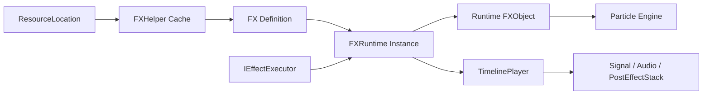

# Java 与 Runtime API


*Java API 加载编辑器使用的同一份 FX 定义，并为每次播放持有独立 Runtime Instance。*

Photon 的公开播放 API 仅用于客户端。加载近似不可变的 `FX` 定义，创建或由 Executor 创建 `FXRuntime`，并让所有世界/渲染修改留在客户端线程。

## 依赖

```gradle
repositories {
    maven { url = "https://maven.firstdark.dev/snapshots" }
}

dependencies {
    implementation("com.lowdragmc.ldlib2:ldlib2-neoforge-${minecraft_version}:${ldlib2_version}:all")
    implementation("com.lowdragmc.photon:photon-neoforge-${minecraft_version}:${photon_version}") {
        transitive = false
    }
}
```

Photon 2.2.4 面向 Minecraft 1.21.1 / NeoForge 21.1，并要求对应的 LDLib2 版本线。准确依赖范围以发布 Maven Metadata 和当前 Mod 文件为准，不要照抄旧示例中的版本号。



## 最小播放示例

```java
FX fx = FXHelper.getFX(ResourceLocation.parse("mymod:fire"));
if (fx != null) {
    new BlockEffectExecutor(fx, level, pos).start();
}
```

`FX`、`FXRuntime`、Executor、粒子对象、Shader 资源和后处理都属于客户端。不要让 Dedicated Server 必须 Class-load 引用这些类型的代码；把集成放进 Client-only Class/Event。

## 本章内容

- [加载、列出与缓存 FX](./loading-listing-and-caching.md)
- [内置 Effect Executor](./built-in-executors.md)
- [FXRuntime 生命周期](./fxruntime-lifecycle.md)
- [Runtime 数据注入](./runtime-data-injection.md)
- [Runtime Object 与 Transform](./runtime-objects-and-transforms.md)
- [自定义 Executor、Timeline 与 Signal](./custom-executors-timeline-and-signals.md)
- [后处理 Java API](./post-processing-api.md)
- [扩展、序列化与调试](./extension-serialization-and-debugging.md)
