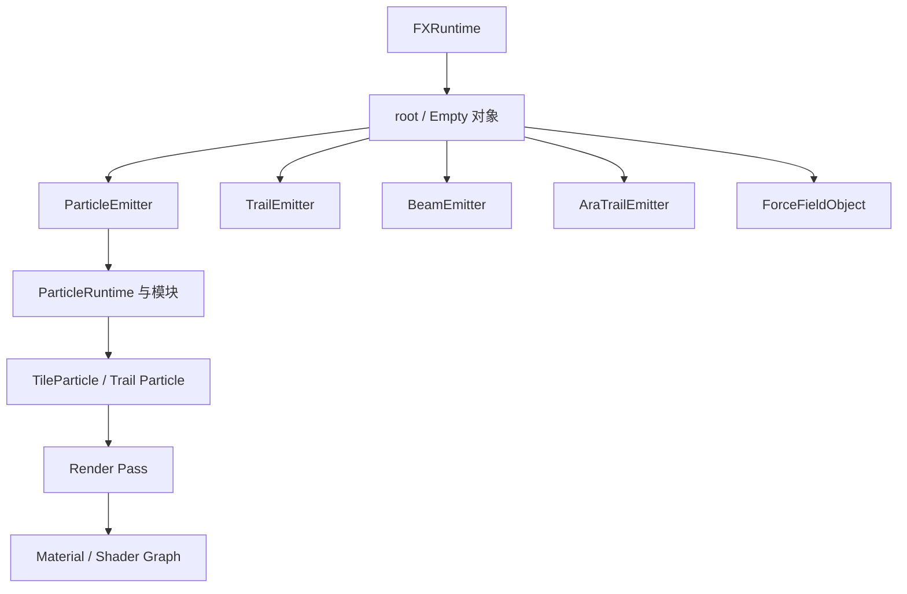

# Particle System

Photon 使用 FX 对象层级构建效果。Emitter 负责模拟粒子；Renderer 设置把状态转换成 draw call；Material 决定顶点如何变成像素；Timeline 可以随时间覆盖同一批 Runtime 值。

<figure>

<figcaption>真实 tornado 项目同时展示对象、材质、Scene 实时预览、Resources 与 Timeline。</figcaption>
</figure>

## FX 对象类型

| 类型 | 用途 |
| --- | --- |
| Empty | 组合子对象，并提供可动画的 Transform。 |
| Particle Emitter | 生成大量独立 Tile/Model 粒子和可选粒子 Trail。 |
| Trail Emitter | 根据移动中的 Emitter 构建连续 Ribbon 或 Tube。 |
| Beam Emitter | 在端点之间或 Raycast 方向上渲染 Beam。 |
| AraTrail Emitter | 模拟带物理运动和分段属性的 Trail。 |
| Force Field | 通过 External Forces 施加 directional、gravity、drag 和 vortex 影响。 |

## 推荐阅读顺序

1. [Hierarchy 与 Transform](./hierarchy-and-transforms.md)
2. [Curve、Gradient 与 Value Function](./value-functions.md)
3. [Particle Emitter](./particle-emitter.md)
4. [Emission 与 Shape](./emission-and-shapes.md)
5. [Simulation 与 Force](./simulation-and-forces.md)
6. [Lifetime 与 Speed 模块](./lifetime-and-speed-modules.md)
7. [Rendering、Material 与 Mesh](./rendering-materials-and-meshes.md)

## Runtime 模型

编辑器中的设置保持为 Config 数据。每个发射出的对象都会创建 Runtime layer；没有 override 时，Runtime 值回退到 Config。Timeline 和 Java 可以写入 Runtime slot，而不修改可复用的 FX 定义。因此同一个 `.fx` 可以同时播放多个互不影响的实例。

::: tip 一次只调试一个系统
先使用普通 Texture Material、常量值和一个模块。确认 Emission 与运动正确后，再加入 Curve、Trail、自定义 Shader 和后处理。
:::
