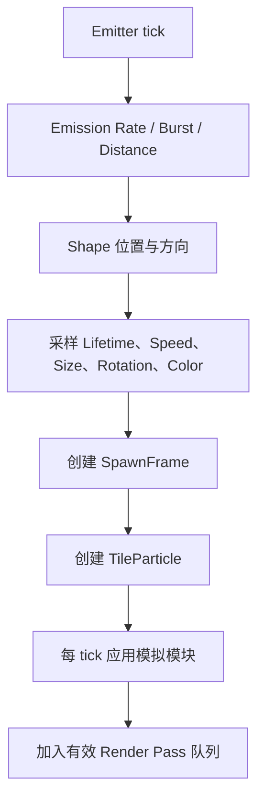

# Particle Emitter 核心


*Inspector 直接显示 Duration、Looping、Lifetime、Speed、Size、Color、Simulation Space 与 Max Particles。*

`ParticleEmitter` 会生成独立的 `TileParticle`。`ParticleConfig` 保存编辑数据；每个播放实例拥有自己的 `ParticleRuntime`，其中包含顶层值、模块 Runtime、Custom Data 和 Renderer override。

## 核心设置

| 设置 | 含义 |
| --- | --- |
| `duration` | Emitter 单次循环长度，单位为 tick。 |
| `looping` | Duration 结束后开始下一轮。 |
| `prewarm` | 第一帧可见前预先模拟的 tick 数。 |
| `startDelay` | 每次 Emitter 开始时采样的 Function。 |
| `startLifetime` | 新粒子的生命周期。 |
| `startSpeed` | 沿 Shape 方向的初始速度大小。 |
| `startSize` | 初始 X/Y/Z Size。 |
| `startRotation` | 初始 X/Y/Z Rotation。 |
| `startColor` | 初始颜色，后续 Color 模块和 Material 逻辑会继续相乘。 |
| `maxParticles` | 该 Emitter 同时存活的粒子上限。 |
| `parallelUpdate` | 允许符合条件的粒子并行更新。 |

## 生成流程



`SpawnFrame` 会在生成时保存 Emitter Transform 和 Simulation Space 转换。因此即使之后移动 FX root，Local/World/Custom 行为仍能保持一致。

## Duration 与结束

非循环 Emitter 会在 Duration 后停止生成，但已有 Particle 或 Trail 仍在播放时，FX 不会结束。循环 Emitter 不会自然结束，拥有它的 Executor 应在合适时机销毁 Runtime。

## Prewarm

Prewarm 适合循环 Smoke、Aura 或环境效果，让它们第一帧就像已经运行了一段时间。它会增加启动时的模拟成本，频繁生成的效果不要设置过大。

## Parallel Update

Parallel Update 适合大量互相独立的粒子。Photon 对 World/Light 访问和 Sub Emitter 生成做了安全交接，但自定义逻辑不能引入不安全的共享可变状态。粒子较少时，调度成本可能高于收益。

## Runtime 访问

```java
ParticleEmitter emitter = (ParticleEmitter) runtime.findObject("sparks");
emitter.runtime().startSpeed.set(new Constant(0.2f));
emitter.runtime().maxParticles.set(256);
```

清除 override 后会恢复编辑器中的设置。详见 [Runtime Data Injection](../java-api/runtime-data-injection.md)。
