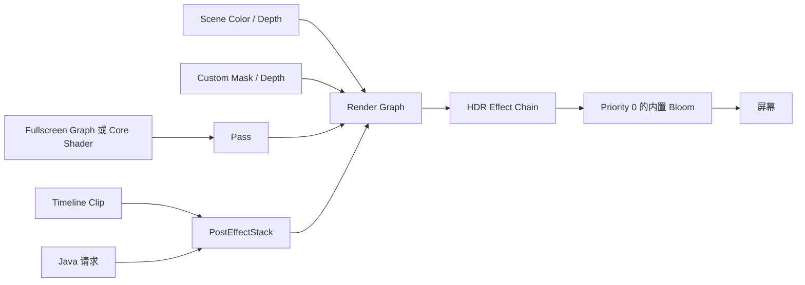

# 后处理

<VersionBadge version="2.2.0" label="开始支持" icon="tag" />

Photon 后处理会在捕获的 Scene 上执行一个或多个全屏 Pass。Fullscreen Shader Graph 定义单个 Pass，Render Graph 连接 Pass 并声明最终效果，Timeline 或 Java 则每帧提交带权重的请求。

*后处理从捕获的 Scene Color/Depth 开始，再由当前 Render Graph 变换最终画面。*

## 各资源的职责

| 资源/Runtime | 职责 |
| --- | --- |
| Fullscreen Shader Graph | 像素算法及暴露的 Sampler/Uniform |
| Core Shader Pass | 手写 JSON/VSH/FSH 方案 |
| Render Graph | Pass 顺序、临时 Target、输入、输出、Priority |
| Post Process Clip | Effect Path、Fade/Weight、参数、Mask Filter |
| `PostEffectStack` | 合并请求并在全局轴上执行效果 |

系统采用“逐帧请求”模型。只有 Timeline、Java、Preview 或其他 Owner 在本帧提交时，效果才运行。停止提交后下一帧就不再执行，它不是持久的全局开关。

## 本章内容

- [制作一个后处理效果](./authoring-a-post-effect.md)
- [Render Graph 与 Pass](./render-graph-and-passes.md)
- [Fullscreen Graph 与自定义纹理](./fullscreen-graphs-and-textures.md)
- [手写 Fullscreen Shader](./handwritten-fullscreen-shaders.md)
- [内置效果、混合与 Mask](./built-in-effects-blending-and-masks.md)
