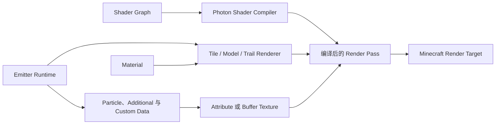

# Shader、材质与 GPU 数据

<VersionBadge version="2.2.0" label="Shader Graph 与 GPU 数据流" icon="tag" />

Photon 将“发射器画什么”和“像素如何着色”分开处理。材质选择纹理、渲染状态和 Shader；Shader Graph 用节点生成 Shader；GPU 数据则为每个粒子或 Trail 点提供不同的数值。

<figure>

<figcaption>真实 Particle Graph 与 Scene 实时效果、Material 资源、Inspector 和 Timeline 同时显示。</figcaption>
</figure>

## 如何选择

| 需求 | 使用 |
| --- | --- |
| 纹理、混合、深度和普通粒子 | Texture 或 Sprite Material |
| 不写 GLSL 的逐像素逻辑 | Shader Graph Material |
| 已有 Core Shader JSON/VSH/FSH | Custom Shader Material |
| Scene Color 或全屏处理 | Fullscreen Graph 与 Render Graph |
| Shader 内的逐粒子动画 | Additional GPU Data |
| 由 Timeline 或 Java 控制的值 | Custom Data Stream |

新效果优先使用 Shader Graph：它会声明所需的数据流，并适配 Photon 的不同渲染路径。手写 Shader 适合移植现有代码或 Graph 暂时无法表达的算法。

## 本章内容

- [材质系统](./material-system.md)
- [Shader Graph 入门](./shader-graph-getting-started.md)
- [Stage、Function 与 Subgraph](./stages-functions-and-subgraphs.md)
- [核心 Shader 节点参考](./core-node-reference.md)
- [Photon Shader 节点参考](./photon-node-reference.md)
- [Custom Shader Material](./custom-shaders-uniforms-and-samplers.md)
- [手写 Core Shader 与 ExtendedShader](./extended-shader.md)
- [内置 Uniform 与 Sampler 参考](./custom-shader-builtins.md)
- [Vertex Format 与 GPU Instancing](./vertex-formats-and-instancing.md)
- [Additional GPU Data](./additional-gpu-data.md)
