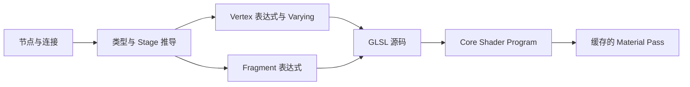

# Stage、Function 与 Subgraph

*Distortion、Outline、Dissolve 与 Alpha 分组展示了复用逻辑如何汇入 Graph Output。*

Shader Graph 会把一个节点图编译成 Minecraft Render Pass。先分清表达式在哪个 Stage 执行，可以避免大部分编译与插值问题。

## Vertex 与 Fragment Stage

| Stage | 执行频率 | 适合计算 |
| --- | --- | --- |
| Vertex | 每个输入顶点一次 | 位置形变、Instance Data 读取、较粗粒度计算 |
| Fragment | 每个覆盖像素一次 | 纹理/颜色、Alpha/Discard、法线/雾/光照、Depth Fade |

Additional 与 Custom Data 在 Vertex Stage 读取。如果 Fragment 节点需要它，编译器会自动创建 Varying，因此不需要手写 `out`/`in`。

## 输出

- **Position** 修改最终顶点位置，连接前必须明确坐标空间。
- **Base Color** 是普通着色颜色。
- **Emission** 增加不受光照影响的 HDR 能量。
- **Alpha** 控制透明度和混合。
- **Discard/Alpha Clip** 直接移除不满足条件的像素。

不要用 Discard 代替正确的 Blend/Depth 状态。Cutout 可以写深度，半透明边缘一般不应写深度。

## Function Graph

Shader Function Graph 封装可复用计算。声明有类型的输入与输出，保存为资源，然后在粒子 Graph 中实例化。适合 UV 扭曲、调色板映射、Dissolve Mask 和共享光照模型。

Function Graph 不保存材质渲染状态，纹理/Uniform 参数仍由调用它的 Graph/材质持有。不要形成递归函数引用，Photon 会将其报告为 Graph 编译错误。

## 编译流程

## 常见错误

| 报错/表现 | 检查 |
| --- | --- |
| Type mismatch | 报错端口两侧的 Vector 宽度与隐式转换 |
| 缺少必须输出 | Fragment Output 连接及 Graph 类型 |
| 未知 Function/Resource | Function Graph 路径及 FX Pack 依赖 |
| 编译成功但数据全为 0 | Additional Data 不受支持或正在走 CPU 路径 |
| 编辑后仍显示旧结果 | 保存 Graph、Reload Shader，再清理 Photon FX Cache |
